# The Linux System

## Logging in

In our lab, there are two users setup on each system, the Super User and the Admin User. It is not good security practice to login as the Super User account (root on Linux, Administrator on Windows), so we will be logging in as the Admin User, who also has super user privileges. At the login screen, simply type the username of the admin user and you will be prompted for a password, which are both shown in the table on the first page of the lab guide.

Note: Root login is disabled from the login screen on Ubuntu

## Kernel, OS Version & Release Information

The output of this command is straightforward. To get the kernel version: `uname -a`

To get the release and version number of the OS: `cat /etc/*-release`

There’s no standard for the output above, you will have to look through the output to get the details you need. Generally, you will see something that says `ID_LIKE` that will let you know what root family the Linux version belongs to (like Debian, Fedora, BSD, etc). Then you will see `Version` or `Version_ID` that gives the version of the OS and possibly the name of it. There’s also `Pretty_Name` which will give the user-friendly version of the name as well.

## Storage Space

You can view the storage space and how it’s allocated with the df -h command. This command stands for ‘disk free’ and the -h switch tells Linux to put it in human readable format of Mb or Gb. If you run it without the -h option, it will show it as long numbers instead. You can see the total space in the ‘size’ column and the used/available space in their respective columns.

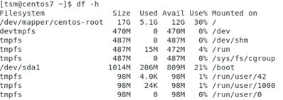              

# The Terminal 

   The terminal is the most basic part of any Linux system. Even though most Linux distributions come with Graphical User Interfaces (GUI’s) now, you can still access the terminal through here. Most of the commands you will be doing in the labs will require the terminal, so it’s good to get used to working in this space. To access the terminal, depending on your Linux distribution, you will need to find the icon on application menu, shortcut bar or the desktop. The icon generally looks like the image below:


## The Terminal Prompt (Shell)

Once you click on the icon, you’ll be greeted with a command prompt as shown below. 

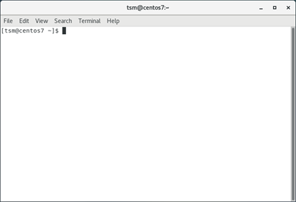

The command line is called a shell in Linux, and the most common shell is Bash. We will be using the Bash shell in our lab environment.

Inside the brackets at the beginning of the prompt, we have the following items:

`[username@hostname <current directory location>] $`

As explained above, you first see the username you’re currently logged in as. After the `@` symbol, you see the hostname of the machine you’re connected to.

The current directory location of `~` indicates you are in your home folder for the user, which is typically `/home/username` or `/home/tsm` in the case above. If you navigate to another location, it will show the name of the folder you’re in.

The `$` at the end of the prompt indicates you are a normal user. If you were to switch to the root account, that would change to a `#` symbol instead.

## Keyboard Shortcuts

The following key combinations will provide shortcuts for getting around in the console:

| Key-Sequence               | Description                                                  |
| -------------------------- | ------------------------------------------------------------ |
| `  TAB  `                  | If there’s any key you should  use in Linux, it’s TAB. The TAB key  will auto-complete commands and sometimes parameters for you. If you double-tab while typing a command,  it will show you possibly completions given what you’ve typed so far. TAB is your friend. |
| `  Arrow Up   `            | Look at the previous command in  the command history         |
| `  Arrow Down  `           | Look at the next command in the  command history             |
| `  CTRL+A  `               | Move the cursor to the beginning  of the current line        |
| `  CTRL+E  `               | Move the cursor to the end of  the current line              |
| `CTRL+Left/Right Arrow  `  | Move the cursor left/right one  word at a time               |
| `CTRL+R  `                 | Search the command history. Type part of the command at the  prompt. You can press CTRL+R again to  search backward in the history through multiple matches. Press ENTER to run the selected command or  press CTRL+C to abort the search. |
| ` CTRL+C  `                | Abort current command entry or  kill current process         |
| ` CTRL+L  `                | Clear the screen (same as the  ‘clear’ command)              |
| `  CTRL+K  `               | Removes all text from the cursor  to the end of the line     |
| `CTRL+X, then BACKSPACE  ` | Removes all text from the cursor  to the beginning of the line |
| ` !!  `                    | Execute the last command, useful  if you just want to use sudo on the last command |

# The File System

## File structure

As you work in the CLI, you will always be ‘located’ in a directory. The default starting point is the home folder of your user. This location is called the current working directory.

Linux’s file structure is a hierarchical file structure much like that of Windows. One large difference is directories in Linux are specified using forward slashes (`/`). A full directory path begins with a forward slash as well. Therefore the full path to the home folder for user TSM would be `/home/tsm`. 

A path specified without the beginning forward slash is called a relative path, meaning it uses your current directory as the starting point. For instance, if your current working directory is `/home/tsm`, then the relative path `Downloads/test1` would correspond to the full path `/home/tsm/Downloads/test1`. 

There are several common folders found on Linux, shown & described in the following table:

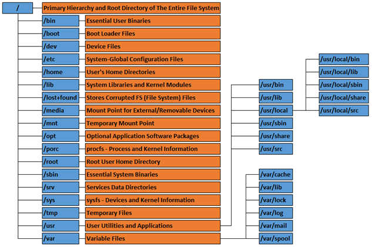

## Directory & File Navigation

The table below lists several useful commands for directory & file navigation. While navigating files and folders, always remember that unlike Windows, Linux files and folders are all case sensitive. So ‘myfile.txt’ and ‘MyFile.txt’ are considered two different files by Linux.

| Command                             | Description                                                  |
| ----------------------------------- | ------------------------------------------------------------ |
| `cd  <directory>  `                 | Changes the current working directory  location to the specified location |
| `  cd ..  `                         | Changes the current working  directory location to the parent folder |
| `  ls -la  <dir>  `                 | Lists the contents, including  hidden files that start with ‘.’, in long listing format (shows the  attributes, permissions, etc for files) for the directory specified or the  current directory if none is specified.   You can also specify a file to show details on that file alone. |
| `  pwd  `                           | Shows the current working  directory (stands for Present Working Directory) |
| `  mv  <source> <destination>  `    | Move a file from one location to  another. Also doubles as a rename if you supply a different filename in the  destination |
| ` cp  <source> <destination> `      | Copy a source file to a new  destination file. If you specify a  different filename in the destination, it will rename the copy to that  filename. |
| `  mkdir  <path/directory>  `       | Create a directory (stands for  Make Directory). If you don’t supply a  full path, it creates the directory in the current working directory. |
| `  rm  <path/file1> <path/file2>  ` | Removes a file. Specify multiple files by separating each  one by a space. |
| `  rmdir  <path/directory>  `       | Removes a directory. To recursively remove directories and  files, use the -rF switch. |
| `  touch  <path/filename>  `        | Creates a file at the given  location with the given name.   |

## Searching for & Locating Files

The two easiest ways of finding a file on Linux is using the locate and find commands.

The locate command is the simplest option but is not always available. The syntax is simply locate `<keyword>` which will search the entire filesystem for any directory or file with that keyword in it.

The more reliable but slightly more difficult option is the find command. The syntax is shown below:

`find <starting_dir> -iname <keyword>`

If searching directories that required privileges to access, this command will require elevated privileges as well. The starting directory is where the search begins, then it will search every child directory from that location.

Wildcards can also be used with the keywords of the find command (locate can also use a wildcard but it’s a little flaky as it only seems to work at the front of the keyword), so the keyword could be ‘serv*’ to match on ‘server’ or ‘service’.

## File Permissions & Ownership

Linux file permissions define who can read, write or execute files. If you use the command `ls -laF` to show a directory’s contents, you will see output as shown in the figure below:

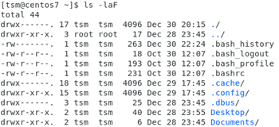

The grouping of letters to the left in the output below denote the file permissions. These are broken down in the figure to the right. 

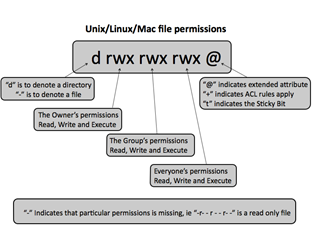

   The next information is the owner and the group that the file belongs to. In this case, all the files listed belong to user `tsm` and group `tsm` (except for the `../` item, which is not a file). Therefore, the .bash_history file can be read and written to only by the owner, which is `tsm` in this example. However, the file `.bash_logout` can be read by the owner, the file’s group owner, and any other user, but can only be written to by the owner.

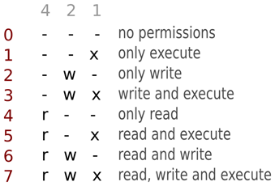

Linux file permissions use octal number system to track the changes. Each digit is a binary flag, as show in this figure. In order to determine the octal value of the permissions, you simply add the value of each column that is set to ‘on’. Therefore, for Read/Write, the octal value is `6`. For Read-Only, the octal value is `4`. Since there are 3 groups of these permissions, the permissions of a file is represented by a 3-digit octal number. Given the octal number `750`, the `7` denotes permissions for the user (Read/Write/Execute), `5` denotes permissions for the file’s group (Read/Execute), and `0` denotes permissions for everyone else (No permissions).

To change permissions of a file, we use the chmod command. The syntax is: 

`chmod <octal_permissions> <filename/directory>`

For example, to set the permissions of the four .bash* files above to 700, you could enter:

`chmod 700 .bash*`

Ownership of the file can be changed with the chown command. The syntax is:

`chown <user>:<group> <filename>`

For example, to change ownership of the .bash_history file to root, you could enter:

`chown root:root .bash_history`

Remember that changing the owner affects who can access the file. If we changed the `.bash_history`’s owner to root, then we could no longer read or write to the file as the tsm user because only the owner can do that with the permissions it has now.

One other note, you can add the option `-R` to either command to cause it to apply the changes recursively. For instance, if you have a folder full of files and you want to change the owner of the folder AND the files inside it to root as well as change the permissions to 700, you could use these commands:

`chmod -R 700 Downloads`

`chown -R root:root Downloads`

## Piping & Redirection

Piping is the process of taking the output of one command and sending it to another command. This is a very common practice and almost anything can be piped into anything else. Think about it this way, when you type a command you and see output on the screen, that output is being sent to the screen. Piping takes that output and sends it to another command instead of your screen. Piping is a powerful feature when used correctly.

In order to pipe output, use the vertical line, which is usually `SHIFT + BackSlash`, to produce this character: `|`

One of the most common uses of the pipe command is the grep command, which is described in more detail in the section below.

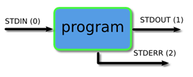

Another useful technique is redirection. The diagram above shows the details of this; programs normally take their input from the stdin stream (the keyboard) and sends their output to the stdout stream (the monitor). Redirection is the process of taking the output or input of something and sending it to a different location. The difference between piping and redirection is subtle, but piping is used to send output of one program as the input to another program but redirection is about changing the source of inputs and the destination of outputs. 

To make more sense of this, consider the situation where you want to save the output of a command to a file for later use. Normally the command would output the information the screen. This is called stdout (standard out). You can redirect the output from stdout to a file by using the "greater-than" symbol `>` and then specifying a file location. For instance:

`ls -laF /etc > output.txt`

This would take the output of the ls command and put it inside the file `output.txt` (located in the current working directory). If you were to view this file, you would see the output. 

Important Note: Using one greater than tells Linux to overwrite the contents of the file, so be careful you don’t accidentally overwrite an existing file. The safer alternative is to use two greater than symbols `>>` which tells Linux to append the output to the file. This way, if the file exists, you just tag extra information onto the file rather than totally overwriting it. For instance, if we were to follow up the command above with this command:

`ls -laF /etc >> output.txt`

You would now see the results of both directory listings inside the same file, with the most recent addition at the bottom.

To further illustrate the difference between piping and redirection, if I tried the following command:

`ls -laF /etc | output.txt`

I would get the following error:

```bash
bash: output.txt: command not found...

Exiting on Broken Pipe
```

This is because you cannot pipe output to files, you must redirect it using the greater than symbol.

## Searching Inside Files & Filtering Output

Grep is a tool that searches whatever input you give it, whether it be a file or if you want to pipe some output into it and filter out just what you’re looking for. For instance, suppose your output has 500 lines, but you’re only interested in lines that have the word ‘vm’ in it. You could pipe the output of that command into grep and search for ‘vm’ to only display those lines. An example:

`ls -laF | grep txt`

This command would list the contents of the current directory, but only lines that have the word `txt`, such as text documents, would be printed on the screen. 

You could also grep a file or set of files to search the file and print lines containing a certain criteria:

`grep password *.txt`

This would search the current folder for all files ending in `.txt` for any lines containing the word `password` and print those lines to the screen.

If you want to search for multiple keywords, use the `-e` option to specify each keyword:

`grep -e password -e pswd *.txt`

This would search the current folder for all files ending in .txt for any lines containing the word ‘password’ OR ‘pswd’ and print those lines to the screen.

# Viewing & Editing Files

Linux has many ways to open files, some are read-only while others allow you to edit the files. We’ll begin with the text editors. Linux has two common text editors in almost every OS, nano and vi. Nano is the more popular of the two due to it’s ease of use. VI is probably the least popular, but it’s the oldest and pretty much guaranteed to be installed on any flavor of Linux you may come across. Let’s look at each one:

## Nano

 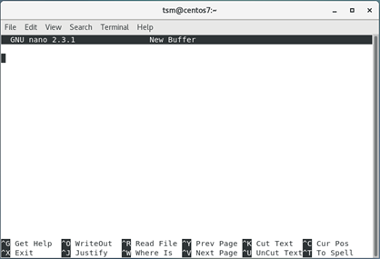

To edit a file in nano, simply enter the command `nano <filename>`

Nano is very straightforward; you just type like you would in any word processor. Shortcuts are listed at the bottom, you press `CTRL` along with the letter to use each one, although there are other shortcuts not shown there. A very useful shortcut is `ALT+G`, which will let you go to a specific line in the file. This is very useful if you are dealing with an error and it’s pointing to a specific line of a configuration file. As shown in the help menu, to exit, press `CTRL+X`. It will prompt you to save the file and ask you were you want to save it at, in case you want to save it as a new file.

## VIM

Most people either love or hate vi. This is mainly due to its non-intuitive way of working within the text editor. For instance, once you open a file using the command `vim <filename>`, you will find that you can move the cursor around and maybe even type a little, but you’ll find that it’s behaving odd when you type certain characters. This is because vi starts off in ‘command mode’, where certain letters of the keyboard perform editing functions, like moving the cursor or deleting text.

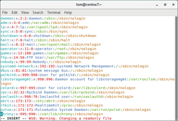

In order to exit command mode, and enter ‘insert mode’, first press `ESC `to make sure you’ve exited out of any existing command mode processes, then press `i`. You will notice the screen will display `INSERT ` at the bottom to let you know you’re working in insert mode now. Within insert mode, you can edit the file as you normally would. When you are finished editing, press `ESC `to return to command mode. To exit and save the file, type a colon, which will give you a prompt, then enter `x` at the prompt. It will not confirm if you want to save, it’ll just do it. If you want to exit a file that you’ve not made any changes to, type colon `:`, then enter `q` to exit. If you have made changes and you want to discard them, type colon and then enter `q!` to quit and discard changes.

Vi isn’t for everyone and it has a big learning curve to it, as there are so many other features that are outside the scope of this documentation. You may ask, why is vi so jacked up? The answer is in its roots, since vi has been around since the early days of computing, using keyboards like the one shown below. Thus vi gave users a way of entering many different commands that weren’t supported by keyboards yet, like backspace, home, end, arrow keys, etc.


### Special VIM Commands

These special commands can be run from command mode (press ESC to enter command mode):

`:set number` - This will display line numbers

`:set expandtab!` - This turns off the expandtab feature, which causes VIM to insert spaces instead of tabs when using the tab key to indent.

## Viewing Files (Read Only)

The two most popular way of viewing files in Linux is the less command and the cat command.

The less command offers a convenient, paginated view of a file, and it can also be used with the pipe to take output that would’ve spanned multiple screens and allow you to view it in pages. This is essential if you are working on a console where you can’t scroll back normally. To view a file with less, you simply enter:

`less <filename>`

Then you can scroll up and down using the arrow keys or `PGUP`/`PGDOWN`. You can also skip to the end of the file by entering upper case `G`. If you wanted to pipe information into less, you would use this syntax:

`<command> | less`

This would cause all the output of the command to be presented in a paginated format. 

The second popular way of viewing files is `cat`. The name of this command came from the word ‘concatenate’ because this command can also be used to merge files together. It was called ‘cat’ instead of ‘con’ because ‘con’ was already used (it was short for console). The syntax of the `cat` command is:

`cat <filename>`

This will simply display the contents of the file to the terminal. This is mainly useful for small files, as a large file would be better viewed with the `less `command.

If you simply wanted to search a file and display the lines that matched a keyword, you would actually use the grep command, discussed in the “Searching Files & Filtering Output” section.

# Commands, Programs and Scripts

## Executing commands and Scripts

Each distro of Linux has a system path that includes common locations where executable commands may reside. These paths usually include the `bin` directories shown in the common directory chart in the earlier section. This path definition allows you to execute commands that reside in these directories without specifying the complete path to the command.

For commands which are not located in one of these directories, you must specify the full path to the file. For instance, if you have a command in `/tmp/myprogram` called `mycommand`, to execute the command you must type `/tmp/myprogram/mycommand`. Alternately, if you are in the folder containing the command, you can execute it directly from the current directory by prefacing the command with a period and forward slash like `./mycommand`. This is a safeguard meant to keep someone from accidentally executing a command in the current directory. Scripts are executed in the same way as commands.

## Running commands as root - Sudo

Some commands are referred to as privileged commands. These commands require elevated permissions in order to run. The root user can run all these commands, but it’s not a good idea to use the root account regularly. This will be discussed in more detail later, but for now, know that non-privileged users can be allowed to run commands as root using the sudo. The syntax is simply:

`sudo <command>`

You will be prompted for the credentials of the non-privileged user.

For these labs, the `kali` user can use `sudo`

## Man Pages - The Built in Documentation

Almost every program in Linux has documentation built into the system that can be accessed by typing ‘man’ + command. For instance, to see the man page for the `ls` command, you would type `man ls`. This will take you to a documentation screen showing detailed information on the various switches and parameters you can use with the command. The exit the man page, press `q`.

## Viewing Running Processes (top & ps aux)

Some commands run in the background of the system for extended periods of time or indefinitely. There are multiple ways to see running processes on Linux. 

### top

The first way is to use the `top `command. This command will give a dynamic table output of the running processes on a system as shown below:

 

You can then interact with the table using the following keys:

| Key         | Action                                                       |
| ----------- | ------------------------------------------------------------ |
| Arrow Keys  | Use to navigate through the  table up, down, left & right one column or row. |
| PGUP/PGDOWN | Scroll through the table a page  at a time                   |
| M           | Sort the table by memory usage                               |
| P           | Sort the table by CPU usage                                  |
| N           | Sort the table by process ID                                 |
| T           | Sort the table by the running  time                          |

### ps aux

The second command is the ps aux command, which stands for Process Status. The ‘aux’ options stand for:

- `a` show processes for all users
- `u` display the process's user/owner
- `x` also show processes not attached to a terminal

This command is best when piped to Grep with a keyword. For instance, if I wanted to see all processes for username `testuser`, I could run `ps aux | grep -e testuser -e USER` to get the following output:


The output above shows the headers of the ps aux command, which are described below:

- USER = user owning the process

- PID = process ID of the process

- %CPU = It is the CPU time used divided by the time the process has been running.

- %MEM = ratio of the process’s resident set size to the physical memory on the machine

- VSZ = virtual memory usage of entire process (in KiB)

- RSS = resident set size, the non-swapped physical memory that a task has used (in KiB)

- TTY = controlling tty (terminal)

- STAT = multi-character process state

- START = starting time or date of the process

- TIME = cumulative CPU time

- COMMAND = command with all its arguments


In the output above, notice there are 3 matches, but only one is a process belonging to the user `testuser`. This is because grep matched on other criteria, in this case, it was the user’s name in the command line itself. You should always pay attention to the output and don’t assume just because it returned a match that it’s the one you’re looking for.

## Ending a Process (Killing PID)

Using either top or ps aux, you can find the process ID of a command running on your system. There will be times when you need to end a process forcefully and this can be done with the kill command. The syntax is:

`kill <processID>`

The kill command will immediately end the process with the matching process ID. Alternately If you want to kill multiple processes with the same name, you can use the `killall `command instead:

`killall <processname>`

For instance, if I have 16 processes for httpd, rather than having to look up the process ID of each one and killing them individually with the `kill `command, you can just run `killall httpd` to end all of them at once.

# Package Management

Modern Linux OS’s support package managers, which allow you to quickly and easily install programs and their dependencies automatically, without having to go out on the Internet to find them yourself. Package managers require a repository to be configured (this is usually preconfigured) that they communicate with to find the latest packages. 

## Red Hat Family Package Management

The Red Hat family uses `yum `(Yellowdog Updater Modified) for package management. Below are useful commands for `yum`. Some of these commands produce a lot of output, particularly the list command, so remember you can pipe the output to grep and filter it.

Note: To specify multiple package names in any of the commands below, just leave a space between each package name.

| Command | Description |
| ----------------------------------- | ------------------------------------------------------------ |
| `yum list  installed`               | Show all installed packages on  the system                   |
| `yum list`                          | Show all available packages in  the repository               |
| `yum install  [-y] <package name(s)>` | Install a package. Use the -y option to override confirmation  prompts (only do this if you’re sure you know what you are installing) |
| `yum update [-y]  <package name(s)>` | Update a specific package, or  specify ‘all’ as the package name to update all packages. Running ‘yum update’ with no package  specified will update the yum database. |
| `yum remove  <package name(s)>`     | Uninstall a package                                          |
| `yum search  <keyword>`             | Search the repository for any  packages containing the keyword in their name, description, or summary |

## Debian Family Package Management

The Debian family uses apt (Advanced Package Tool) for package management. Below are useful commands for apt. Some of these commands produce a lot of output, particularly the list command, so remember you can pipe the output to grep and filter it.

Note: To specify multiple package names in any of the commands below, just leave a space between each package name.

| Command                               | Description                                                  |
| ------------------------------------- | ------------------------------------------------------------ |
| `apt list  --installed`               | Show all installed packages on  the system                   |
| `apt list`                            | Show all available packages in  the repository               |
| `apt install  [-y] <package name(s)>` | Install a package. Use the -y option to override confirmation  prompts (only do this if you’re sure you know what you are installing) |
| `apt upgrade [-y]`                    | Update all installed packages. Use -y to override confirmation  prompts. NOTE: If an upgrade requires removing a package,  it will skip upgrading that particular package. |
| `apt  full-upgrade`                   | Performs the function of upgrade but will  remove currently installed packages if this is needed to upgrade the  system as a whole. |
| `apt update  <package name(s)>`       | Update the apt database.                                     |
| `apt remove  <package name(s)>`       | Uninstall a package                                          |
| `apt search  <keyword>`               | Search the repository for any  packages containing the keyword in their name, description, or summary |

# User Accounts & Groups

## Switching Users

After you’ve logged in as a user, you have the option of switching to another user, giving operating ownership of that session to the other user using the `su `(switch user) command. In other words, once you’ve switched users, every command you run will be run as that user. The syntax is shown below:

`su - <username>`

You will be prompted for the target user’s password (as opposed to the previous user). Once you’ve entered it correctly, you will see the username at the prompt changes to the new user you’ve switch to.  If you do not supply a username, then it will assume you want to switch to the root user and prompt you for the root password.

To check/verify what user you are currently logged in as, use the `whoami `command.

To return to the original user, simply type `exit`.

## Running Commands as Other Users

You can run commands as another user using the switch user (su) command, if you know the user’s password and that user has permissions to run the command. The command will run just as if the user were logged in and ran the command. The syntax:

`su - <username> -c '<command to run>'`

Note that the command is enclosed in single quotes. On running this command, you will be prompted for that user’s password and then the command will run.

NOTE: This is different than running commands as another user using sudo, which we will learn about later.

## User Configuration Files

User account & group information on a Linux system is stored in three locations:  `/etc/passwd`, `/etc/shadow`, and `/etc/group`.  The first two are described below:

### /etc/passwd

This file contains the basic information for a user account. The format is shown below:


1. <u>Username</u>: Used when user logs in. It should be between 1 and 32 characters in length.
2. <u>Password</u>: An `x` character indicates that encrypted password is stored in `/etc/shadow` file. Please note that you need to use the `passwd `command to compute the hash of a password typed at the CLI or to store/update the hash of the password in `/etc/shadow` file.
3. <u>User ID (UID)</u>: Each user must be assigned a user ID (UID). UID `0` (zero) is reserved for root and UIDs 1-99 are reserved for other predefined accounts. Further UID 100-999 are reserved by system for administrative and system accounts/groups.
4. <u>Group ID (GID)</u>: The primary group ID associated with the user. This correlates to a group and group ID stored in the `/etc/group` file.
5. <u>User ID Info</u>: The comment field. It allows you to add extra information about the users such as user’s full name, phone number etc. This field use by finger command.
6. <u>Home directory</u>: The absolute path to the directory the user will be in when they log in. If this directory does not exist, then the user’s directory becomes `/`
7. <u>Command/shell</u>: The absolute path of a command or shell (`/bin/bash`). Typically, this is a shell but note that it does not have to be a shell, as is the case with service accounts.

### /etc/shadow

This file contains the encrypted password of users. The format of this file is shown below:


1. <u>Username</u>: The login name.
2. <u>Password</u>: The encrypted password. The password should be minimum 8-12 characters long including special characters, digits, lower case alphabetic and more. Usually password format is set to `$id$salt$hashed`, The `$id` is the algorithm used On GNU/Linux as follows:
   - `$1$` is MD5
   - `$2a$` is Blowfish
   - `$2y$` is Blowfish
   - `$5$` is SHA-256
   - `$6$` is SHA-512
3. <u>Last password change (lastchanged)</u>: Days since Jan 1, 1970 that password was last changed
4. <u>Minimum</u>: The minimum number of days required between password changes i.e. the number of days left before the user may change his/her password
5. <u>Maximum</u>: The maximum number of days the password is valid (after that user is forced to change his/her password)
6. <u>Warn</u>: The number of days before password is to expire that user is warned that his/her password must be changed
7. <u>Inactive</u>: The number of days after password expires that account is disabled
8. <u>Expire</u>: days since Jan 1, 1970 that account is disabled i.e. an absolute date specifying when the login may no longer be used.

## User Account Management

Rather than directly editing the files listed above, commands are used to create, modify & remove lines in the files automatically. Note that usernames ARE case sensitive on Linux, but it’s normal practice to use all lowercase for usernames to avoid confusion.

| Command                                                      | Description                                                  |
| ------------------------------------------------------------ | ------------------------------------------------------------ |
| `useradd -G  <group> <username>`                             | For Red Hat family systems. Creates a user account on the system &  add them to a group. If no group is  specified, they are added to a group with the same name as the username. The Red Hat family OS will automatically  create a home directory and specify the user’s shell. For non Red Hat, you must specify this as  shown in the next command. |
| `useradd -G  <group> -m -d <homedir> -s <shell_location>  <username>` | For non-Red Hat family systems. As mentioned above, you must tell it to  create a home directory with -m, specify the home location with -d and  specify the shell with -s. **The common shell is /bin/bash and the  common home directory location is /home/<username>** |
| `userdel [-r]  <username>`                                   | Remove a user account. Use the -r option to automatically remove  the user’s home directory & mail spool as well. |
| `compgen  [-u\|-g]`                                          | List all user accounts on a  system with the -u option or all groups on a system with the -g option. |
| `groups <username>`                                          | Show what groups a user is a  member of                      |
| `passwd  <username>`                                         | Change the password of a  user. This command requires privileges  to change user passwords. If no user  is specified, it will change the password of the current user. |

## User Group Management

### /etc/group

This file contains the basic information for groups that users belong to. The format of the file is shown below:

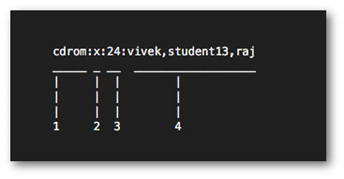

1. <u>Group Name</u>: Name of group. If you run ls -l command, you will see this name printed in the group field.
2. <u>Password</u>: Generally, password is not used, hence it is empty/blank. It can store encrypted password. This is useful to implement privileged groups.
3. <u>Group ID (GID)</u>: Each user must be assigned a group ID. You can see this number in your `/etc/passwd` file.
4. <u>Group List</u>: It is a list of user names of users who are members of the group. The user names must be separated by commas.

As with user management, commands are used to create, modify & remove lines in the `/etc/group` file automatically. Note that groups ARE case sensitive on Linux, but it’s normal practice to use all lowercase for groups to avoid confusion.

| Command                         | Description                             |
| ------------------------------- | --------------------------------------- |
| `groupadd  <group>`             | Create a new group                      |
| `groupdel  <group>`             | Delete a group                          |
| `usermod -a  -G <group> <user>` | Add a user to a group                   |
| `gpasswd -d <user>  <group>`    | Remove a user from a group              |
| `groups  <username>`            | Show what groups a user is a  member of |

# System Configuration

Many system configuration changes can be made via the GUI but it’s better to know how to do these via the CLI since it will be almost universal across Linux distros.

## Check the current time

Checking the current date and time on Linux is a simple command:

`date`

This will give you output like this: Tue Jan 1 12:00:00 CST 2019

## Changing the System Clock

Typically, Linux will be using NTP to set the date and time, but there may be times when you need to manually change this, whether due to loss of Internet connection or to test something. 

In order the change the system date, use the following command:

`date +%Y%m%d -s "20200101"`

This will set the date on the system to 1/1/2020. Note the use of zeros to pad the single digit month and days.

In order the change the system time, use the following command:

`date +%T -s "14:01:01"`

This will set the system clock to 2:01:01 PM. Alternately, you can use the %p option to use AM/PM in the command:

`date +%T%p -s "2:01:01PM"`

## Changing the Time Zone

Changing the time zone is simple as long as you have the `tzselect `command on your system. Modern releases of Linux have this but older released may require additional steps. To change the time zone using `tzselect`, simply run the command it will guide you through picking a new time zone as shown below:

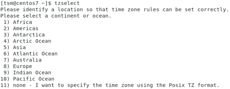