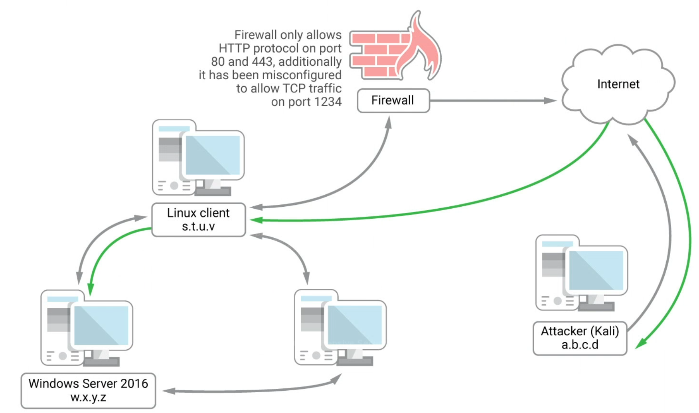
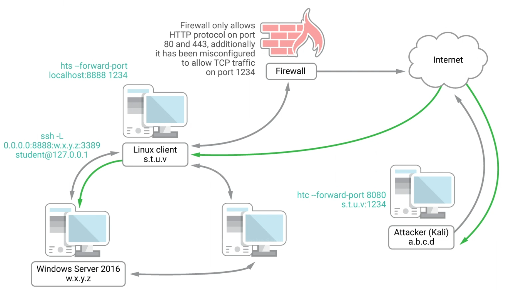

## httptunnel

This program creates a tunnel through the HTTP protocol.  It relies on a client-server model, meaning one end must act as the client while another end acts as the server, requiring the appropriate software to be installed on each end.

### Example

Imagine we have compromised a Linux client and achieved root, and have the passwords for the system as well.  Assume this device has deep packet inspection enabled that only allows the HTTP protocol, so an SSH-based tunnel will not work here.

The firewall also only allows ports 80, 443, and 1234 inbound and outbound.



The goal is to leverage the Linux client to reach the Windows 2016 Server using only the HTTP protocol, as shown below.  There will be two segments required.  

1. An SSH local port forward will be established on the Linux Client using the loopback, so that connections to port 8888 of the Linux Client is forwarded to port 3389 of the Win2016 Server.
2. We will use a shell achieved through HTTPS to establish a second connection from Kali to the Linux Client such that all traffic sent to port 8080 on Kali is sent through the HTTP tunnel to port 1234 on the Linux Client and then handed off to port 8888 of the Linux Client, which will send it along the SSH port forward to Windows 2016.



1. Install httptunnel on Kali

   ```bash
   sudo apt install httptunnel
   ```

2. Start a netcat listener on Kali and run an exploit to get a reverse interactive shell from the Linux Client.
   
3. Start a local SSH port forward from the Linux Client to the Windows 2016 server and confirm the port is listening:

   ```bash
   ssh -L 0.0.0.0:8888:172.16.216.5:3389 student@127.0.0.1
   ss -antp | grep "8888"
   ```

4. Set up the httptunnel server on the Linux Client to listen on port 1234, the random port open through the firewall.

   ```bash
   hts --forward-port localhost:8888 1234
   
   # Options
   --forward-port localhost:8888	# Specifies where to send decapsulated data
   1234	# port that httptunnel server will listen on
   ```

5. Verify the httptunnel server is running and the port is listening

   ```bash
   ps aux | grep hts
   ss -antp | grep "1234"
   ```

6. Start the httptunnel client on the Kali machine to connect to the Linux Client to establish the httptunnel:

   ```bash
   htc --forward-port 8080 192.168.216.44:1234
   
   # Options
   --forward-port 8080	# Designates that traffic sent to localhost:8080 is forwarded through the httptunnel
   192.168.216.44:1234	# Specifies the httptunnel server to connect to
   ```

7. Verify the httptunnel client is running and the port is listening

   ```bash
   ps aux | grep htc
   ss -antp | grep "8080"
   ```

8. Connect to the Windows 2016 Server using rdesktop on Kali and the localhost:8080 address:

   ```bash
   rdesktop 127.0.0.1:8080
   ```

9. Wireshark will verify that this traffic is all being sent over http.