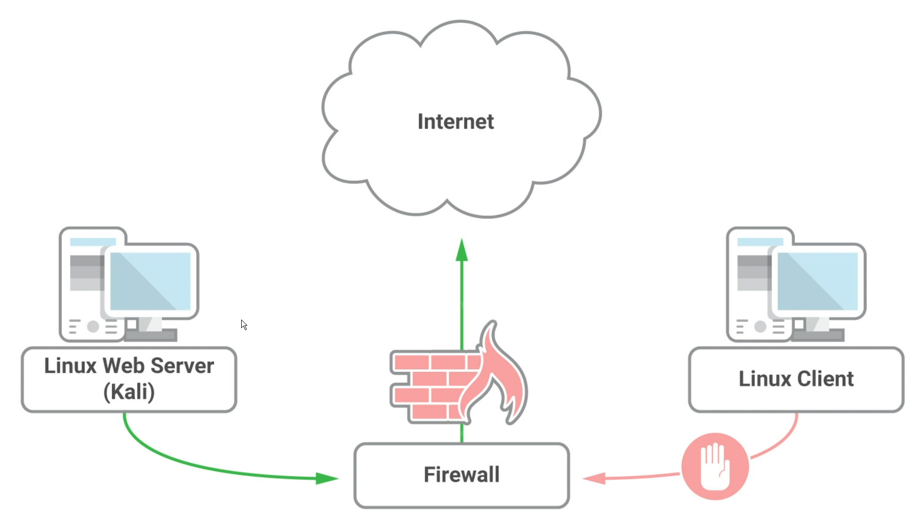

## rinetd

### Example

Imagine a Linux client with no Internet access that is only accessible by pivoting from another host (the web server).  Files need to be transferred to the client from the attacker on the Internet.



1. Install rinetd on the intermediary device (the web server in our example)

   ```bash
   sudo apt update && sudo apt install rinetd
   ```

2. Modify /etc/rinetd.conf and add forwarding rules to specify what forwarding to allow through.

   ````bash
   #bindadress    bindport  connectaddress  connectport
   0.0.0.0			80		 64.233.177.100	 80			
   
   # This rule causes all traffic received on the host on any interface (due to 0.0.0.0) on port 80 to be redirected to 216.58.207.142 on port 80
   ````

3. Restart rinetd, then use ss (or netstat) to verify the port is listening

   ```bash
   # Restart rinetd
   sudo systemctl restart rinetd
   
   # Verify ports
   ss -antp | grep 80
   ```

4. Make a netcat connection from the internet-disconnected client to the intermediate server.

   ```bash
   nc -nvv 192.168.119.216 80
   ```

5. Send a test string from the internet-disconnected client to the remote destination to verify the relay is working.  Note, you will not be referencing the IP of the remote destination, only the IP of the intermediate server:

   ```bash
   GET / HTTP/1.0
   # Press Enter twice for this command to go through
   ```

   