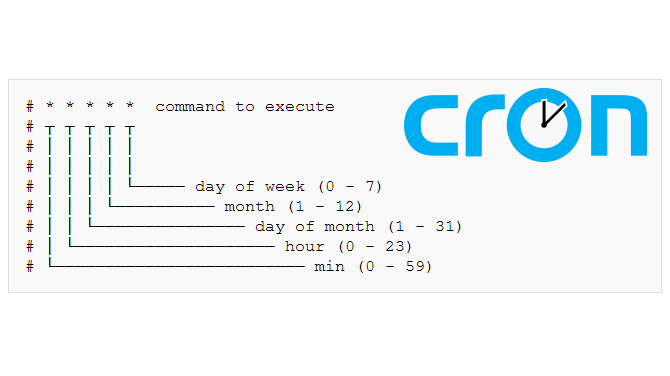

## Cron - Task Scheduler



### Working with cron

User can edit their crontab jobs be entering the following `crontab` command:

```
$ crontab -u someuser -e 
```

The above command will open your personal crontab configuration file  using your default text editor. Simply make your changes and save the  file. There is no need to restart your crontab as it will pickup your  changes automatically.
 To list your crontab task enter:

```
$ crontab -l 
```

Lastly, if you need to remove your crontab tasks execute the below  command. Please note that this will remove all you crontab entries:

```
$ crontab -r 
```

## System wide crontab scheduler

Many of the services use crontab automatically. They store their crontab scheduler configuration directly into `/etc/cron.d` directory. Any files located in this directory are automatically picked up and executed by the crontab scheduler. 

Linux system administrators can also take an advantage of crontab preconfigured schedules directories `/etc/cron.daily`, `/etc/cron.hourly`, `/etc/cron.monthly` and `/etc/cron.weekly`. 

The crontab files located within these directories are periodically  traversed and execute by crontab scheduler. So for example crontab files found in `/etc/cron.daily` directory are executed every day. Furthermore, if root wishes to run eg. `backup.sh` script once a week he will place it into `/etc/cron.weekly` directory.

------

### Special Cases

| Crontab Entry | Description                                  |
| ------------- | -------------------------------------------- |
| */5 * * * *   | Run Crontab job at every 5 minutes           |
| 0 * * * *     | Execute Crontab job every hour               |
| 0 0 * * *     | Execute crontab job every day at 00:00 hours |

### Tools

https://crontab.guru/