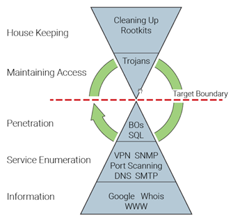
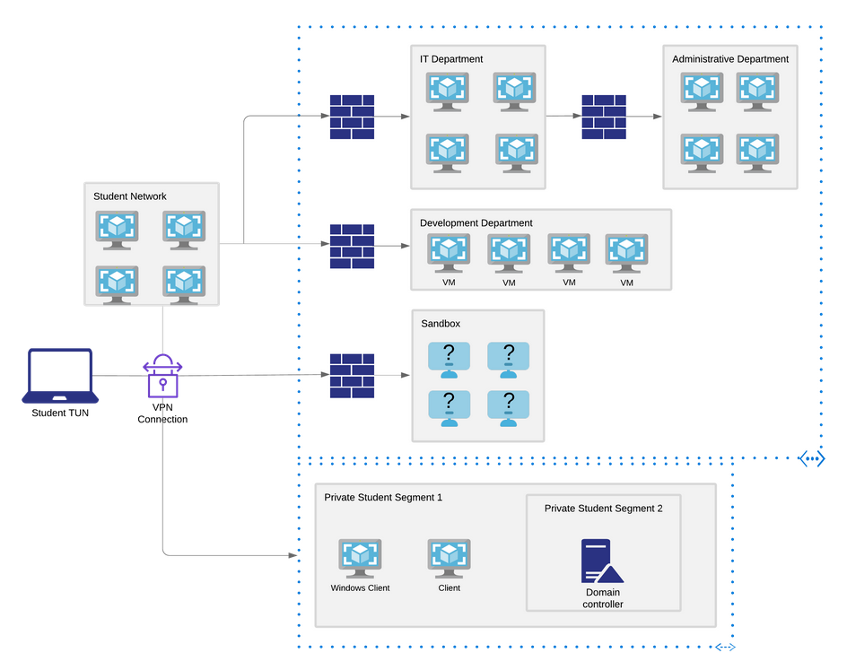
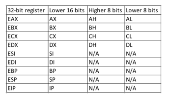
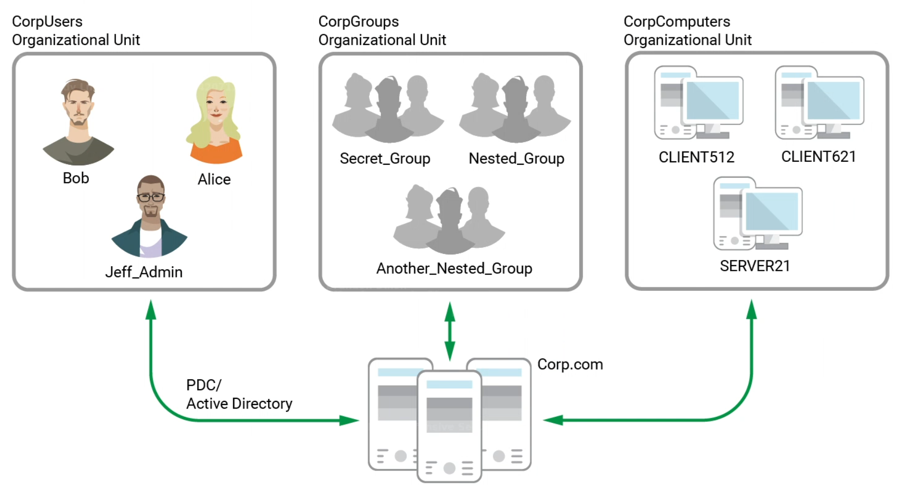
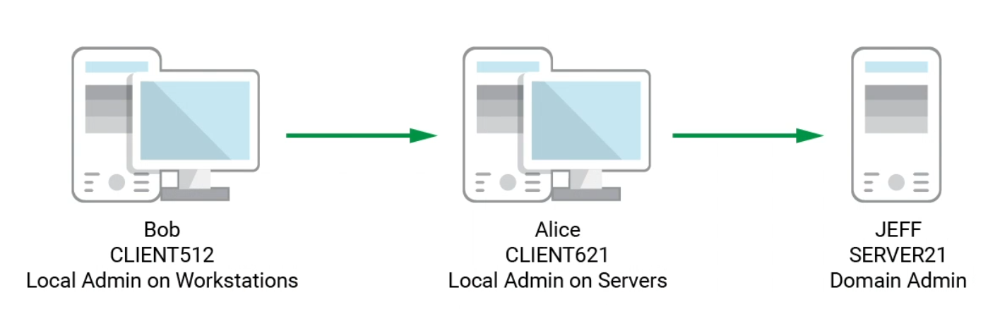
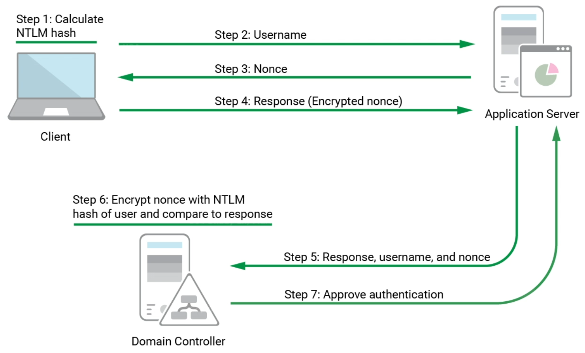
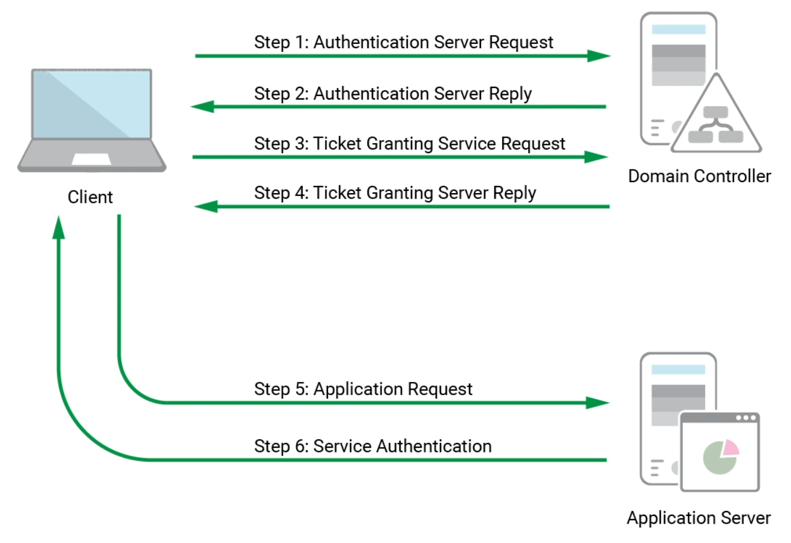

# Lesson 1

## 1.4 Pen Tests
- Pen tests are structured, calculated, and verified (if possible) in a lab before implemented. 
- Ongoing cycle of research and attack



## 1.7 Lab Info


**OSCP Labs Ranges**
Client Machines:
**You MUST revert these on connecting and reconnecting to the labs to use them**

- Windows 2016 Server: 172.16.216.5 (Must RDP from Windows 10 Client)
  - administrator/lab
  - offsec/lab
  - jeff_admin/lab
  
- Windows 10 Client: 192.168.216.10
  - administrator/lab
  - admin/lab
  - offsec/lab
  - student/lab
  
- Debian Client: 192.168.216.44
  - student/lab
  - root/lab


- Subnet: 10.11.1.0/24
  Target Range: 10.11.1.1 - 10.11.1.254

- Crackpot Priority Code:  1337123456
  

  
- **megacorpone.com + subdomains** - available outside the VPN, but only for passive & active info gathering during course exercises. It is prohibited to compromise it.

- **sandbox.local** - only accessible through VPN

- **proof.txt** - is a trophy for compromising the machine, but goal is to get root/system level shell access

- **network-secret.txt** – found on certain machines, unlocks the ability to revert virtual machines to their original state in the IT, Development, and Administrative departments networks

- IP’s don’t always line up between examples in guide and the lab, so don’t copy things verbatim

- Only 12 reverts per day, but you can request more if needed from Live Support

- Revert the three clients (Win10/Server2k16/Debian Linux) whenever you connect to the VPN

- Reverting either Windows box reverts both of them
### Warnings
- Always remember this is a hostile environment and take proper protections
- No ARP spoofing, poisoning or Man in the Middle attacks
- Do not delete or relocate key system files or hints unless you have to
- Don’t change the contents of the flags
- No disrupting other students
- Revert before scanning/attacking a machine and revert after you are finished
### Old Lab Ranges
**For students who are mid way through their lab time**

Here is a break down of which IP addresses have been moved and removed:**
192.168.xx.201/10.11.1.201 -> 10.11.1.5
192.168.xx.202/10.11.1.205 -> 10.11.1.133
192.168.xx.203/10.11.1.203 -> 10.11.1.13
192.168.xx.204/10.11.1.204 -> 10.11.1.14
192.168.xx.205 -> 10.11.1.202
192.168.xx.206 -> *Removed*
192.168.xx.207/10.11.1.207 -> 10.11.1.7
192.168.xx.208/10.11.1.208 -> 10.11.1.8
192.168.xx.210/10.11.1.210 -> 10.11.1.10
192.168.xx.215/10.11.1.215 -> 10.11.1.115
192.168.xx.216/10.11.1.216 -> 10.11.1.116
192.168.xx.222/10.11.1.222 -> 10.11.1.22
192.168.xx.224/10.11.1.224 -> 10.11.1.24
192.168.xx.225/10.11.1.225 -> 10.11.1.125
192.168.xx.228/10.11.1.228 -> 10.11.1.128
192.168.xx.231/10.11.1.231 -> 10.11.1.31
192.168.xx.235/10.11.1.235 -> 10.11.1.35
192.168.xx.236/10.11.1.236 -> 10.11.1.136
192.168.xx.237 -> 10.11.1.217
192.168.xx.239/10.11.1.239 -> 10.11.1.39
192.168.xx.241/10.11.1.241 -> 10.11.1.141
192.168.xx.242 -> *Removed*
192.168.xx.244/10.11.1.244 -> 10.11.1.44
192.168.xx.245/10.11.1.245 -> 10.11.1.145
192.168.xx.249/10.11.1.246 -> 10.11.1.146
192.168.xx.250/10.11.1.249 -> 10.11.1.49
10.11.1.250 -> 10.11.1.50
10.1.1.251 -> 10.1.1.1
10.3.3.44 -> 10.3.3.42
10.3.3.74 -> 10.3.3.47
10.3.3.99 -> 10.3.3.88
Note #1: If a machine isn't mentioned above, then replace the first three (3) octets of 192.168.xx to become 10.11.1.
Note #2: This doesn't include any new targets (of which there are multiple)!

**Here is a list of which machines have been altered in a major way:**
10.11.1.31
10.11.1.35
10.11.1.39
10.11.1.133
10.11.1.202
10.11.1.218
10.11.1.229
10.1.1.248
10.2.2.22
10.2.2.23

## 1.8 Reporting

- Objective: Remember why you are doing the pen-test. It is not to show off skills, it’s should rotate around an intended goal. 
  - For the Exam, focus on the Exam objectives
- Audience: Think of who is reading it, what they hope to learn from it. Try to satisfy the varying knowledge level of those who would read the report.
  - Executive summary should be no more than 2 pages and written at high level and include results and client’s overall security posture. Tailor it specifically for executives
- Include: Think about what NOT to include. Only include what is relevant and meaningful and don’t bloat the report and obscure important info.
  - DO NOT include excessive tool output unless its relevant and makes a point. Grep out important info, snip unnecessary lines
  - Use screenshots wisely: screenshots should always make a point
  - Any extra materials should be included as supporting documents if they would drive up the page count
  - Refer back to the objective of the assessment: Consider what information relates to the objective.
- Presentation: Focus on points that are simple and easy to understand. Be consistent in document formatting, heading styles, indentions, etc. And remember to spellcheck.
# Lesson 2: Kali Linux
## 2.1 Booting Up
- Always take time to properly verify downloaded files before using them. The MD5 hashes are there for a reason…
- Metapackages provide the flexibility to install specific subsets of tools based on needs. Basically they lump similar packages together
# Lesson 6: Passive Information Gathering
- Also known as Open-source Intelligence (OSINT)
- Collect public info about target, generally without any direct interaction with the target
- Not a linear process, but cyclical
- Next step depends on what information is uncovered in the previous step
- Goals are to get info that:       
  - clarify or expand an attack surface
  - help us conduct a successful phishing campaign
  - supplement other pentest steps like password guessing 
Two schools of thought on passive info gathering:

Two schools of thought on passive info gathering:

- Never communicate with target directly, rely solely on 3rd parties for info.  This maintains high level of secrecy about actions but can be cumbersome and limit results
- Interact with target only as a normal internet user would.  You can interact with the website, for example, but not do vulnerability testing on it.  This is the approach we will examine in this module.

If you manage to social engineer someone, avoid casting blame on the individual in the written report.  Ultimately the company's policy and security awareness set the stage for breaches.

**TAKE GOOD AND ORGANIZED NOTES ON INFORMATION DISCOVERED!**

## 6.2 Website Recon

1. Browse the company website
   1. Look for contact info, other accounts
   2. Take note of email address format or differences in formats (older accounts may have an older format)
   3. Run a whois against the site

## 6.12 User Information Gathering

Gather information about the organization’s employees. Our purpose for gathering this information is to:

- compile user or password lists
- build pretexting for social engineering
- augment phishing campaigns or client-side attacks
- execute credential stuffing
- much more

Must exercise caution when gathering info.

- Some rules of engagement don't allow for social engineering
- Don't break laws
- Don't get someone fired
- Stay in scope, don't touch personal devices if not in scope

# Lesson 7 Active Scanning

## 7.1 DNS

Hierarchical structure divided into several zones, beginning with top-level root zone.

- When a client performs a DNS lookup, the first server in the chain is a DNS recursor, which is responsible for interacting with the DNS infrastructure & return a response to the client.  
- The recursor contacts one of the servers in the DNS root zone, which tells the recursor the address of one or more servers responsible for the zone containing the Top Level Domain.  
- The recursor then contacts one of these servers for the address of the authoritative nameserver for the DNS entry's domain name.
- Some DNS servers, clients, and browsers will cache DNS entries for performance.  Domain owners set a TTL to control how long a cached entry should be kept.

## 7.2 Port Scanning

- Remember that port-scanning could be considered illegal in some jurisdictions so only perform with permission.
- Port scanning can have a negative impact on production systems
- Reduce risk by adopting a proper methodology.  For instance, scan ports that are related to the scope of engagement, then further refine based on results rather than blind aggressive scans.

### 7.2.1.3 Pitfalls of Port Scans

- UDP scanning is unreliable
- Open ports identified by the absence of an ICMP Unrechable
- Firewalls & routers block these ICMP messages & cause false positives
- Many scanners only go after a pre-set list of ports and miss others

### 7.2.2.1 Accountability for traffic

nmap scans can generate a lot of traffic, with one full port for one host generating 4MB of traffic and a full /24 range generating over 1 GB of traffic.  Consider these things when scanning over slow uplinks to avoid crushing connections.  Pick & choose what hosts to scan individually or start with default port ranges.

## 7.3 SMB Enumeration

- NetBIOS listens on TCP port 139 + several UDP ports
- SMB listens on port 445
- SMB & NetBIOS are two different things

## 7.4 NFS Enumeration

- Distributed file system protocol originally made by Sun Microsystems in 1984
- Allows access to files over network as if locally mounted
- Predominantly insecure in its implementation due to its difficulty to set up securely
- RPCBind maps RPC services to the ports they listen on.  Clients contact the RPC service and specify a program number.  RPCbind redirects the client to the proper port number (often 2049) to communicate with the requested service.
- Both Portmapper and RPCbind run on TCP 111.

## 7.6 SNMP Enumeration

- Based on UDP
- Susceptible to IP spoofing and replay attacks
- Version 1-2 offer no encryption
- Commonly left with default public/private community strings

# Lesson 8

## 8.1 Vulnerability Scanning

During a security audit, it's better to do manual scans than automated ones, but automated scans have their place.

Most automated scanners will:

1. Detect if a target is up
2. Conduct a full or partial port scan, depending on the configuration
3. Identify the operating system using common fingerprinting techniques
4. Attempt to identify running services with common techniques such as banner grabbing, service behavior identification or file discovery
5. Execute a signature-matching process to discover vulnerablities

Some automated scanners may also attempt to exploit a vulnerability it finds to verify it's not a false positive.

Backporting is when a security patch is applied to older versions of software.  Automated scanners can pick these up based on the version number when the vulnerability has actually been fixed.

Signature mismatches can results in false negatives.

Automated scanner results should be manually inspected & reviewed whenever possible.

Update signature databases before each scan to have the best chance of accurate results.

It is wise to understand how automated tools operate to know how to digest the results and overcome limitations.

### 8.1.2 Scanning Considerations

Manual Scanning

- Cons
  - Resource-intensive
  - Time-consuming
  - Prone to errors due to human element
- Pros
  - Able to be more precise & stay hidden
  - Allows for discovery of complex and logical vulnerabilities

Automated Scanning

- Cons
  - Not good for precision
  - Network intensive
- Pros
  - Great for time-constrained large-scale scanning
  - Establish a baseline in a much shorter time
  - Validate easily detected vulnerabilities

In general:

- Can harm the target
- Could lock-out accounts with brute-force scans

### 8.1.3 Internet vs Internal Scanning

- Consider the speed of your Internet connections
- Consider number of hops to the targets
- Internal scans can go faster, but might be too fast for older hosts & may need to be throttled
- Consider firewalls, IPS/IDS in the way
- NAT blocks many private IP's
- ARP scans can only be done locally

### 8.1.4 Authenticated Scans

You can get better visibility into a system if the scanner is supplied with creds of a privileged user account.

Authenticated scans can get lists of packages or programs installed on the OS, system files, and more to detect potentially vulnerable software.

These scans generally take longer, but give more and more accurate information.  They are generally used more for patch management than pentesting.

# Lesson 9 Web Application Attacks

- Most common vulnerabilities are similar in concept, regardless of the underlying technology stack
- Basic Web App Pentesting Methodology
  - Gather info about the app
    - What does it do
    - What language is it written in
    - What server software is it running on
  - Exploit
  - Enumerate functionality & test access
  - Repeat

Using XAMPP in Windows for demonstrating web vulnerabilities

## 9.2 Web App Enumeration

- Vulnerabilities are technology-agnostic but some exploits and payloads need to be crafted based on the technology
- The following components should be discovered:
  - Programming language and frameworks
  - Web server software
  - Database software
  - Server OS
- Inspecting URL's can yield file extensions which show the programming language
  - This is becoming less common with the concept of 'routes' which allow develops to map a URI to a section of code
- Inspecting Page content involves looking at the source code of the page.
  - Firefox Debugger `CTRL+SHIFT+K`	shows the page's resources and content

## 9.4 Cross-Site Scripting (XSS)

- Data sanitization - process in which user input is process, removing or transforming all dangerous characters or strings
- Unsanitized strings allow an attacker to inject and potentially execute malicious code
- When unsanitized input is displayed on a web page, this creates a cross-site scripting vulnerability
- Three variants of Cross-Site Scripting
  - Stored XSS attacks (or Persistent XSS) - Exploit payload is stored in a database or otherwise cached by server.  Web application retrieves it and displays it to anyone who views the vulnerable page.  Commonly exists in forum software, comments or product reviews
  - Reflected XSS - Usually includes the payload in a crafter request or link.  The web app takes this value and places it into the page content.  Only the person submitting the request or viewing the link is attacked.  Can occur in search fields and results, or anywhere user input is included in error messages
  - DOM-base XSS attacks - similar to the above two, but take place solely within the page's Document Object Model (DOM).  The page's DOM is modified with user-controlled values.  The key difference is that DOM-based attacks occur when a browser parses the page's content and inserted code is executed.
- The common thread is the attack is carried out on the user viewing the page, so the web-browser executes the payload, not the webserver.

### 9.4.2.1 Identifying XSS Vulnerabilities

Potential XSS entry points are input fields that accept unsanitized input which is displayed as output in subsequent pages.

Test by inserting special characters & observing the output to see if any of the special characters returned unfiltered.

The most common special characters of interest are: `< > ' " { } ;`  

- HTML uses `< >` to denote elements
- Javascript uses `{ }` in function declarations.  Single `'` and double `"` quotes are used to denote strings and semicolons `;` mark the end of a statement.

If these characters are allowed, the form may be vulnerable to XSS as these characters can be used to introduce code into the page.

You also must consider where your code is being inserted to determine what wrappers are needed for it to have the correct syntax.  For instance, needed `< >` to create a script tag in HTML.

## 9.4.3 Directory Traversal

Allows attackers to gain unauthorized access to files within an application or files normally not accessible through a web interface, such as those outside the application’s web root directory. This vulnerability occurs when input is poorly validated, subsequently granting an attacker the ability to manipulate file paths with `../` or `..\` characters.  These attacks do not execute code on the application server.

## 9.4.4 File Inclusion Vulnerabilities

Allows an attack to include a file into the application's running code.  Requires writing a shell payload somewhere.

- Local File Inclusions (LFI) occur when the included file is loaded from the same web server. 
- Remote File Inclusions (RFI) occur when the file is loaded from an external source.

You must consider these factors when exploiting these vulnerabilities:

- Programming language the application is written in
- Server configuration
- Language runtime

For PHP, the web server configuration is in php.ini, and variables such as `register_globals` and `allow_url` make a difference.

- These are discovered the same way as Directory/Path Traversals.  
- Test for Remote File Inclusion by modifying the URL to include another URL.  This process takes some trial and error as you try different ports due to firewalls.

Webshells are small pieces of software that provide a web-based command line interface, making it easier and more convenient to execute commands.  Kali includes several written in different languages but the contents should be reviewed prior to using them.

## 9.4.5 SQL Injection Attacks

- SQL = Structured Query Language
- Must identify locations where data may pass through a database.  
  - Authentication fields
  - Products on e-commerce site
  - Message threads on a forum

- Sanitizing all single quotes is not good to prevent a SQL injection because some single quotes are needed.
- Best approach is parameterized queries, also known as prepared statements. 
- These create a layer of separation between the SQL statement code and the data values & prevents the user supplied data from manipulating the SQL code. 

### 9.4.5.3 Authentication Bypass

Common method of exploiting a SQL injection.

Consider a normal SQL query for login:

```sql
select * from users where name = 'tom' and password = 'jones';
```

Normally this only returns results that match BOTH criteria.  But, if we insert a single quote and break up the code, we can get this:

```sql
select * from users where name = 'tom' or 1=1;#' and password = 'jones';
```

In PHP, `#` is a comment marker, so when it is supplied through a webform, the remainder of the text is removed, this reduces the query to:

```sql
select * from users where name = 'tom' or 1=1;
```

FThis OR operation says to match where name equals tom, or if TRUE.  This causes every row to match because TRUE always is TRUE, so any comparison evaluates to TRUE.  What happens next depends on the application, however, and requires some trial and error to produce the correct results.

If returning multiple rows produces an error, we can limit our results to one row:

```sql
select * from users where name = 'tom' or 1=1 LIMIT 1;#
```

# Lesson 10 Intro to Buffer Overflows

## Stack Memory


- For buffer overflows, the focus is on the 'Stack' area of memory.
- The stack is the area used to store a program's functions, local variables and program control info.  
- Each thread in a running application has its own stack.
- Viewed by the CPU as Last-In First-Out (LIFO)
- Items put on stack ("pushed") last are removed ("popped") first

## Function Return Mechanics

- When a function is called, the return address or position in memory it left from, is stored so that it knows where to come back to when the function is complete.  
- This also includes parameters and local variables, which are collectively called a stack frame.

## CPU Registers

- CPU maintains a series of nine 32-bit registers (on a 32-bit platform)
- The names were established for 16-bit architecture but extended for 32-bit platforms (hence the 'E' in front of the names)
- More info on registers - https://wiki.skullsecurity.org/Registers
- More on Assembly Language - https://www.tutorialspoint.com/assembly_programming/

- 

## General Purpose Registers

The primary registers are:

- EAX (accumulator): Arithmetical and logical instructions
- EBX (base): Base pointer for memory addresses
- ECX (counter): Loop, shift, and rotation counter
- EDX (data): I/O port addressing, multiplication, and division
- ESI (source index): Pointer addressing of data and source in string copy operations
- EDI (destination index): Pointer addressing of data and destination in string copy operations

### ESP - Extended Stack Pointer

Keeps track of the most recently referenced location on the stack (which would be the 'top' of the stack) by storing a pointer to it

### EBP - Extended Base Pointer

Helps the program locate its own stack frame, which is basically the the top of the stack before the function was called.  This is used along with offsets to find variables in the stack frame.

### EIP - Extended Instruction Pointer

One of the most important registers for BOF.  This points to the next code instruction to be executed.  This is the attackers primary target in exploiting any memory corruption vulnerability like buffer overflow.

# Lesson 11 Windows Buffer Overflows

Steps to discover a buffer overflow

1. Discover the vulnerability in the code without access to the source
2. Craft input in such a way that it grants control of critical CPU registers
3. Manipulate memory to gain reliable remote code execution

## Discover the Vulnerability

Three primary techniques for identifying flaws in code:

1. Source code review
2. Reverse engineering (fuzzing)

The goal of fuzzing is to provide the target application with input it's not designed to handle.  If a crash occurs, it may indicate the presence of a potentially exploitable vulnerability.

# Lesson 12 Linux Buffer Overflows

Newer memory protection techniques:

- Data Execution Prevention (DEP)
- Address Space Layout Randomization (ASLR)
- Stack Canaries

Bypassing these technologies won't be discussed in this course.

# Lesson 13 Client-Side Attacks

- Takes advantages of vulnerabilities on the client's machine
- Don't require direct access to the client's machine

## Know your Target

- Biggest challenge is enumerating client-side machine
- Best tool is active/passive information gathering

### Passive Client Information Gathering

- Do not directly interact with targets
- For example, can google known external IP's of an organization and hope to find collected user agent data to find out information about the clients.
- You can then create a lab environment with the same conditions before deploying the exploit for the target to hit
- Info can be gathered in unlikely places like IRC or even in photos on social media.

### Active Client Information Gathering

- Direct contact with client machine or clients
- Includes phone calls or sending links to client

## Social Engineering & Client-Side Attacks

- Most client-side attacks require some type of interaction with the client
- Social engineering tactics can be leveraged to ensure success
- Example:  You want to get into an HR target.  Apply for a job using an intentionally malformed resume document.  When they ask for a fixed resume, you can respond asking what software they are using and what version.
- To get the most precise info, you must gather it from the target itself

- Goal is identify the victim's software and OS
- There are fingerprinting projects you can use, like fingerprint2.js

##  HTML Application Attacks

### Internet Explorer

Interprets files with a `.mta` extension using the `mshta.exe` program.  These are executed outside the security boundaries of Internet Explorer by the Microsoft signed binary `mshta.exe`, allowing for arbitrary code execution, with the user's permissions.

### HTML Applications

Feature the typical HTML tags followed by script tags and JavaScript or VBScript code.  Since this is executed outside the browser, we can use legacy or dangerous features.

# Lesson 14 Locating Public Exploits

- Always be cautious of using public exploit code and understand what it does before using it in an environment
- 0pen0wn was released an an openssh 0-day exploit, but it actually wiped the attacker's machine and posted in an IRC channel that it had been owned.

# Lesson 15 Fixing Exploits

- It's difficult to find public exploits that match every scenario
- You should understand what the exploit does so you can fix it to work in your setup

## Buffer Overflows

- Good practice to clone the environment and run the exploit in your clone to verify the return address overwrite and how it will behave
- Always review the payload or insert your own

Differences in Languages

- Scripting language (Python, etc) exploits require an interpreter to be installed
- In scripting languages, concatenating strings is easy

Fixing Exploits

- Need to check the return address being assigned to EIP to make sure it will work for you (check what DLL it's in, for example)
- Check the Internet for hints on things like return addresses, bad characters, etc
- Some public exploits are trash

### Cross-Compiling Code

- It's recommended to use the native compiler for the OS, but not always possible if only one environment is available (like using Kali but needing to compile for Windows)

## Web Exploits

- Web exploits don't rely on memory corruption and are much easier to repurpose
- Properly read the code to understand what considerations need to be taken:
- Remember web application exploits don't take into account additional protections like htaccess files.

# Lesson 16 File Transfers

## Considerations & Preparations

- Remember these methods could endanger the engagement & should be used with precaution
- May need to transfer attack tools to target, but be aware:
  - Post-exploitation tools could put clients at risk
  - Anti-virus software could frustrate this process.  
  - Always try to use native tools for this reason

#### Non-Interactive Shell

- Does not allow for user input for a command
- Many commands will not work in this type of shell (FTP, sudo, etc)
- This occurs because the stdout is not properly forwarded

# Lesson 17 Antivirus Evasion

## Detection Methods

- Signature Based - basically a blacklist technology.  Relies on finding a continuous sequence of bytes in the malware.  Assumes the malware is always the same and can easily be bypassed by breaking the sequence.
- Heuristic Based - Relies on various rules and algorithms to determine if an action is malicious.  Steps through the binary file or attempts to decompile and analyze the source code.
- Behavioral Based - Dynamically analyzes the behavior of a binary file.  Often done in an emulated environment and watching the behavior.  This abstracts the detection to be able to more effectively detect unknown malware.

Most AV makers use a combination of these techniques for higher detection rates.

### Portable Executables (PE)

The Portable Executable (PE) file format is used on Windows operating
systems for executable and object files. The PE format represents a Windows
data structure that details the information necessary for the Windows loader
to manage the wrapped executable code including required dynamic libraries,
API imports and exports tables, etc.

## Bypassing Antivirus Detection

### On-Disk Evasion

Focuses on modifying malicious files on disk to evade AV detection.

1. Packers - generate an executable that is smaller and functionally equivalent but creates a new signature, bypassing signature scans
2. Obfuscators - reorganize and mutate code to make it more difficult to reverse engineer.  Replaces instructions with equivalent ones, inserting dead code, splitting functions, etc.
3. Crypters - Cryptographically alters code and adds a decryption code stub that restores the code on execution.  This all happens in memory so only encrypted code exists on disk.  This is the most effective technique
4. Software Protectors - Originally designed for legitimate purposes but can be used for malware too

### In Memory Evasion

Does not write any files to disk

1. Remote Process Memory Injection - attempts to inject the payload into another valid PE.  Most commonly leverages a set of API's to copy the payload to the memory space of that process.
2. Reflective DLL Injection - Attempts to load a DLL stored by the attacker in the process memory.  Attackers must write their own version of the API that doesn't rely on disk-based DLL's
3. Process Hollowing - Attackers first launch a non-malicious process in a suspended state.  Once launched, the image of the process is removed from memory and replaced with a malicious executable image, and the process is resumed to execute the malicious code.
4. Inline Hooking - Modifying the memory and introducing a hook, or instructions that redirect code execution into a function to point the execution flow into the malicious code.  After execution, the flow returns to the modified function and continues normal execution which hides the malicious code's execution.

## Practical Tips

During a pen-test, given the time restrictions, it makes more sense to target the specific AV deployed in the environment.

# Lesson 18 Privilege Escalation

We typically gain non-privileged user access with an exploit 

## Information Gathering

Gather as much info as possible after gaining a foothold on a machine

### Manual Enumeration

This can be time consuming but allows for more control, allowing for identifying rare privilege escalation methods missed by tools.

## Privilege Escalation

Privileges refer to the permissions of a specific account.

Windows uses objects called access token to assign to a user once they are authenticated.  The token contains various pieces of info that describe the context of the user including privileges.  These tokens are uniquely identified, using a Security ID (SID).

Windows also implements an integrity mechanism, which assigns integrity levels or levels of trust, between the OS and applications.

### User Account Control (UAC)

Any application that wants to perform an operation cannot do so without the user's consent, in theory.

Two modes:

- Credential Prompt
  - If a standard user wants to perform an admin level task, they are prompted for credentials
- Consent Prompt
  - If an admin tries to perform the same task, a consent prompt is displayed

When logged in as an admin, the account has two security tokens, one at a medium integrity level and another at a high integrity level, with UAC separating the two.

# Lesson 19 Password Attacks

Goal is to discover and use valid credentials to gain access to a user account or service.

Few approaches

- Try to guess with dictionary attack using wordlists
  - Prioritizes speed at the expense of coverage
- Bruteforce every possible character in a password
  - Prioritizes coverage over speed

Password hashes allow us to either attempt to crack a password hash to discover the password or use the hash to authenticate.

## Wordlists

- Also referred to as dictionary files.  
- Used as input to programs designed to test passwords.  
- Precision is more important than coverage.
- It's more important to create a lean wordlist of relevant passwords than an enormous generic wordlist
- Many wordlists are based on a common theme
- It's better to build custom wordlists than use generic ones

### Standard Wordlists

- Increase effectiveness of wordlists by crafting it to be specific to the target organization
- Involves generating an intentional wordlist that is focused on the target's profile

### Brute Force Wordlists

- Calculates and tests every possible character combination until a match is found
- Extremely time consuming
- Depending on the length, complexity, and power of the system doing the processing, it could take months or even years to brute force the password.

## Common Network Service Attack Methods

- Password attacks against network services are noisy, generating logs and warnings
- Multiple attempts can lock out accounts and cause serious problems
- Take steps to improve efficiency of password tests
- You can try to use multiple authentication threads to speed up the process, but be mindful that for some protocols, this can work against you and slow down the process instead
- Authentication for some protocols, like RDP, are more time consuming that something like HTTP
- The art is choosing appropriate targets, user lists, and password files carefully and intelligently before initiating the attack
- Not only match the target username and password, but also follow the protocol used in the authentication process.  
- We can use tools that will follow the protocols for us
- Which tools you use depends on the application and desired output

## Leveraging Password Hashes

Hash function is one-way that returns a fixed size string called a hash or message digest.

### Retrieving Password Hashes

- Most systems with authentication store password hashes locally
- Password presented by the user is hashed and compared with previously stored hash
- When identifying the message digest type, there are three important properties to consider
  - Length of hash
  - Character set used in hash
  - Any special characters used by the hash

#### Linux Passwords

- Passwords listed in /etc/shadow
- Password hash divided into subfields with $6 referencing SHA-512 algorithm, the randomized 'Salt' value, and then the hash.
- Salt values are used along with the cleartext password during the hash calculation to cause the resulting hash value to vary from system to system for the same password.  This prevents simple hash lookup attacks.

#### Windows Passwords

- Hashed user password are stored in the Security Accounts Manager (SAM)
- Microsoft introduced the SysKey feature to curb offline SAM file attacks.
- Windows-NT based systems up to & including 2003 stored two different password hashes:
  - LAN Manager (LM)
    - based on DES
    - very weak
    - Passwords longer than seven chars are split into two strings and each piece is hashed separately
    - Each password string is converted to Upper Case before being hashed
    - Does not include salts
    - Disabled in Windows Vista & later
  - NT LAN Manager (NTLM)
    - Uses MD4 algorithm
    - Case sensitive
    - Supports all Unicode characters
    - Does not split hash
    - Still does not include salts
- SAM Database cannot be copied while Windows is running because the kernel has an exclusive file lock on it.  Mimikatz can dump the hashes from memory, however.
- Mimikatz leverages Local Security Authority Subsystem (LSASS) to access these hashes and requires Admin privileges.
  - First executes `privilege::debug` which enables SeDebugPrivilge access right to tamper with another process.  If this fails, then mimikatz didn't have admin rights.
  - LSASS is a SYSTEM process, so it's rights are even higher than admin rights, so `token::elevate` is used to elevate the security token from 'high integrity' (admin) to 'SYSTEM integrity'.  If mimikatz is launched from a SYSTEM shell, this is not required.

## Password Cracking

- The process of recovering a plaintext password that matches a stored hash value
- Process of password cracking
  1. Discover the hashing mechanism
  2. Iterate over a wordlist, hashing each word to generate the message digest
  3. Compare the computed message digest to the stored hash to see if they match
- Trying to crack a password without knowing the salt value could be impossible due to the number of possible combinations involved.  However, generally if the hashes are obtained, the salts are obtained with them or the source uses the same salt for all hash values.

# Lesson 20 Port Redirection and Tunneling

- Tunneling encapsulates in a different protocol to carry one protocol over an incompatible delivery network or provide a secure route through an untrusted network

## Port Forwarding

Redirect traffic destined for one IP/Port to another IP/Port

## SSH Tunneling

SSH is the most popular for tunneling and port forwarding due to its encryption.

### SSH Local Port Forwarding

Allows you to tunnel a local port to a remote server.  This is similar to rinetd port forwarding.

## HTTPTunnel-ing Through Deep Packet Inspection

- Sometimes deep packet inspection technology will only allow a certain protocol through
- For instance, if SSH wasn't allowed, all the previous techniques wouldn't have worked.

# Lesson 21 Active Directory Attacks

- Allows sys admins to manage OS's, applications, users, and data access on a large scale
- Has a large attack surface

## Active Directory (AD) Theory



- Domain Controller - hub or core of AD
- Enforces various sets of rules to govern how objects interact with each other
- Domain is given a name, like `corp.com`
- Various objects like users, groups, and computer objects
- Objects are organized by containers called Organization Units (OU), which are like folders for files, that are contain
- Computer objects are actual workstations (virtual or physical) that are considered 'domain joined' and part of the domain.
- User objects generally represent employees or affiliates of the organization
- Attributes of objects are dependent on the object type
- Internet connected web-servers are sometimes intentionally disconnected from the domain.

## Enumeration

- Typically begins with an exploit that provides access to an AD connected workstation or server
- Goal is to gain control of one or more domains
- Admins use groups to assign permissions to users, so high value groups are a target, such as 'Domain Admins'
- Another route is to successfully compromise a DC which has full control to modify things
- DC's also have password hashes of every Domain user account

### Lightweight Directory Access Protocol (LDAP )

LDAP is an Active Directory Service Interface (ADSI), which is basically an API that is understood by DC's that supports search functionality against the DC.  You can interface with the DC to obtain non-privileged information.

LDAP provider paths are used: `LDAP://HostName[:PortNumber][/DistinguishedName]`

#### Logged in Users

We want to find high-value logged in users since their credentials could be cached in memory.

The goal is to get domain admin rights.  If we can't get a domain admin account, we can get other accounts to pivot up to a domain admin account.  This is called chain compromise.



- NetWkstaUserEnum
  - Requires admin rights 
  - Returns all users logged into a target workstation
  - After compromising a domain machine, you should enumerate all computers in the domain and then run this against them.
- NetSessionEnum
  - Can be used by any domain user
  - Returns a list of active user sessions on servers like fileservers or DC's
  - After exploiting and getting a list of DC's and Fileservers, this can be used against the servers to enumerate active users' sessions

On both of these, the results may vary depending on the user's permissions and the configuration of the domain environment.

Calling an OS API from Powershell is not straightforward but using PowerView, part of the PowerShell Empire framework, simplifies the issue.

#### Service Principal Names

Service accounts are also valid targets as they may be members of high-value groups.

There are some pre-defined accounts:

- LocalSystem
- LocalService
- NetworkService

Service Principal Names (SPN) are used when applications are integrated into AD to associate the service on a that server to a service account in Active Directory

Enumerating these SPN's will identify IP's and ports of services integrated with AD.

## Authentication

Active Directory supports multiple authentication protcols

Uses either NTLM or Kerberos for most auth attempts

### NTLM Authentication

- Used when a client authenticates to a server by IP instead of by hostname
- Used when a client attempts to authenticate to a hostname that is not found in the AD DNS directory
- 3rd Party apps can use it too

#### Authentication Steps



1. Client calculates an NTLM from the password 
2. Client sends username to server
3. Server returns random value called nonce, aka, the challenge
4. Client encrypts the challenge using the NTLM hash and send it as the response
5. Server forwards response, username, and nonce to the DC
6. DC encrypts the nonce with the already stored NTLM hash of the user and compares it to the response
7. If they are equal, the DC approves the authentication request

### Kerberos Authentication

- Been used as MS's primary authentication protocol since Windows Server 2003
- Uses a ticket system rather than a challenge and response. 
- Uses a Domain Controller in the role of a key distribution center (KDC)



1. Authentication Server Request (AS_REQ)
   1. When a user logs into a client, a request is sent to the DC, which has role of KDC and maintains the authentication server service.  
   2. The Authentication Server Request contains a timestamp that is encrypted using a hash derived from the user and the username.  
   3. When the DC receives the request, it looks up the password hash for the user and attempts to decrypt the timestamp.  
   4. If it is successful AND the timestamp is not a duplicate, it approves the authentication request.
2. Authentication Server Reply (AS_REP)
   1. The DC Replies to the client with an Authentication Server Reply containing a session key (since Kerberos is stateless) and a Ticket Granting Ticket (TGT).
   2. The session key is encrypted using the user's password hash and may be decrypted by the client and reused.
   3. TGT contains information regarding the user including group memberships, the domain, a time stamp, the IP of the client, and the session key.
   4. To avoid tampering, the TGT is encrypted by a secret key known only to the KDC & is not decrypted by the client.
   5. The client authentication is considered complete at this step
3. Ticket Granting Service Request (TGS_REQ)
   1. This request is generated and sent to the KDC when the user wants to access resources of the domain like shares or some other application with an SPN.
   2. Client constructs a Ticket Granting Service Request packet that consists of the current user, a timestamp encrypted by the session key, the SPN of the resource, and the encrypted TGT
4. Ticket Granting Server Reply (TGS_REP)
   1. TGS_REQ is received by the KDC and checks if if the SPN exists in the domain
   2. If so, the TGT is decrypted using the secret key
   3. Session key is extracted from the TGT and used to decrypt the username and timestamp of the request
   4. Three TGT checks are performed
      1. The timestamp in the TGT is checked for validity
      2. The username from the TGS_REQ is compared to the username in the TGT
      3. The client IP must match the TGT IP
   5. If all this succeeds, the ticket granting service on the KDC responds to the client with a Ticket Granting Server Reply  which contains
      1. The SPN to which access was granted
      2. Another session key to be used between the client and the SPN
         - The SPN and new session key are encrypted using the session key from the TGS_REQ
      3. A service ticket containing the username and group memberships 
         - This is encrypted using the password hash of the service account registered with the SPN 
5. Application Request (AP_REQ)
   1. Starts once the client has a session key and service ticket for the SPN
   2. Client sends an AP_REQ, which has the username and a timestamp encrypted with the session key associated with the service ticket and the service ticket itself
6. Service Authentication
   1. The application server decrypts the service ticket using the service password account hash and extracts the username and the session key.
   2. It then uses the service key to decrypt the username from the AP_REQ and compares it to the one decrypted from the service ticket.
   3. It inspects the supplied group memberships in the service ticket and assigns appropriate permissions to the user.
   4. The user is now able to use the service.

### Cached Credential Storage and Retrieval

- Because Kerberos is basically a single-sign-on system, the password hashes have to be stored somewhere to renew the TGT requests.
- In current Windows, these are stored in the Local Security Authority Subsystem Service (LSASS) memory space.
- If we can get these hashes, we can crack them or re-use the hashes
- This is not a straightforward process
- We must have System or Local Admin privileges to get access
- Often have to start attack with local privilege escalation
- Data structures used to store the hashes in memory are not publicly documented and they are encrypted with an LSASS storage key
- Many tools have been made to get these hashes
- Mimikatz is the most popular tool to use

### Service Account Attacks

- Recall that when requesting the service ticket from the DC, no check is performed on whether the user has permissions to access the service hosted by the SPN.
- If you know the SPN of the target, you can request a service ticket for it from the DC, extract it from local memory and save it to the disk.

## Active Directory Lateral Movement

- There are better ways of getting access than password cracking
- Kerberos and NTLM don't use cleartext passwords directly
- Native tools from MS do not support authentication with the password hash
- We can login using the hash or a ticket

### Pass the Hash

- Login to a remote server or service using the NTLM hash
- Only works for NTLM authentication, not Kerberos
- PsExec from Metasploit, Passing-the-hash toolkit, and Impacket all use this method
  - PTH uses the NTLM hash legitimately, but the vulnerability is gaining unauthorized access to a local user hash
- Technique is basically the same, attacker connects to the vicitim using SMB and auths with NTLM

### Pass the Ticket

- The TGT can only be used on the machine it was created on while a TGS can be exported and used somewhere else to authenticate to a specific service.  
- No admin privileges are required as long as the TGS belongs to the current user.
- Remember that applications determine permissions based on the group memberships contained in the ticket and they don't verify it anywhere else because it's all encrypted with a password has that is supposed to only be known by the service account and DC.
- Silver tickets are forged service tickets made from the password or NTLM hash of the service account that the service runs in the context of.  Permissions can be crafted in these tickets using customized group memberships and the service will blindly trust them.
- This silver ticket can be used on any server that uses the same SPN

### Distributed Component Object Model (DCOM)

- Fairly new technique
- Interactions between nodes performed over RPC
- Local admin rights required to call DCOM Control Manager, which is basically an API
- Interactions through MS Office allow lateral movement
- Because it requires MS Office, best used against workstations

### Active Directory Persistence

- We don't want to lose access to compromised machines
- There are always traditional methods, but there are some methods specific to AD
- Generally in a real-world test, persistence is not usually in scope due to the tendency to forget to remove the back-doors

#### Golden Tickets

- Remember KDC uses a secret key to encrypt TGT's.  This secret key is the password hash of a domain user account called `krbtgt`
- If we can get the `krbtgt` password hash, we can make our own custom TGT's, also known as Golden Tickets
- For example, could make a TGT that specifies a non-privileged user is a member of the Domain Admins group and the DC will blindly trust it.
- The `krbtgt `password is not automatically changed, so it's common to find old password hashes.
- When using the 'Golden' option for Mimikatz, it uses two sets of default values:
  - The UID is set to 500 by default, which is the RID for the built-in Domain Administrator account
  - The values for the Group ID's consist of the most valuable groups in Active Directory, including the Domain Admins group

#### Domain Controller Synchronization

- Another persistence technique is steal the password hashes for all admin users in the domain
- Ways to do this:
  - Gain access to the DC as a Domain Admin and dump the password hashes of every user
  - Steal a copy of the NTDS.dit database file which is a copy of all AD accounts stored on the hard drive
    - The above methods leave indicators of compromise and may require tools to be uploaded
  - Abuse AD functionality itselt to capture hashes remotely from a workstation
- Directory Replication Service Remote Protocol
  - Domain controller may request an update with the IDL_DRSGetNCChanges API
  - DC's do not verify the request came from a known DC, just checks that the SID has appropriate privileges
  - If a request is issued to a DC from a use in the Domain Admin Group , it will succeed

# Lesson 22 The Metasploit Framework

- Issues with public exploits

  - Must be modified per scenario

  - Must be tested for malicious code
  - Each uses a unique command-line syntax
  - No standardization in coding practices or languages
  - Deployment techniques vary
  - Additional tools are often required

- Exploit frameworks 

  - seek to address these difficulties
  - Aims to consolidate and streamline the process
  - Provide variety of exploits
  - Ease use of exploits
  - Offer lateral management
  - Dynamic Payload capabilities

- Some popular frameworks

  - Core Impact
  - Immunity Canvas
  - Cobalt Strike
  - PowerShell Empire
  - Metasploit - open source
    - Started off as a portable network game
    - Valuable in almost every phase of a pen test

## Metasploit Syntax

- There are several thousand modules divided into categories
  - Exploits
  - Auxiliary
  - Post
  - Payloads
  - Encoders
  - NOPS
  - Evasion

### Exploit Modules

- These are the parts that contain the exploit code for vulnerable apps and services
- MSF Contains over 1700 exploits that were developed & tested
- Non-staged payload is sent in its entirety along with the exploit
- Staged payload is usually sent in two parts
  - First part contains small primary payload that causes the target to connect back to the attacker
  - The attacker then sends a larger secondary payload containing the rest of the shellcode and the target executes it
  - This is good for instances such as a buffer overflow where there is not enough space for the entire shellcode.
  - Anti-virus will often detect embedded shellcode in an exploit, but the smaller payload increases the chances of success
  - The remaining payload is injected directly into the victim's memory
- In Metasploit, the / indicates whether a payload is staged or not.
  - Ex. `shell_reverset_tcp` is non-staged, but `shell/reverse_tcp` is staged

### Meterpreter 

- A multi-function payload that can be dynamically extended at runtime
- Provides more features and functionality than a regular command shell
- Offers things like keylogging & file transfer
- Favorite & most commonly used metasploit payload

#### Executable Files

- Payloads can be exported into various executable formats


# Lesson 23 PowerShell Empire

- PowerShell and Python post-exploitation agent
- Focuses heavily on client-side exploitation and post-exploitation of Active Directory deployments
- Exploitation & Post-exploitation use PS on Windows and Python on Linux
- Relies on standard, pre-installed libraries and features
- Only requires PS Ver 2 on Windows and Python 2.6 or 2.7 on Linux/Mac
- Operates with a Listener, Stager, and Agent combination
  - Listener listens for connections
  - Stager downloads and starts the agent
  - Agent sets up an AES encrypted connection through the l

### Credentials & Privilege Escalation

- Empire uses reflective DLL Injection to load the Mimikatz library into the agent directly in memory to minimize the risk of detection.  
- Windows does not expose any API's to do this normally