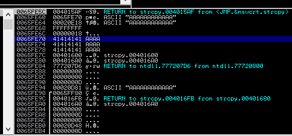
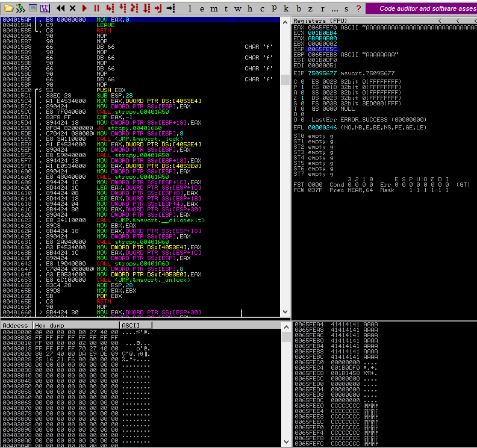
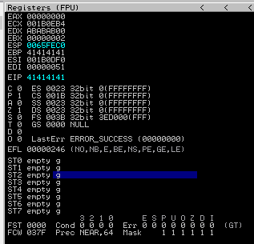

### 10.2.5 Exercises
#### 1. Repeat the steps shown in this section to see the 12 A’s copied onto the stack.

The 12 A's are shown beginning at 0x0065FE70

#### 2. Supply at least 80 A’s and verify that EIP after the strcpy will contain the value 41414141.

The address in EBP is 0x0065FEB8, meaning the return call is expected at 0x0065FEBC, which now contains our address of 41414141.

Verified:  EIP contains the address 41414141

