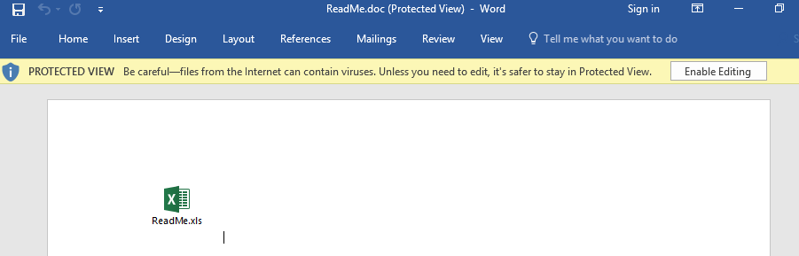
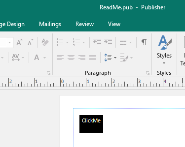
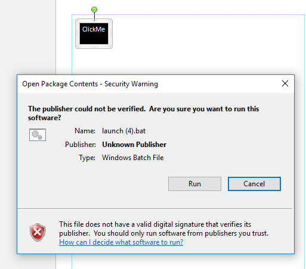
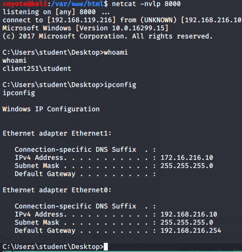
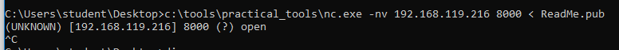
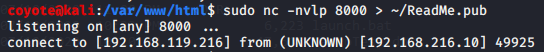
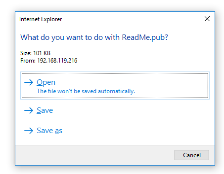
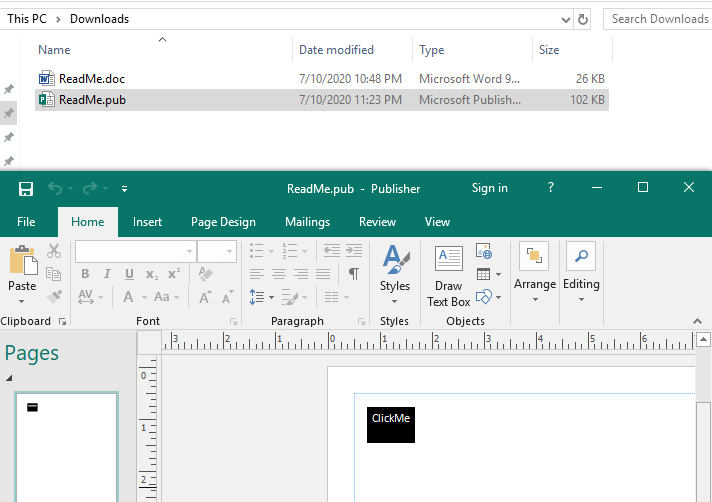

### 13.3.4.1 Exercises
#### 1. Trigger the protection by Protected View by simulating a download of the Microsoft Word document from the Internet.

#### 2. Reuse the batch file and embed it in a Microsoft Publisher document to receive a reverse shell to your Kali system.

I had issues getting the icon to show up in Publisher.  It would just show a blank image, so I just colored it in to let it show up since the icon was not a requirement of this exercise.

- Batch file embedded in Publisher Doc
  
- Double-clicked embedded file
  
- Started Netcat listener on Kali and clicked Run to get Reverse Shell
  

#### 3. Move the file to the Apache web server to simulate the download of the Publisher document from the Internet and confirm the missing Protected View.

- Used netcat to transfer file from Windows to Kali.
  
  

- Started python simple http server on Kali to serve up Pub file & downloaded in IE:

  

- Opened Publisher Doc with no Protected mode:
  