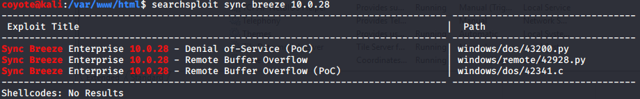
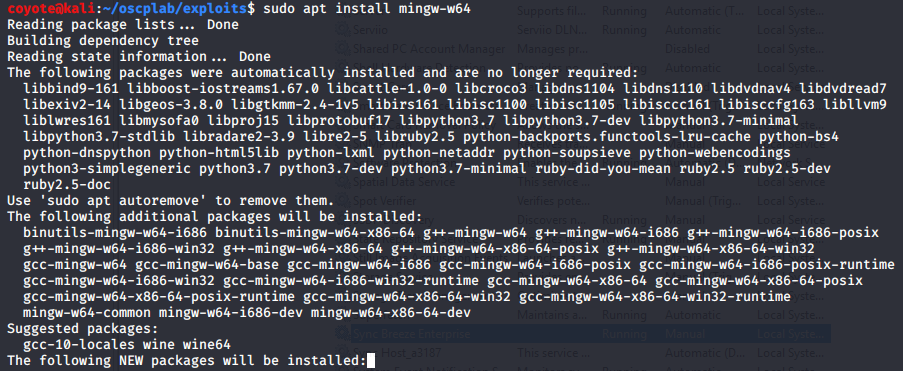
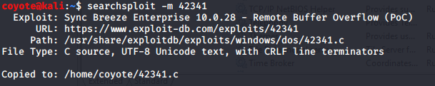
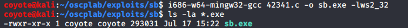

### 15.1.3.1 Exercises
#### 1. Locate the exploit discussed in this section using the searchsploit tool in Kali Linux.



#### 2. Install the mingw-w64 suite in Kali Linux and compile the exploit code.

```bash
sudo apt install mingw-w64
```





