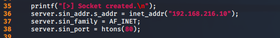
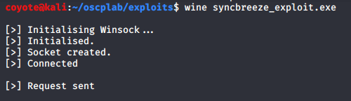
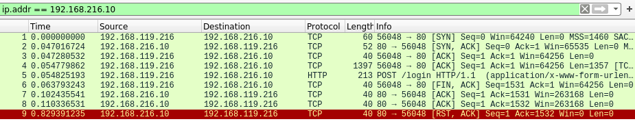

### 15.1.4.1 Exercises
#### 1. Modify the connection information in the exploit in order to target the SyncBreeze installation on your Windows client.

- Fixed remote host information:
  

#### 2. Recompile the exploit and use Wireshark to confirm that the code successfully initiates a socket connection to your dedicated Windows client.

- This activity occurs before Wine was introduced and I had difficulty getting Wine installed (as others also seemed to have).  I did the following to install Wine:

  ```bash
  sudo dpkg --add-architecture i386
  apt-get update
  sudo apt-get install wine32
  sudo apt-get install gcc-9-base libgcc-9-dev libc6-dev
  sudo apt-get install wine32
  ```

- I was then able to run the exe successfully:

  

- And the connection was confirmed by Wireshark:

  