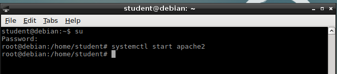
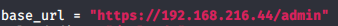
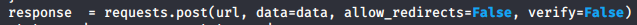
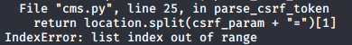

### 15.2.3.1 Exercises
#### 1. Connect to your dedicated Linux lab client and start the apache2 service; the target web application is located under /var/www/https/.

#### 2. Modify the original exploit and set the base_url variable to the correct IP address of your dedicated Linux lab client as well as the protocol to HTTPS.

#### 3. Get familiar with the requests Python library and adjust your exploit accordingly to avoid SSL verification.

I modified the POST request code to include 'verify=false' to overcome the unsigned certificate.  This was done on lines 34, 55, and 80:

Example:

#### 4. Edit the username and password variables to match the ones from our test case (username “admin”, password “HUYfaw763”).

#### 5. Try to run the exploit against the Linux lab client, does it work? If not, try to explain why.

It did not work.  There appears to be an issue with one of the list variables, per this error:

