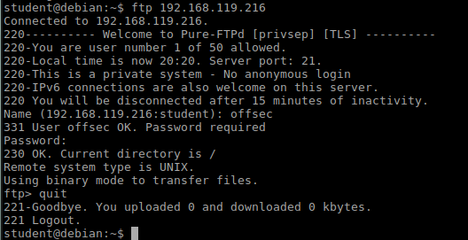
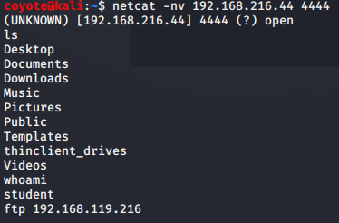
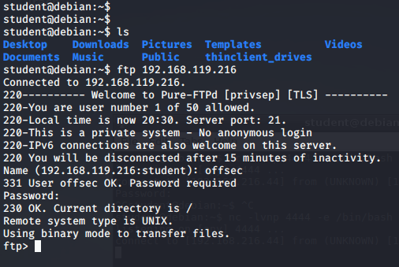

### 16.1.3.2 Exercises
#### 1. Start the Pure-FTPd FTP server on your Kali system, connect to it using the FTP client on the Debian lab VM, and observe how the interactive prompt works.



#### 2. Attempt to log in to the FTP server from a Netcat reverse shell and see what happens.

It's sad and lonely....



#### 3. Research alternatives methods to upgrade a non-interactive shell.

This sequence of commands also upgrades the shell:

```bash
SHELL=/bin/bash script -q /dev/null
CTRL+Z
stty raw -echo
# After typing the above, you won't see the next thing you type
fg
reset
# Press enter a few times to see the prompt
```

Upgraded Reverse Shell

