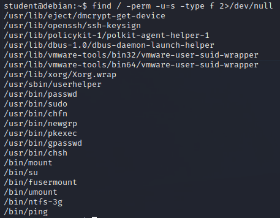

### 18.1.1.13 Exercise
#### 1. Perform various manual enumeration methods covered in this section on both your dedicated Windows and Linux clients. Try experimenting with various options for the tools and commands used in this section

- Windows
  - Users
    
  - Hostname
    
  - System OS & Architecture
    
  - Running Processes & Services
    
    
  - Readable/Writable Files & Directories
    
  - Device Drivers
    
    
- Linux
  - User ID
    
  - Hostname
    
  - System OS & Architecture
    
  - Running processes
    `ps aux | grep root`
    
  - Firewall Rules
    
  - Scheduled Tasks
    
  - Storage Devices
    
  - SUID Enabled files
    