### 18.1.2.1 Exercises
#### 1. Inspect your Windows and Linux clients by using the tools and commands presented in this section in order to get comfortable with manual local enumeration techniques.

Not sure how this is different than the 18.1.1.13 question, so here's the same answer:

- Windows
  - Users
    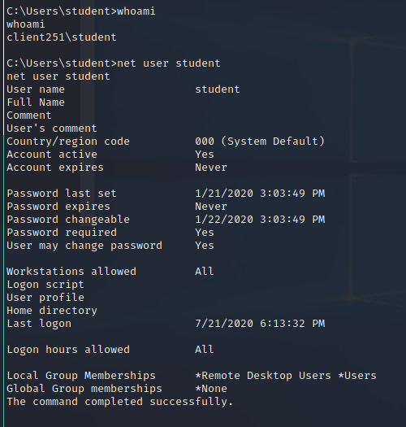
  - Hostname
    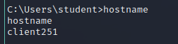
  - System OS & Architecture
    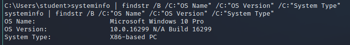
  - Running Processes & Services
    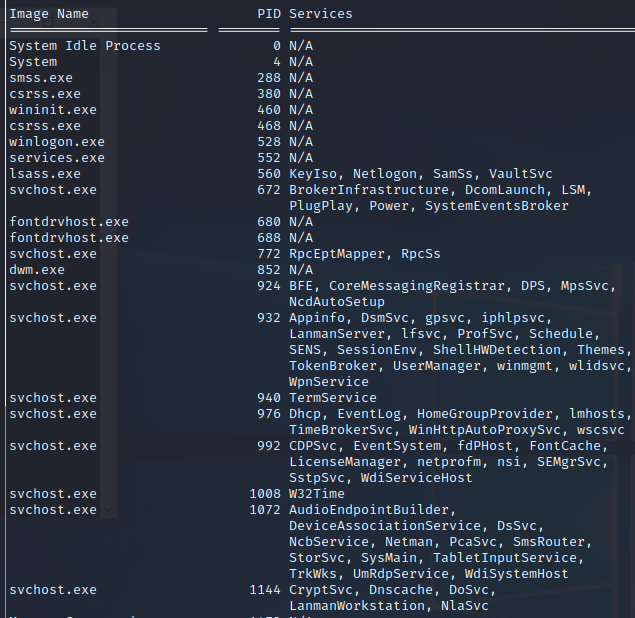
    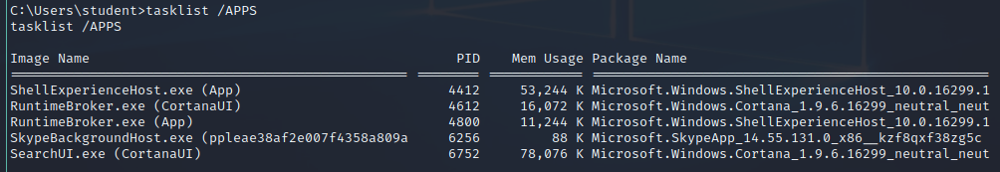
  - Readable/Writable Files & Directories
    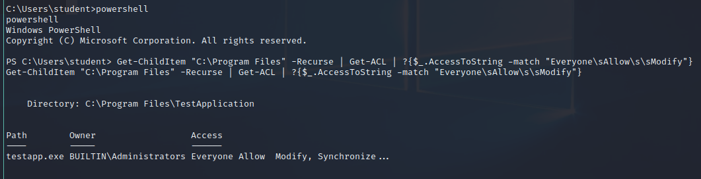
  - Device Drivers
    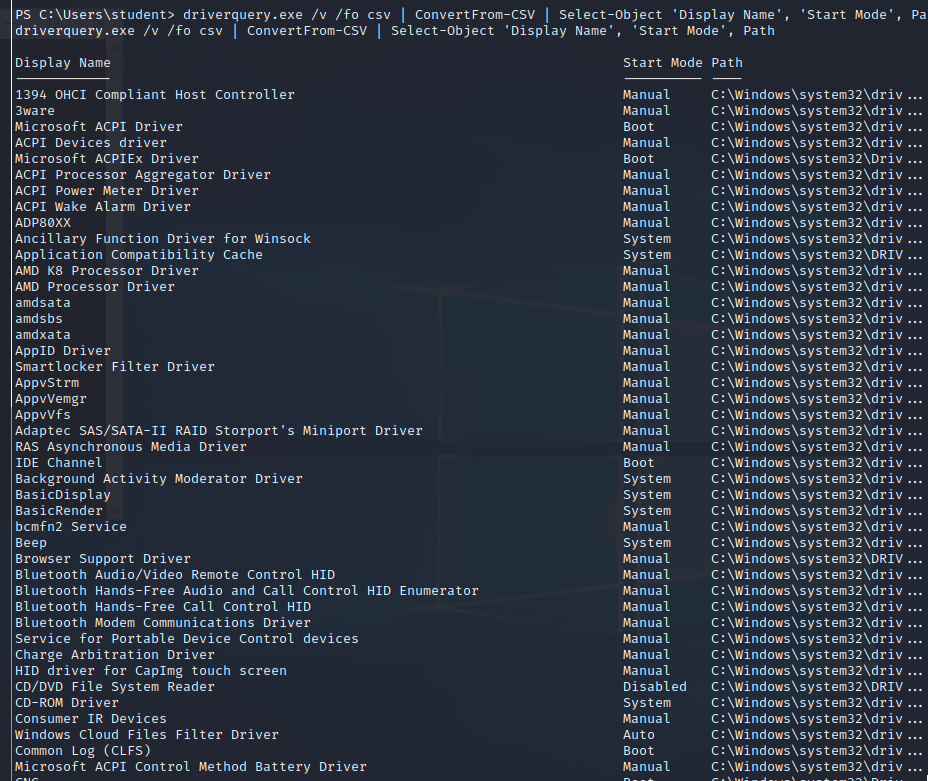
    
- Linux
  - User ID
    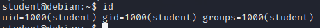
  - Hostname
    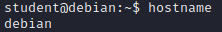
  - System OS & Architecture
    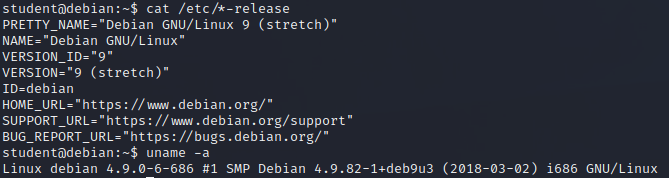
  - Running processes
    `ps aux | grep root`
    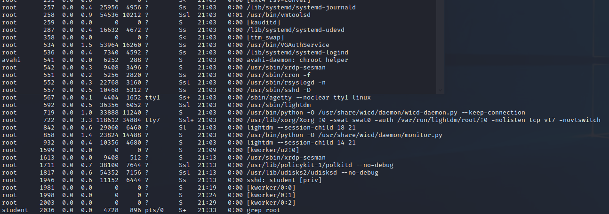
  - Firewall Rules
    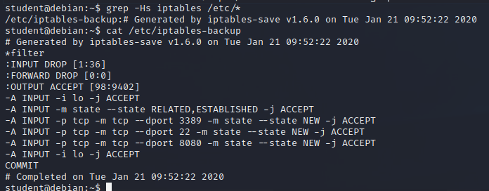
  - Scheduled Tasks
    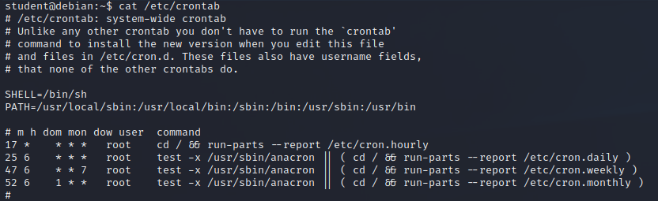
  - Storage Devices
    
  - SUID Enabled files
    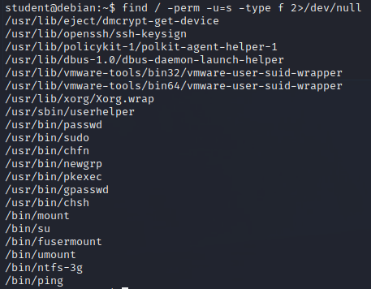

#### 2. Experiment with different windows-privesc-check and unix_privesc_check options.

- Linux
  - `./unix-privesc-check standard > stdpriv.txt`
    
  - `./unix-privesc-check detailed > detpriv.txt`
    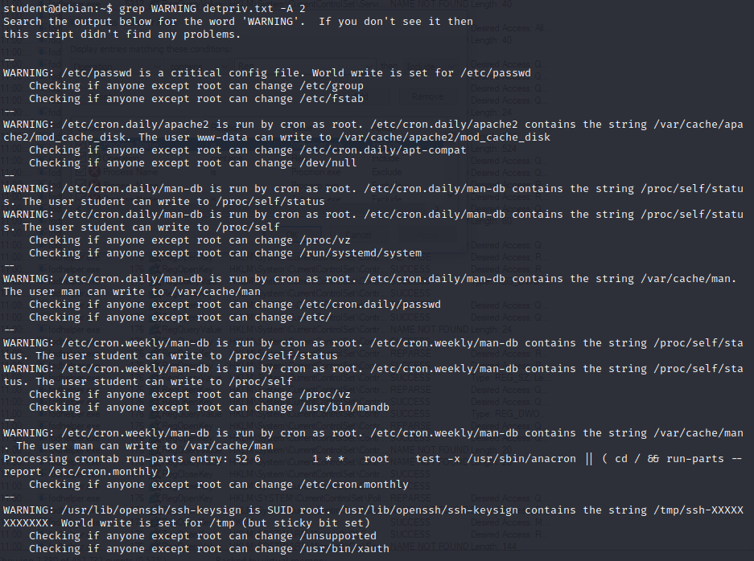
- Windows
  - Drives: `windows-privesc-check2.exe -D --dump`
    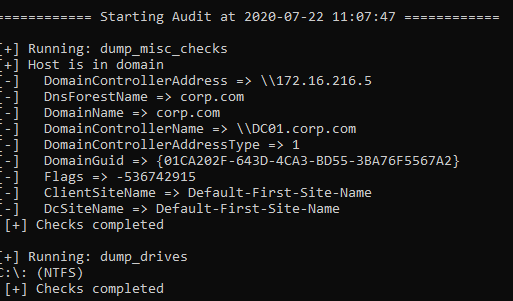
  - Drivers: `windows-privesc-check2.exe -k --dump`
    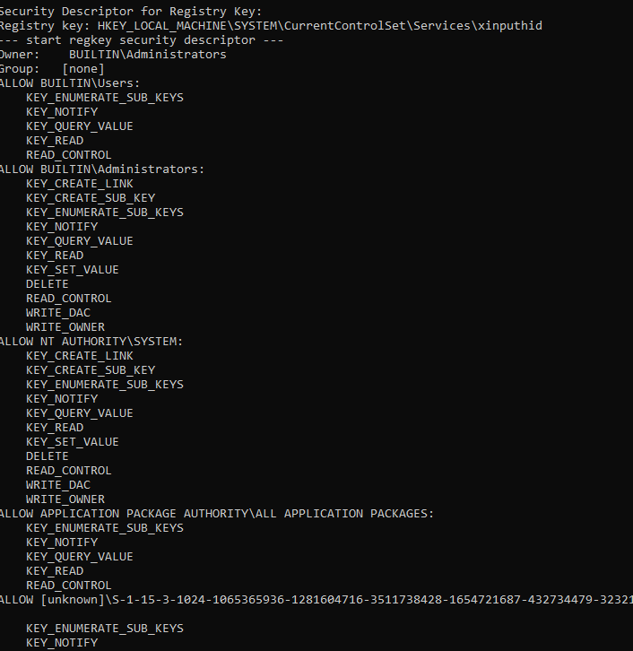
  - Users: `windows-privesc-check2.exe -U --dump`
    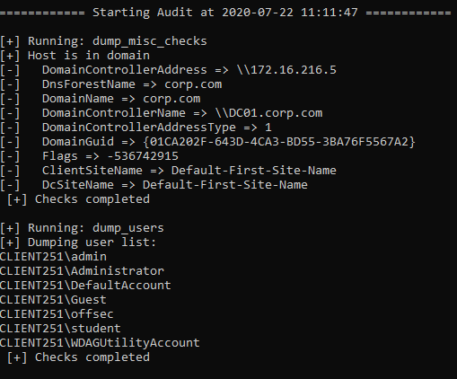