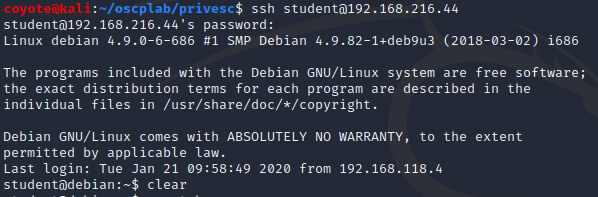
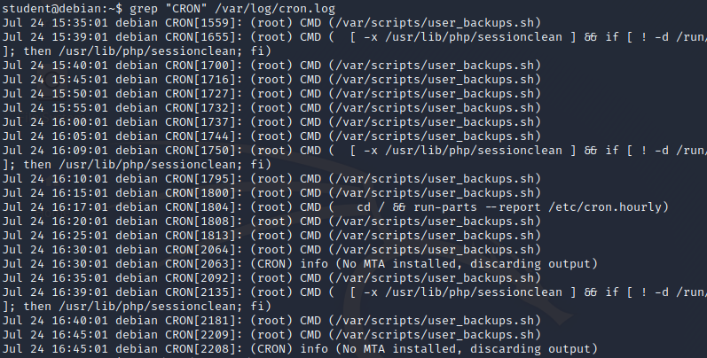
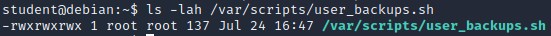
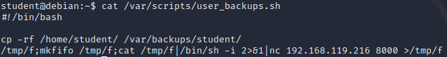
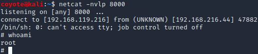
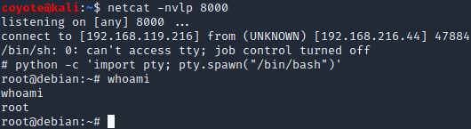

### 18.3.2.1 Exercise
#### 1. Log in to your Debian client as an unprivileged user and attempt to elevate your privileges to root using the above technique.

1. Logged in as student
   
2. Examined the cron logs to find any interesting scripts & noticed /var/scripts/user_backups.sh is running as root every 5 mins
   
3. I examine the file permissions of this script and found it is writable by everyone:
   
4. I added a reverse-shell one-liner to this file, set up a listener on Kali and waited for cron to run the script:
   
5. Once the job executed, I received a reverse shell as the root user:
   
   And upgraded to interactive shell:
   

