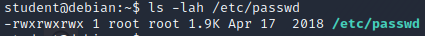
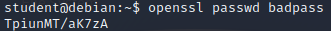
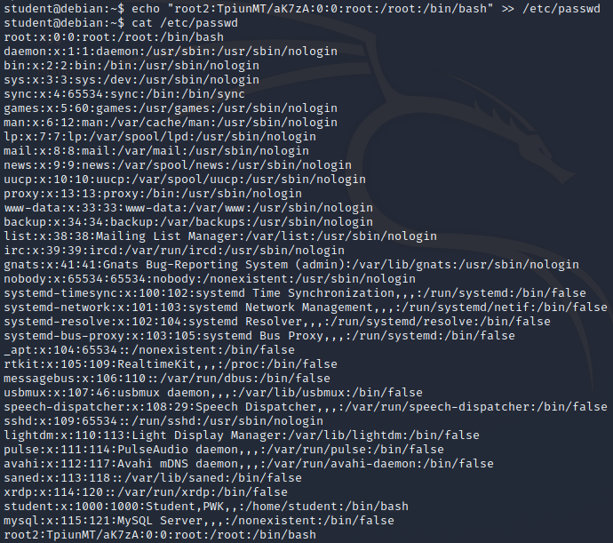
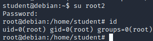

### 18.3.3.1 Exercise
#### 1. Log in to your Debian client with your student credentials and attempt to elevate your privileges by adding a superuser account to the /etc/passwd file.

1. Examined the permissions of the /etc/passwd file to confirm it is writeable:
   
2. Generated a password has for the password `badpass`
   
3. Added a line to /etc/passwd for the user root2 using this hash and the root user's UID and GID.
   
4. Switched to the root2 user and verified root access:
   