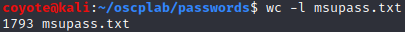

### 19.1.1.1 Exercises
#### 1. Use cewl to generate a custom wordlist from your company, school, or favorite website and examine the results. Do any of your passwords show up?

```bash
cewl campus.murraystate.edu -m 6 -w msupass.txt
```



None of my passwords showed up because I'm secure.