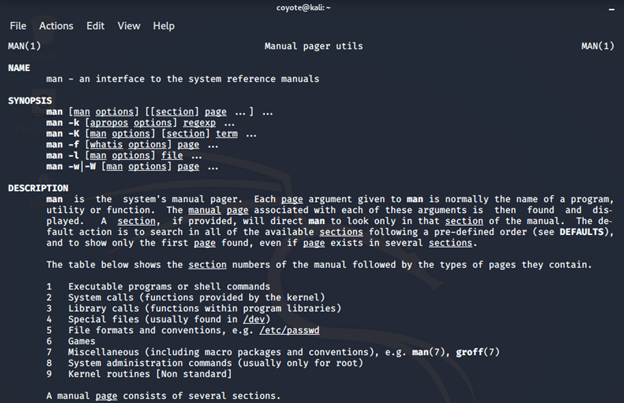
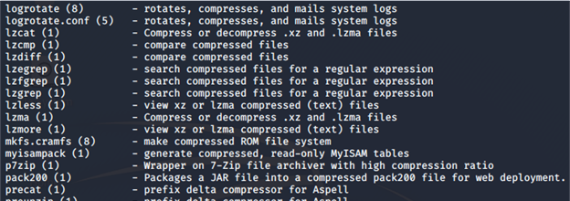
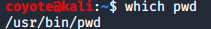
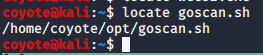
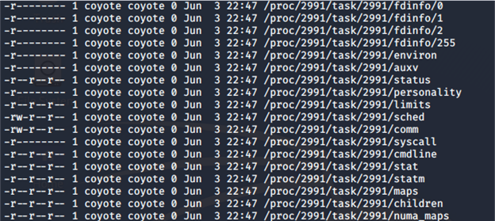

### 2.4.3.4 Exercises
#### 1. Use man to look at the man page for one of your preferred commands.

```bash
man man
```



#### 2. Use man to look for a keyword related to file compression.

```bash
man -k compress
```



#### 3. Use which to locate the pwd command on your Kali virtual machine.



#### 4. Use locate to locate wce32.exe on your Kali virtual machine.

wce32.exe did not exist, so I looked for another file (goscan.sh) instead, per the forum post.



#### 5. Use find to identify any file (not directory) modified in the last day, NOT owned by the root user and execute ls -l on them. Chaining/piping commands is NOT allowed!

```bash
find / -type f -mtime -1 \! -user root -exec ls -l "{}" \;
```

