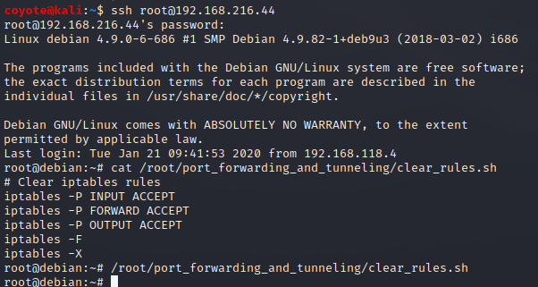
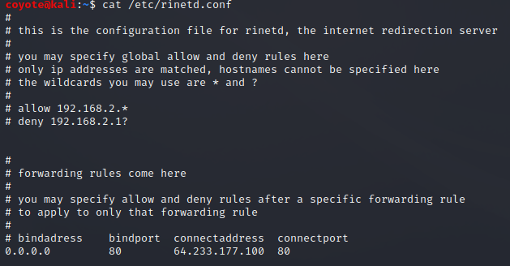
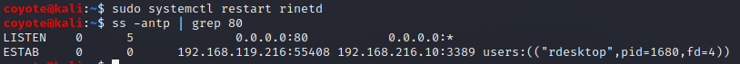
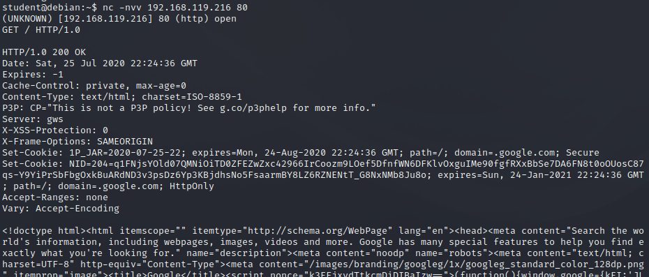

### 20.1.1.1 Exercises
#### 1. Connect to your dedicated Linux lab client and run the clear_rules.sh script from /root/port_forwarding_and_tunneling/ as root.



#### 2. Attempt to replicate the port-forwarding technique covered in the above scenario.

1. Install rinetd on kali

   ```bash
   sudo apt update && sudo apt install rinetd
   ```

2. Lookup Google's IP, modify /etc/rinetd.conf and add forwarding rules to forward connections on port 80 to Kali to Google's IP on port 80.

   

3. Restart rinetd, then use ss (or netstat) to verify the port is listening

   

4. Make a netcat connection from the internet-disconnected client to the intermediate server, then send a test string which is forwarded to Google:

   

   

