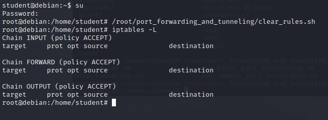
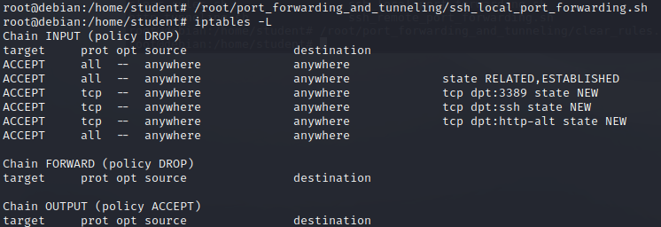
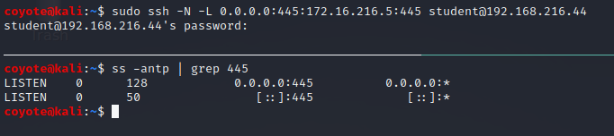
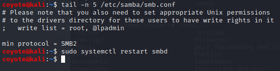
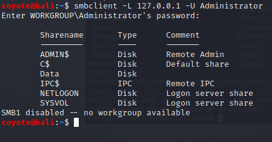

### 20.2.1.1 Exercises
#### 1. Connect to your dedicated Linux lab client and run the clear_rules.sh script from /root/port_forwarding_and_tunneling/ as root.

#### 2. Run the ssh_local_port_forwarding.sh script from /root/port_forwarding_and_tunneling/ as root.

#### 3. Take note of the Linux client and Windows Server 2016 IP addresses shown in the Student Control Panel.

<u>Linux Client:</u>  192.168.216.44
<u>Windows Server 2016:</u>  172.16.216.5

#### 4. Attempt to replicate the smbclient enumeration covered in the above scenario.

1. Use SSH's bind feature to create a connection from Kali to the intermediate Linux Client and setup the port forward:

   

2. Set the minimum SMB version to SMBv2 because WinServer 2016 no longer supports SMBv1 by default:

   

3. Verify it is forwarding by attempting to list the Samba shares on the remote host using the local loopback address.

   