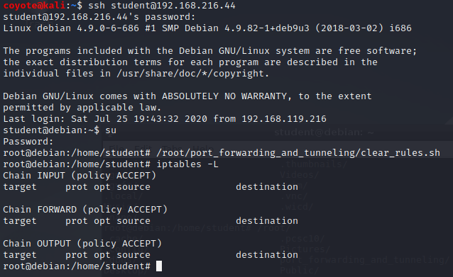
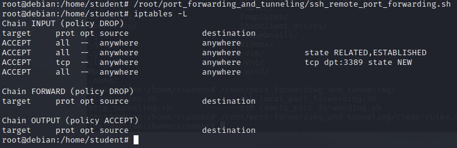
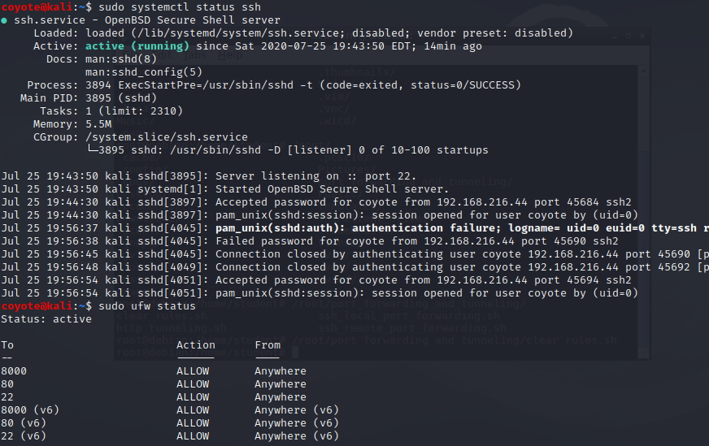
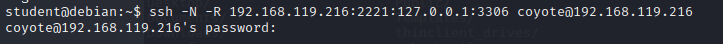
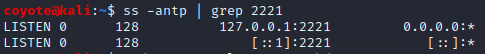
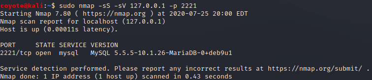
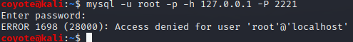

### 20.2.2.2 Exercises
#### 1. Connect to your dedicated Linux lab client via SSH and run the clear_rules.sh script from /root/port_forwarding_and_tunneling/ as root.



#### 2. Close any SSH connections to your dedicated Linux lab client and then connect as the student account using rdesktop and run the ssh_remote_port_forward.sh script from /root/port_forwarding_and_tunneling/ as root.



#### 3. Attempt to replicate the SSH remote port forwarding covered in the above scenario and ensure that you can scan and interact with the MySQL service

1. Ensure SSH is started and accessible on Kali:

   ```bash
   sudo systemctl start sshd
   sudo ufw allow 22
   ```

   

2. On the remote Linux client, create an SSH connection to the  Kali machine, specifying the ports on the Linux Client to be forwarded to the Kali machine:

   
   
3. Verify on the remote end (Kali) that the port (2221) has been opened:

   
   
4. Nmap scan using port 2221 on the local host, which will be forwarded via the SSH rule to port 3306 on the remote Linux Client over port 22/ssh.

   

5. Verify I can connect to the MySQL Server from Kali:

   

