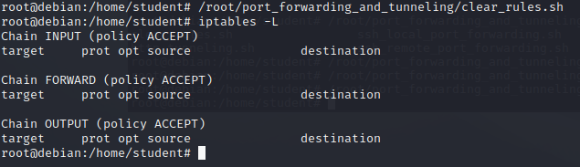
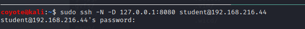
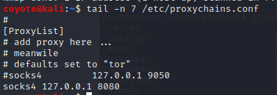
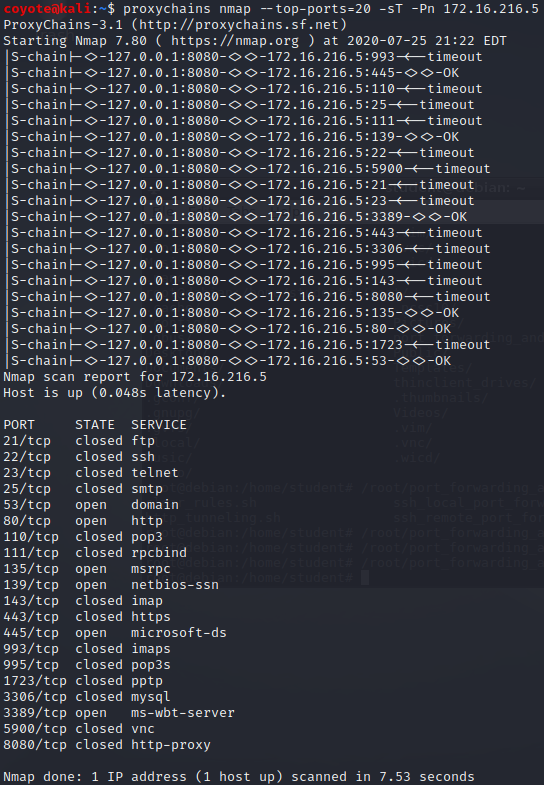
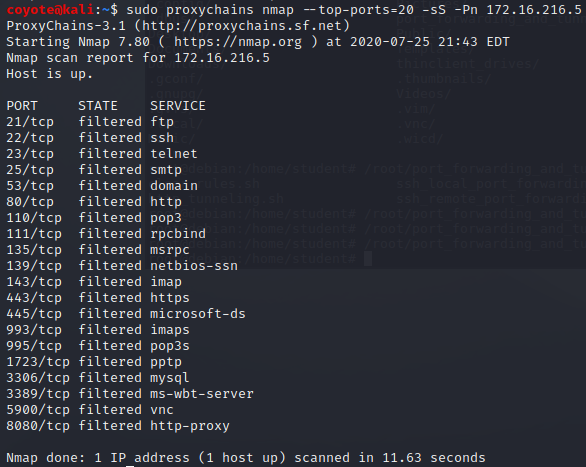

### 20.2.3.1 Exercises
#### 1. Connect to your dedicated Linux lab client and run the clear_rules.sh script from /root/port_forwarding_and_tunneling/ as root.

#### 2. Take note of the Linux client and Windows Server 2016 IP addresses.

<u>Linux Client:</u>  192.168.216.44
<u>Windows Server 2016:</u>  172.16.216.5

#### 3. Create a SOCKS4 proxy on your Kali machine, tunneling through the Linux target.

1. On the Kali machine, setup an SSH connection with the intermediary Linux Client, specifying Dynamic port forwarding:

   

2. Edit `/etc/proxychains.conf` and add the SOCKS4 proxy to the `[ProxyList]` section.

   

#### 4. Perform a successful nmap scan against the Windows Server 2016 machine through the proxy.

#### 5. Perform an nmap SYN scan through the tunnel. Does it work? Are the results accurate?

It is showing all the ports as filtered.  This is because nmap is going through a proxy server and is not able to directly perform a 3-way handshake with the remote target but is rather performing it with the proxy server.  As a result, it's not able to perform a partial handshake for the SYN scan because the proxy server interferes with it.

