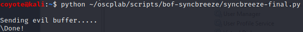
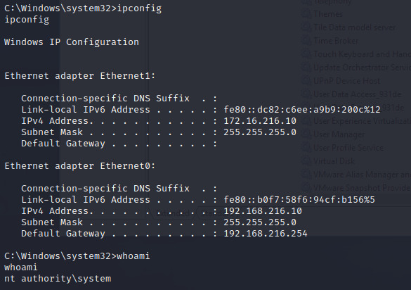
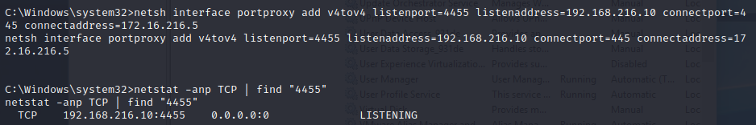
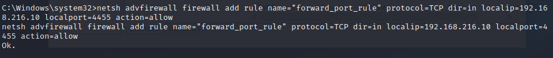
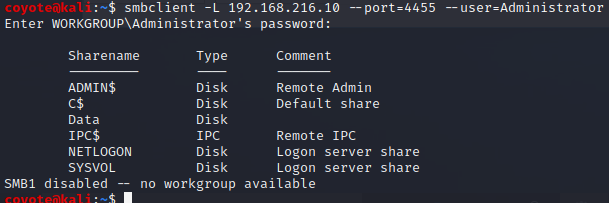
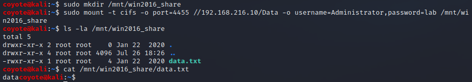

### 20.4.1.1 Exercises
#### 1. Obtain a reverse shell on your Windows lab client through the Sync Breeze vulnerability.

Use Python code from Lesson 11

#### 2. Using the SYSTEM shell, attempt to replicate the port forwarding example using netsh.

1. Setup the NETSH proxy on the Win10 Client & verified listening port
   
2. Added a firewall rule to allow 4455 inbound on the Win10 Client
   
3. Verified I can connect to the SMB Share on Win2016 Server from Kali using the Win10 Client as a proxy
   
4. Verified I could mount a share and read data from it:
   